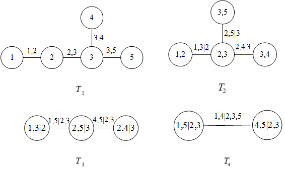
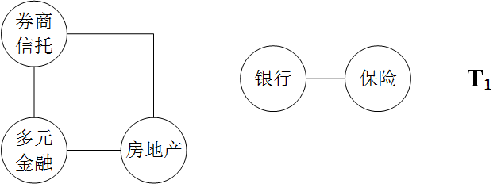
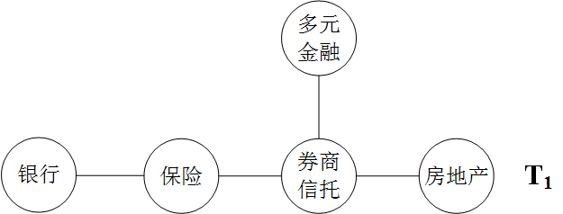
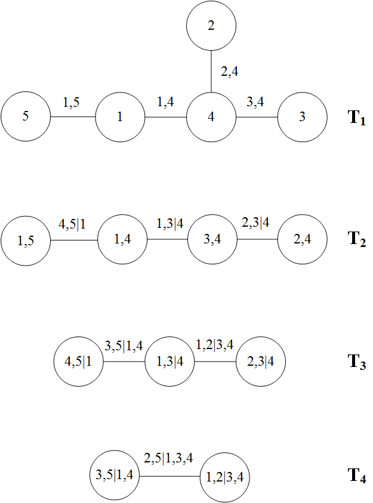

**TODO**
- [ ] 模型介绍增加尾部相依系数，常见六种Copula形式


```{r setup, echo=F}
knitr::opts_knit$set(root.dir = getwd())
knitr::opts_chunk$set(echo = FALSE, results = 'hide')
knitr::opts_chunk$set(warning = FALSE, message=FALSE)
```

```{r prepare}
rm(list=ls())
options(digits=4)
options(scipen=100)
graphics.off()
Sys.setlocale("LC_ALL", "Chinese")
```

# 引论

## 研究背景和意义

### 研究背景

防范化解重大风险，特别是防控系统性金融风险被列为我国“三大攻坚战” 之首。根据2019年中央经济工作
会议相关精神，防范金融市场异常波动和共振，打好防范化解系统性风险这一重点战役，是保持经济持续健
康发展的重要保障。当前我国经济运行稳中有变、变中有忧，外部环境复杂严峻，经济面临下行压力。需市
场各主体坚决坚持稳中求进工作总基调，特别地，对于金融市场来说，需继续坚持以供给侧结构性改革为主
线，深化市场化改革、扩大高水平开放，加快建设现代化经济体系，保持经济持续健康发展和社会大局稳定，
为全面建成小康社会收官打下决定性基础。

随着我国经济体制改革不断深化，尤其是利率市场化改革的纵深推进,对我国金融业带来了两大显著影响：首
先是促进以单一盈利业务为主的业务分业经营模式向包含多种创新业务的混业经营模式逐渐转变；其次是推
动金融不断创新,金融衍生产品快速发展，不同类型的市场参与主体之间因此有了更加紧密的联系，进而导致
证券市场中各个行业板块结构日益复杂化，其关联性和依存性增加，使得证券市场发生系统性金融风险的可
能性及系统风险程度大大增加。

而且当系统性风险发生时，不仅影响金融机构自身的发展，影响所在行业的稳定，甚至会影响国民经济乃至全
球经济的稳定。不仅如此，系统性风险往往呈现较强的传染性，某一个体受到系统性风险冲击时，会快速影响
到其它个体。在股票价格的调节过程中，及时发现板块间股价变动的联动性，也可以一定程度上避免受到板块
间风险传染的影响。


### 研究意义

我国现阶段系统性金融风险日益凸显，但相关市场主体的风险防范意识相对淡薄且风险管理水平较弱。
同时“金融机构‘太大而不能倒’（‘too big to fail’）的传统观念正逐步向‘太关联而不能倒’（‘too
interconnected to fail’）的思想转变[@杨子晖2018]”。正是由于证券市场中的各行业板块的股价日趋呈现出
交叉联动的特点，研究证券市场板块间风险传染路径、机制以及风险相关程度、影响力度，为政策制定及投资
决定提供参考建议，成为一个日渐紧迫的任务，越来越具有现实意义。

在风险管理领域，由于风险传染效应，某一金融行业的收益率损失会迅速传播到其他板块，从而引发系统性风
险，所研究股市行业的相关性可为风险度量和管理提供建议和指导。由于证券市场总是能够反映实体经济的运
行状况，股票价格的变动和互相影响往往是相关行业、企业之间的实际关联关系的具体反映。所以对于板块溢
出效应的研究能够很好地帮助我们认识实体经济当中，行业和地区之间不同的经济部门所处的经济关系，还有
一个行业或者地区的经济单位对不同行业、地区经济单位的影响作用。

在投资领域，根据马科维茨的理论，投资者在进行资产选择和组合的时候，需要考虑资产之间的相关性，要求
选择相关性较小的资产。因此研究股市行业板块之间的相关性也能指导投资者进行资产配置。投资机会的把握和投
资组合的构建都需要对不同股票之间的关联关系有非常清晰、全面的认识，如果仅把单个股票、板块孤立起来
加以研究和考察，则无法准确地判断新的市场信息对整个股票市场上不同板块的公司产生的总体影响，
这就会极大地削弱投资组合的盈利和避险能力。

因此本文将首先通过CCA模型对我国证券市场金融各板块的系统性风险进行度量，然后运用前沿的藤理论，将板块
与板块组成一个整体，并且以Copula为媒介，确定板块间风险的相关关系，进而对金融板块的风险传染进行分析
探究。最终得到的结论不仅将利于投资者根据板块的关联性做出最优的投资组合决策，而且可以为政策制定者和
市场监管者如何更有效防范系统性风险提供理论依据和实践指导。

## 国内外文献综述

### 关于系统性风险定义、形成及影响因素的研究

关于系统性金融风险的定义，目前大多文献都是从系统性金融风险的产生、传染及其造成的影响三个角度去定义。Markowitz（1952）首先提出“均值-方差”模型，认为系统性风险是和整个市场有关的风险，不能通过投资组合来分散。Minsky（1980）认为系统性金融风险来源于金融系统内部脆弱性以及金融体系和宏观经济周期之间的相互关联性。Bandt和Hartmann（2000）指出系统风险就是困难的处境从一个机构、市场或者系统向其他机构、市场或者系统的传染。Kupiec和Nickerson（2004）将系统性金融风险定义为整个经济体表现出公司流动性紧缺、资产价格异常波动、破产风险大幅提高的动荡状态。

### 关于系统性风险量化方法的研究

国内外对系统性风险的量化方法主要包括以下三种：

（1）综合指标法

综合指标法。即通过构建子系统指标，综合衡量当前金融体系风险综合状况的方法， 主要包括两个步骤，一是选取对系统性风险影响较大的指标，二是采取一定的统计方法对指标进行综合，从而得到能够衡量当前系统性风险整体状况的指数。 从预警应用角度来看，综合指数法基于历史数据设定阈值或划定风险等级，当指数高于阈值或在风险等级中处于高位时，可做出预警。由于综合指数结构法明了清晰， 并且运用较为灵活、可简可繁，因此在实践中被广泛运用。

许涤龙等（2015）基于CRITIC赋权法，通过选取银行、房地产、股票市场和外部金融市场等四个市场的宏观性指标，构建金融压力指数FSI，对我国的系统性金融风险进行测度[@许涤龙2015]。

唐升等（2018）选择宏观经济运行指标、金融机构经营指标、泡沫经济指标和外部资本冲击指标等四类指标通过熵值法构建了我国系统性金融风险指标，对我国的系统性金融风险预警系统的建设提出了建议[@唐升2018]。


综上，关于综合指标法的应用主要是通过宏观、微观和市场三个层面构建子系统指标。之后学者们在综合指标法中逐渐引入金融市场数据，完善了系统性风险测度和预警的指标体系。但综合指数法的弊病在于其始终无法体现金融机构间的风险传染效应。

（2）VaR法

 VaR，即在险价值。由Baumol（1963）第一次提出，在给定置信水平和持有期下，基于股票市场数据估计单个头寸或投资组合在常态市场环境中可能面临的最大损失。该方法在巴塞尔协议Ⅰ得到首次官方运用，主要用以评估资产、利率和汇率等金融风险。此后，VaR方法因其操作简便、易于推广和标准化，在风险测度中得到了广泛的运用。
 
 文献。
 
 但从VaR的计算方法可以看出，其存在些许不足。因此学者后续对其进行了改进，改进后的计算方式主要有两种：条件风险价值CoVaR和期望损失ES。
 
 条件风险价值（CoVaR，Condi-tional VaR）由Adrian等（2008）提出，一经提出便受到广泛关注，其主要用于度量投资组合在危机或高风险情况下面临的损失。在国内，CoVaR属于系统性风险测度的主流方法。
 
赵树然等（2018）基于异质市场假说，利用高频数据构造了多银行和系统间多元联合分布过程，并将银行间的动态联系纳入考虑，构建高频动态多条件Co VaR模型及基于此的群体性系统性风险贡献指标，从群体分析视角出发,研究了不同商业银行群体对金融体系的风险溢出效应[@赵树然2018]。
 
 但是CoVaR 并非完美，其存在两个关键的缺陷：其一，整个金融体系的系统性风险并不能直接与运用该方法度量的单个机构风险溢出之和划等号；其二，由于此方法基于高频数据，易造成尾部损失的总体严重性信息缺失，从而使得尾端风险度量失准。
 
由Artzner等（1999）提出的期望损失（Expected Shortfall）是对VaR的进一步改进，改进之处在于当损失超出估计值时，VaR方法失效，而此时ES可明确给出VaR无法度量的条件期望。因此，许多学者指出与VaR相比，ES测度更具理论优势，在该方法下度量的风险精度更高，更具价值。
 
文献。


（3）相关违约法

相关违约法的主要思想是基于Copula函数通过对单个机构违约概率的分析估计总体违约概率。CCA是其中运用最为普遍的一个方法。

CCA。未定权益分析（ContingentClaimsAp-proach，CCA）模型由Lehar（2005）提出。该方法假设单个机构的期望损失服从广义极值分布，采用一种非参的依赖性度量方法演绎出联合期望损失，以此考查系统性风险。经由Gray、Jobst等人的改进，CCA得到了巨大的发展和广泛的运用。Gray等（2008，2010，2011）将CCA的运用领域从微观扩展至宏观，可用于计算包括主权债务风险在内的宏观系统性金融风险。Jobst和Gray（2014）提出了SystemicCCA（SCCA），即将整个金融系统看作单个机构未定权益的组合，通过多元极值理论将CCA方法向多元扩展。在国内，

宋凌峰等（2018）基于资产负债表数据和资本市场数据, 将马尔科夫区制转移模型同CCA模型结合，以计算的违约距离作为保险业系统性风险的测度指标, 对保险业系统性风险中内部脆弱性和外部经济波动影响进行度量，研究引起保险行业系统性风险变化的内生因素[@宋凌峰2018]。

与其他方法相比, 或有权益分析法 (CCA) 具有明显优势:一是CCA综合了资产负债数据和前瞻性的股票市场数据, 而尾部度量法依赖于金融市场数据, 资产负债信息捕捉不足;二是CCA能够刻画风险指标周期更新的时变特征，及时反映系统性风险内生性的变化趋势[@gray2010]。

### 关于系统性风险传染效应测度方法的研究

统计模型法：
相关系数法
VAR模型法

郭娜等（2018）先通过因子分析法构建出我国区域金融安全指数，然后将VAR模型与马氏链结合，识别出不同时期我国区域金融安全所处的状态[@郭娜2018]。

喻开志等（2018）则从VAR模型衍生使用关联性衡量方法（DY法）对短期国际资本流动、汇率、房地产、股市和利差等五个成分的金融系统，从理论和系统关联性角度对短期国际资本流动与国内金融市场间相互影响机制进行了深入分析[@喻开志2018]。


Copula函数簇法
叶五一等（2018）将Copula模型与GAS模型相结合，从动态的角度对我国28个行业的动态相关关系和系统性风险溢出变化趋势进行了探究[@叶五一2018]。

尾部分析法：
△CoVaR法
△CoVaR即系统性风险贡献，通常定义为金融机构在危机状态下的条件在险价值CoVaR与它在正常状态或基准状态的条件在险价值CoVaR之差，用以测度金融机构在某一时点下可能的风险事件对整个金融系统潜在的风险溢出的大小。通过将CoVaR和△CoVaR结合，能够实时反映金融机构可能的风险事件对整个金融系统潜在的风险溢出水平。

方意等（2018）


MES法
SRISK法
SRISK即系统性风险贡献度，最早由Brownlees，Christian 和Engle[@brownlees2016]提出，属于较为新颖的方法。其计算思路与综合指标法类似，都是寻找某些宏微观指标来反应系统性风险。但综合指标法反映的是风险程度，而SRISK法则计算的是风险贡献程度。

肖崎等（2018）通过选择资产周转率、非传统生息资产占比、非利息收入占比、不良贷款率、资产收益率、权益乘数、GDP等指标构建SRISK模型，实证检验了我国商业银行轻型化转型对系统性风险的影响[@肖崎2018]。

网络分析法

网络分析法通过定义金融关联网络中的节点和连线，对金融系统的内在结构和网络复杂性进行测度。

李绍芳等（2018）从尾部风险和溢出效应的视角出发, 利用2007～2017年中国上市金融机构数据, 基于动态尾部事件驱动网络模型构建了中国金融机构体系的关联网络, 并在此基础上分析了金融机构关联水平与系统性风险之间的关系[@李绍芳2018]。

除上述总结的方法外，部分学者也会通过其他方式对系统性风险的传染进行研究，例如：王桂虎等（2018）运用双向固定效应模型和面板logit模型对35个OECD国家的保险业资产负债流动性错配指数和系统性金融风险之间的关系进行了实证检验，结果表明保险业资产负债流动性错配指数与金融危机之间呈现显著的正相关关系[@王桂虎2018]。


## 研究内容和方法

### 研究内容

本文共分为五个部分，各部分的主要内容如下：

第一部分是引论，包括论文研究背景与意义、文献综述、研究内容与方法以及研究的创新之处。其中文献综述主要从系统性风险的金融理论、系统性风险的量化、系统性风险传染效应测度三个角度对国内外文献进行了归纳总结。

第二部分是对本文在研究过程中所涉及的模型进行介绍。首先对用于系统性风险测度的CCA模型进行介绍，指明选用CCA模型的原因以及CCA模型的计算方法；然后介绍Copula模型的基本原理以及基于Copula模型的相依性计量方法；最后介绍藤Copula的理论基础，包括多元Copula分解及常见的藤结构。

第三部分是以CCA模型为基础对金融各板块的系统性风险进行计算。但是在计算中，本文并非直接使用板块指数
等整体性指标计算板块的系统性风险，而是通过化整为零，先计算各板块样本股的违约距离，再进行汇总得到板块
的系统性风险，尽可能减小系统性风险测度过程中存在的误差。基于CCA模型的计算原理，该部分先对计算时所需
的指标进行处理，主要包括无风险利率的选取、股权市场价值和债权账面价值的计算以及股权波动率的计算。
然后通过R语言的nleqslv函数求解样本股的资产市场价值及其波动率，进而得到样本股以及所属版块的违
约距离。最后对近十年金融板块的系统性风险波动进行简要分析，寻找波动的原因并对整体趋势做一个评估。

第四部分是通过RVine-Copula模型分析金融板块间的系统性风险传染效应。该部分主要分为两节：第一节是构
建RVine-Copula模型，首先使用第三部分计算得到的各板块违约距离序列通过经验分布函数转换为[0,1]上的
均匀分布，然后以新序列为基础确定最优的R藤结构形式，将金融板块的基本网络搭建出来，并进行相应的分
析，最后确定并估计藤结构中节点与节点间边的Copula类型及参数值，通过分析Copula的类型和相应的取值，
分析板块间的上尾相关性或下尾相关性；第二节是在第一节的基础上计算板块间的尾部相依系数、无条件Kendall相关系数和
条件Kendall相关系数，分析得到板块间系统性风险的传染效应。

第五部分是本论文的结论与建议。该部分总结了理论和实证分析得出的结果，在此基础上为投资者的投资组合决策和防范系统性风险的监管政策提供了一定的理论依据和实践指导。

### 研究方法

本文主要采用了文献研究法、描述性研究法和定量分析法。

本文通过运用文献研究法，首先对当前学术界对系统性风险的定义、形成因素以及影响因素做了简要的介绍，
先从整体上对系统性风险有一个基本的认识；然后对系统性风险的测度方法进行梳理，通过比较不同学者，不同
时期对系统性风险测度方法的研究，进一步的认识系统性风险，并为本文对系统性风险的研究提供思路；最后转向
对风险传染效应的文献研究中，通过比较不同研究风险传染的模型，归纳总结各模型的特点和优势，确定最
适合本文研究思路的模型，并加以拓展创新。

在实证研究部分，本文主要用到的基础模型有CCA模型和Copula模型。但在实际应用中，本文则将这两个模型
和藤结构有机结合起来，构建了CCA-Vine-Copula模型来测度金融板块间系统性风险的传染效应。首先通过CCA
模型利用定量分析法计算出金融各板块样本股的违约距离，进而汇总得到的板块整体的系统性风险；然后
运用描述性研究法，对近十年以来各板块的系统性风险进行分析，确定风险波动的原因；最后则是利用藤Copula
模型，对板块间的风险传染效应进行探究，综合利用定量分析法和描述性研究法，对藤结构、板块间Copula
函数的形式和板块间尾部相依系数、无条件Kendall系数与条件Kendall系数进行分析，尽可能全面的对金融板块间的系统性风
险传染有深刻的探究。

## 本文的创新点

本文将从以下两个方面进行创新：

一、目前国内学者在对行业信用风险进行度量时更多的是直接用行业整体的指标进行计算，但是在计算时，相当于是先对行业样本股的相关指标求和，再通过模型的相应计算原理进行计算。本文则是直接采用行业样本股的相关财务指标和市场数据计算个股的违约距离，然后再通过加权平均个股的违约距离来指代整个行业的系统性风险，在一定程度上提高了对行业系统性风险的测量精度。

二、在研究系统性风险传染时，国内学者更多的是研究两个主体间的风险传染，即使在研究多个主体时，也主要是将多个主体两两匹配，对配对的主体进行相应的研究。本文则是运用藤理论，通过藤结构将多个主体联系在一起，从系统的角度研究多个主体间的系统性风险传染，尽可能避免了对金融系统的割裂。

# 模型理论基础

## CCA模型理论基础

### Black-Sholes-Merton期权定价模型

布莱克-舒尔斯-墨顿模型（Black–Scholes–Merton model），简称为BSM模型，是一种为期权或权证等金融
衍生工具定价的数学模型。该模型提供了一种由基础资产与无风险利率构成、完全复制期权价格变动的资产
组合，定价过程就是以无风险利率为折现率，计算期权权益在风险中性测度的折现值。模型具体形式如下：

$$C = SN\left(d_1\right) - Le^{-rT}N\left(d_2\right)$${#eq:bsm-model}

其中：

$$d_1= \frac{\ln\frac{S}{L}+\left(r+\frac{\sigma ^2}{2} \right)T}{\sigma\sqrt T}$${#eq:bsm-d1}

$$d_2=\frac{\ln\frac{S}{L}+\left(r-\frac{\sigma ^2}{2} \right)T}{\sigma\sqrt T}=d_1-\sigma\sqrt T$${#eq:bsm-d2}

在[@eq:bsm-model]、[@eq:bsm-d1]、[@eq:bsm-d2]式中，$C$表示期权权益在风险中性时的合理价格，
$S$表示期权所对应的金融资产的现价，$N\left(\right)$表示标准正态分布的分布函数（$\frac{1}{\sqrt {2\pi}}\int_{-\infty}^{d_n}{e^{-\frac{x^2}{2}}}dx$），
$L$表示期权的有效期，$r$表示无风险利率，$T$表示期权有效天数与365的比值，$\sigma^2$表示期权所
对应的金融资产的波动率。在使用该BSM期权定价公式时，有如下五个基本假设：

+ 金融资产的对数收益率服从正态分布
+ 在期权的有效时间内，无风险利率和该金融资产的收益稳定
+ 在市场中进行交易时没有交易成本和税赋
+ 该金融资产不存在红利或其他特殊收益
+ 该期权为欧式期权，在期权到期日前不可提前行权

只有在上述假设成立时，使用BSM公式对期权的定价才具有准确性。

### CCA模型理论

或有权益模型（Continent Claims Analysis，简称CCA）是在Black-Sholes-Merton期权定价模型的基础上，
通过引入企业的资产负债表，将企业的财务数据与市场数据结合起来构建风险资产负债表，进而对企业的风
险进行整体分析的一种方法。CCA模型将企业的市场价值（$A$）拆分为股权市场价值（低级别权益，$E$）和债务市场
价值（高级别权益，$D$）。当企业市场价值小于债务市场价值时，表明该企业无力偿还债务，即违约发生，风险出现。

需要注意的是，或有权益模型中的企业价值和债务价值均为市场价值，不能通过企业财报得到直接
数据。因此CCA方法指出，可通过以下方法间接计算得到企业的市场价值。具体做法为将股权看为价值为$A$，行权价格为债务账面价值$B$的欧式看涨期权，根据BSM
公式可得股权的市场价值为：

$$E=AN\left(d_1\right)-Be^{-rT}N\left(d_2\right)$${#eq:cca-equity}

$$d_1=\frac{\ln\left(\frac{A}{B}\right)+\left(r+\frac{\sigma^2_A}{2}\right)T}{\sigma_A\sqrt{T}}$${#eq:cca-equity-d1}

$$d_2=\frac{\ln\left(\frac{A}{B}\right)+\left(r-\frac{\sigma^2_A}{2}\right)T}{\sigma_A\sqrt{T}}=d_1-\sigma_A\sqrt{T}$${#eq:cca-equity-d2}

其中，$E$表示股权的市场价值，$A$表示企业资产的市场价值，$N\left(\right)$表示标准正态分布的分布函数，
$B$表示企业债务的账面价值，$r$表示无风险利率，$T$表示当前时刻到到期日的时间（按年计算），
$\sigma_A^2$表示企业资产市场价值的波动率。

但是，[@eq:cca-equity]、[@eq:cca-equity-d1]、[@eq:cca-equity-d2]中$A$、$\sigma_A$均未知，因此需增加一个条件：

$$\sigma_E=\frac{N\left(d_1\right)A}{E}\sigma_A$${#eq:cca-equity-sigma}

其中$\sigma_E$为股权波动率，可通过市场数据得到。综上，通过联立[@eq:cca-equity]、[@eq:cca-equity-d1]、
[@eq:cca-equity-d2]和[@eq:cca-equity-sigma]即可解出企业资产的市场价值$A$和企
业资产市场价值的波动率$\sigma_A$。

<!--在求解债务市场价值时可将其看做债务账面价值($B$)与预期损失净现值（$P$）的差值，即：

$$D=B-P$${#eq:cca-debt-basic}

而预期损失净现值可看做为价值为$B$，行权价格为企业资产价值$A$的欧式看跌期权，通过对BSM公式的推导，
可得到预期损失净现值的计算公式：

$$P=Be^{-rT}N\left(-d_2\right)-AN\left(-d_1\right)$${#eq:cca-debt}

$$d_1=\frac{\ln\left(\frac{A}{B}\right)+\left(r+\sigma^2_A\right)T}{\sigma_A\sqrt{T}}$${#eq:cca-debt-d1}

$$d_2=\frac{\ln\left(\frac{A}{B}\right)+\left(r-\sigma^2_A\right)T}{\sigma_A\sqrt{T}}=d_1-\sigma_A\sqrt{T}$${#eq:cca-debt-d2}

通过联立[@eq:cca-debt]、[@eq:cca-debt-d1]、[@eq:cca-debt-d2]和[@eq:cca-equity-sigma]即可解得$P$，
进而计算出企业的债务市场价值$D$。-->

<!--除此之外，通过CCA模型也-->进而可计算得出企业的违约距离DD和企业的违约概率PD。违约距离DD的计算公式为：

$$DD=\frac{A-B}{A \cdot \sigma_A}$${#eq:dd}

企业的违约距离DD越短，违约概率越大，企业的风险暴露越大；违约距离DD越长，违约概率越小，企业的风险暴露越小。

## Copula函数理论基础

### Sklar定理

Sklar定理是Copula理论的基础。Copula理论简言之就是通过联结函数$C$，将多个变量的边缘分布联结起来，
构成这些变量的多元联合分布函数。特别的，对于仅包含两个变量的情况，且这两个变量均服从[0,1]的均匀
分布时，一定存在一个联结函数$C$，使得二元联合分布函数可用两个变量的边缘分布函数表示。

Copula函数的表达形式为：

$$F\left(x_1,x_2,...,x_n\right)=C\left(F_1\left(x_1\right),F_2\left(x_2\right),...,F_n\left(x_n\right)\right)$${#eq:copula}

其中，$F\left(x_1,x_2,...,x_n\right)$表示变量$x_1,x_2,...,x_n$联合概率分布函数，$c\left(\right)$表
示$n$维联结函数，$F_n\left(x_n\right)$表示变量$x_n$的边缘分布函数。若边缘分布函数的反函数均存在，
则Copula函数的计算公式为：

$$c\left(u_1,u_2,...,u_n\right)=F\left(F_1^{-1}\left(x_1\right),F_2^{-1}\left(x_2\right),...,F_n^{-1}\left(x_n\right)\right)$${#eq:copula-solve}

在模型使用过程中，更多的是用式[@eq:copula-solve]。在已知多元联合分布函数和各边缘分布函数时，就可以
通过式[@eq:copula-solve]得到联结函数的形式及各参数值，进而可对变量之间的相关程度进行研究。

### 几种常见的Copula形式

常见的Copula主要包含两大类型：椭球类Copula函数和阿基米德类Copula函数。两类Copula函数最大的区别在于椭球类Copula函数主要用于刻画尾部对称的相关关系，而阿基米德类Copula函数则在刻画尾部相关性非对称时具有良好的效果。

### 基于Copula模型的传染效应测度方式

在通过Copula函数度量变量间的相关程度时一般使用Kendall's $\tau$秩相关系数进行判断。

Kendall's $\tau$秩相关系数主要从一致性的角度对变量之间的相关关系进行测度。设$\left(x_i,y_i\right)$
和$\left(x_j,y_j\right)$是随机变量$X$，$Y$的两组情况，当$\left(x_j-x_i\right)\left(y_j-y_i\right)>0$
时，即$x_j-x_i$与$y_j-y_i$同号时，则认为随机变量$X$和$Y$具有一致性。反之，当
$\left(x_j-x_i\right)\left(y_j-y_i\right)<0$时，即$x_j-x_i$与$y_j-y_i$异号时，则认为随机变量$X$和
$Y$是不一致的。根据这一原理，可得到Kendall's $\tau$秩相关系数的计算公式为：

$$\tau_{X,Y}=P\left[\left(x_j-x_i\right)\left(y_j-y_i\right)>0\right]-P\left[\left(x_j-x_i\right)\left(y_j-y_i\right)<0\right]$${#eq:tau}

结合Copula函数理论和Kendall's $\tau$的计算公式，可得到的在使用Copula模型时，两个变量间的Kendall's $\tau$相关系数，推导过程如下：

$$\begin{array}{lcl}
\tau_{X,Y}&=&P\left[\left(X_1-X_2\right)\left(Y_1-Y_2\right)>0\right]-P\left[\left(X_1-X_2\right)\left(Y_1-Y_2\right)<0\right]
\\&=&P\left[\left(X_1-X_2\right)\left(Y_1-Y_2\right)>0\right]-\left\{1-P\left[\left(X_1-X_2\right)\left(Y_1-Y_2\right)>0\right]\right\}
\\&=&2P\left[\left(X_1-X_2\right)\left(Y_1-Y_2\right)>0\right]-1
\\&=&2\left\{P\left(X_2<X_1,Y_2<Y_1\right)+P\left(X_1<X_2,Y_1<Y_2\right)\right\}-1
\\&=&2\left\{\iint_{D}P\left(X_2<X,Y_2<Y\right)dC\left(F\left(x\right),G\left(y\right)\right)+\iint_{D}P\left(X_2>X,Y_2>Y\right)dC\left(F\left(x\right),G\left(y\right)\right)\right\}-1
\\&=&2\left\{\iint_{D}C\left(F\left(x\right),G\left(y\right)\right)dC\left(F\left(x\right),G\left(y\right)\right)+\iint_{D}\left(1-F\left(x\right)-G\left(y\right)+C\left(F\left(x\right),G\left(y\right)\right)\right)dC\left(F\left(x\right),G\left(y\right)\right)\right\}-1
\\&=&2\left\{\iint_{D}C\left(u,v\right)dC\left(u,v\right)+\iint_{D}\left(1-u-v+C\left(u,v\right)\right)dC\left(u,v\right)\right\}-1
\\&=&2\left\{\iint_{D}C\left(u,v\right)dC\left(u,v\right)+1-\frac{1}{2}-\frac{1}{2}+\iint_{D}C\left(u,v\right)dC\left(u,v\right)\right\}-1
\\&=&4\iint_{D}C\left(u,v\right)dC\left(u,v\right)-1
\end{array}$${#eq:copula-tau}

进而可根据Copula函数的形式以及相关参数得到两个变量间的Kendall's $\tau$ 相关系数，并以此为依据进行下一步的分析。

## VineCopula模型理论基础

### Pair Copula分解原理

正如前文对Sklar定理的阐述，变量的联合分布函数可由这些变量的边缘分布通过联结函数$C$联结起来。构成
这些变量的多元联合分布函数。。但是一旦面对多元变量的情况，就会陷入“维数灾难”之中：一来会使得Copula
函数的形式过于复杂，所需估计的参数过多，二来甚至有Copula函数不存在的可能，不利于进一步的分析。因
此在处理多元问题时需通过降维的方式，简化问题。在Sklar定理中提到对于仅包含两个变量的情况，且这两个
变量均服从[0,1]的均匀分布时，一定存在一个联结函数$C$，使得二元联合分布函数可用两个变量的边缘分布
函数表示。所以可通过Pair Copula 的方法对多元Copula函数进行分解。

例如，针对二维变量的情况有：

$$f\left(x_1,x_2\right)=c_{1,2}\left\{F_1\left(x_1\right),F_2\left(x_2\right)\right\}\cdot f_1\left(x_1\right)\cdot f_2\left(x_2\right)$${#eq:paircopula-2}

根据链式法则可得：

$$f\left(x_1\left|x_2\right.\right)=\frac{f\left(x_1,x_2\right)}{f_2\left(x_2\right)}=c_{1,2}\left\{F_1\left(x_1\right),F_2\left(x_2\right)\right\}\cdot f_1\left(x_1\right)$${#eq:paircopula-2-cond}

针对三维变量的情况可得到：

$$\begin{array}{lcl}
f\left(x_1,x_2,x_3\right)&=&f_1\left(x_1\right)\cdot f\left(x_2\left|x_1\right.\right)\cdot f\left(x_3\left|x_1,x_2\right.\right)
\\&=&f_1\left(x_1\right)\cdot c_{1,2}\left(F_1\left(x_1\right),F_2\left(x_2\right)\right)\cdot f_2\left(x_1\right)\cdot f\left(x_3\left|x_1,x_2\right.\right)
\end{array}
$${#eq:paircopula-3}

其中$f\left(x_3\left|\right.x_1,x_2\right)$需通过变换条件，达到求解的目的，具体转换方法如下：

$$\begin{array}{lcl}
f\left(x_3\left|x_1,x_2\right.\right)&=&\frac{f\left(x_2,x_3\left|x_1\right.\right)}{f\left(x_2\left|x_1\right.\right)}
\\&=&\frac{c_{23\left|1\right.}\left(F\left(x_2\left|x_1\right.\right),F\left(x_3\left|x_1\right.\right)\right)\cdot f\left(x_2\left|x_1\right.\right)\cdot f\left(x_3\left|x_1\right.\right)}{f\left(x_2\left|x_1\right.\right)}
\\&=&c_{23\left|1\right.}\left(F\left(x_2\left|x_1\right.\right),F\left(x_3\left|x_1\right.\right)\right)\cdot f\left(x_3\left|x_1\right.\right)
\\&=&c_{23\left|1\right.}\left(F\left(x_2\left|x_1\right.\right),F\left(x_3\left|x_1\right.\right)\right)\cdot c_{1,3}\left(F_1\left(x_1\right),F_3\left(x_3\right)\right)\cdot f_3\left(x_3\right)
\end{array}$${#eq:paircopula-3-1}

因此，可得到$f\left(x_1,x_2,x_3\right)$经过Pair Copula方法展开后的结果为：

$$f\left(x_1,x_2,x_3\right)=f_1\left(x_1\right)\cdot f_2\left(x_2\right)\cdot f_3\left(x_3\right)\cdot c_{1,2}\left(F_1\left(x_1\right),F_2\left(x_2\right)\right)\cdot c_{1,3}\left(F_1\left(x_1\right),F_3\left(x_3\right)\right)\cdot 
c_{23\left|1\right.}\left(F\left(x_2\left|x_1\right.\right),F\left(x_3\left|x_1\right.\right)\right)
$${#eq:paircopula3-2}

但是，需要注意的是，在假定$x_1$，$x_2$，$x_3$不可相互替代时，我们在前面计算
$f\left(x_1,x_2,x_3\right)$时采用的是$f_1\left(x_1\right)\cdot f\left(x_2\left|x_1\right.\right)\cdot f\left(x_3\left|x_1,x_2\right.\right)$
变换得到的，但我们也可以证明$f_2\left(x_2\right)\cdot f\left(x_3\left|x_2\right.\right)\cdot f\left(x_1\left|x_2,x_3\right.\right)$同样可以推导至$f\left(x_1,x_2,x_3\right)$，
不过此时再进行Pair Copula分解时，得到的结果为：

$$f\left(x_1,x_2,x_3\right)=f_1\left(x_1\right)\cdot f_2\left(x_2\right)\cdot f_3\left(x_3\right)\cdot c_{1,2}\left(F_1\left(x_1\right),F_2\left(x_2\right)\right)\cdot c_{2,3}\left(F_2\left(x_2\right),F_3\left(x_3\right)\right)\cdot 
c_{13\left|2\right.}\left(F\left(x_1\left|x_2\right.\right),F\left(x_3\left|x_2\right.\right)\right)
$${#eq:paircopula3-3}

可以发现式[@eq:paircopula3-2]与式[@eq:paircopula3-3]存在较大差异。在三维变量的情况下，共存在
$3！/2=3$种分解方式，而每种分解方式得到的结果均不同。因此在研究分析时，具体选择哪一种分析方式
就成为了一个新的问题。关于该问题将在下一节进行解释和回答。

### 规则藤结构概述

按照Pair Copula分解原理，对于一个包含n维变量的联合密度函数，将会存在$n!/2$种分解方法。针对如此繁多
的分解方法，Bedford和Cooke在2001年进行了归纳总结，并依赖“图论”思想，提出了“藤”的模式。藤Copula解决
了传统构建多元Copula函数所遇到的困难和问题。藤的类型主要包括C藤、D藤和R藤。由于本文在建模时主要采
用的为R藤结构，因此主要介绍R藤Copula模型的概况。

不妨以一个包含五维变量的R藤模型为例。一个五维R藤包含四棵树，分别记为$T_1$，$T_2$，$T_3$，$T_4$，
设五个变量分别为1,2,3,4,5，则对于第一棵树$T_1$，1,2,3,4,5也是其5个节点，节点与节点间的线段表示
Copula函数的某一种类型。“|”之后的变量表示条件变量。

则可构造如下五维R藤模型的概念图：

```{r vine,echo=FALSE,fig.cap="五维R藤模型结构图",cache=F,dev="png",results='markup'}

```

针对上述概念图可得到这五维变量的多元联合密度函数：

$$f=f_1\cdot f_2\cdot f_3\cdot f_4\cdot f_5\cdot c_{1,2}\cdot c_{2,3}\cdot c_{3,4}\cdot c_{3,5}\cdot c_{1,3\left|2\right.}\cdot c_{2,5\left|3\right.}\cdot c_{2,4\left|3\right.}\cdot  c_{1,5\left|2,3\right.}\cdot c_{4,5\left|2,3\right.}\cdot c_{1,4\left|2,3,5\right.} $${#eq:vine}

当然，五维R藤模型不止上述一种构造方法。为了简便表示R藤结构的形式，J.DiBmann提出可用下三角矩阵描述
这种结构信息。例如，针对概念图中的结构，可构造以下结构矩阵：

$$M=\left(\begin{matrix}
1&{}&{}&{}&{}\\
4&4&{}&{}&{}\\
5&5&2&{}&{}\\
3&2&5&3&{}\\
2&3&3&5&3
\end{matrix}\right)$${#eq:vine-matrix}

在矩阵[@eq:vine-matrix]中，对角线上的值与矩阵最后一行的值共同构成了图 \@ref(fig:vine)中第一棵树
$T_1$的边，即集合$\left\{\left\{1,2\right\},\left\{3,4\right\},\left\{2,3\right\},\left\{3,5\right\}\right\}$;
对角线上的值和矩阵倒数第二行的值在一矩阵最后一行为条件时，则共同构成了图\@ref(fig:vine)中第二棵树$T_2$的边，
即集合$\left\{\left\{1,3\left|2\right.\right\},\left\{2,4\left|3\right.\right\},\left\{2,5\left|3\right.\right\}\right\}$，
同理可根据矩阵[@eq:vine-matrix]推导出树$T_3$、$T_4$。综上，当结构矩阵$M$唯一确定时，则R藤结构也确定下来，同时可以发现其没有特殊的结构限制，具有较强的灵活性，可以更好的识别不同变量间复杂的相关关系。

# 基于CCA模型的金融各板块系统性风险测度

## CCA模型参数的选择与计算

### 各板块样本股的选择

本文选取的样本均为在我国沪市和深市上市的金融企业，并以证监会和证交所制定的行业板块分类标准进行划分。
由于建模所需数据涉及上市公司的财务数据，因此本文不将2019年上半年上市的企业纳入样本中。最终共
包括银行板块的31只股票，券商信托板块的41只股票，保险板块的7只股票、多元金融板块的25只股票和房地产板块
的141只股票。借鉴杨子晖等[@杨子晖2018]的做法，由于房地产板块因为具有较强的金融属性，所以也纳为本文的研究对
象。本文的研究区间为2009年7月1日至2019年6月30日。

本文研究过程涉及的数据包括各样本股近十年季报中资产负债表的相关数据、交易日的收盘价数据和个股总市值数
据、一年期定期整存整取利率、港元兑人民币汇率和人民币兑美元汇率。数据来源于CSMAR数据库、同花顺数据中心、
中国人民银行官网等。数据分析软件包括R和Excel等。

由于本文在测度板块系统性风险时，是先计算各板块样本股的违约距离，再通过加权平均的方式计算得到，而且涉及
的样本股数量过多，因此下面在计算各股违约距离时不妨以平安银行（股票代码：000001）为例，其他股票的计算方
式与分析过程类似。

```{r import-data}
rm(list=ls())
getwd()
path='F:/github_paper/vine-copula-Zeng'
setwd(path)
## load package
library(readxl)
library(xlsx)
library(splines)
library(fBasics)
library(tseries)
library(forecast)
library(fGarch)
library(nleqslv)
library(knitr)
library(FinTS)
library(rugarch)
library(VineCopula)
## load data
norisk_rate=read.csv('./no_risk_rate.csv',header=T)
no_risk_rate=norisk_rate[,3];date=as.Date(norisk_rate[,2])
stock_test=read.xlsx2('./sample_data.xlsx',sheetIndex=1,header=T,startRow = 1,endRow = 2359,
                      colClasses=c('character','character','numeric','numeric','numeric','character','character',rep('numeric',5)))
debt_book_value_test=read.xlsx2('./sample_data.xlsx',sheetIndex=2,header=T,startRow = 1,endRow = 42,
                      colClasses=c(rep('character',3),'numeric'))
```

### 到期期限与无风险利率的选择

CCA模型中到期期限一般取1年。无风险利率本文选择中国人民银行发布的一年期定期整存整取利率，无风险利率整体
的波动趋势如图 \@ref(fig:norisk-rate) 所示:
```{r norisk-rate,eval=T, fig.cap="近十年一年期定期整存整取利率", dev='png'}
plot(date,no_risk_rate,type='l',ylim=c(0,4))
```

从图 \@ref(fig:norisk-rate) 中可以发现，无风险利率经过了先上升再下降的一个过程。在2008年全球金融危机
爆发后，全球投资情绪都较为低落，大量资金从证券市场撤出，转向投资无风险产品；同时，央行作为研究并协调
解决金融运行中重大问题的机构，为了避免损失的进一步扩大，通过提高无风险利率，保证国家经济的平稳发展。
从2012年3季度到2014年年底，无风险利率趋稳。但是从2015年开始，无风险利率经过了多次显著的下调。主要原因
可概括为“内忧外患”：首先，出于应对2008年经济危机所施行的“4万亿计划”，使得国内产能过剩，上游企业背负了
较大债务，国家面临通货紧缩的压力；其次，国内经济发展放缓，房产等投资减速，企业效益欠佳，国内许多实业
企业都出现了资金链紧张情况，只有网络等虚拟经济在创新中驱动发展；最后，作为全球最大印钞机的美联储反复
提出加息，要收回钞票，这给全球带来了巨大的流动性缺口。所以，央行通过多次降息，释放流动性，一来鼓励投
资者进行实业投资，刺激市场，推动经济的健康发展，二来通过补充流动性，对冲美联储带来的流动性缺口。

### 样本股股权市场价值和债权账面价值的计算

本文在计算样本股股权市场价值时的计算方式为发行总股数与收盘价的乘积，针对非流通股，则直接用当日收盘价
进行定价。同时，考虑到上海B股和深圳B股分别是用美元和港元进行计价，因此针对这部分样本股，分别使用交易
日当日人民币对美元汇率中间价和港币兑人民币汇率中间价将各股股权市场价值转换为人民币计价的金额。

而在计算债权账面价值时，可以通过公开消息得到的仅有个股债务账面价值的季度数据，而本文在分析过程中，采
用的均为当日数据，因此需对季度数据进行插值处理。而在常见的插值方法中，三次光滑样条插值法由于其计算简
单、稳定性好、收敛性有保证，关键是显著的提高了插值函数的光滑性等优点，在数值逼近等问题的解决上得到了
越来越多的广泛应用。所以本文也采用三次样条法对个股的季度债务账面价值进行插值，得到该股当日债务账面价
值。以平安银行为例，经过插值后得到的日债务账面价值如图 \@ref(fig:cubspline) 所示:

```{r cubicspline}
n=length(stock_test$Stkcd)
  ## cubic spline
debt_book_value=spline(debt_book_value_test$Accper,debt_book_value_test$debt_book_value,n+1)
debt_book_value_date=as.Date(debt_book_value_test$Accper)
```

```{r cubspline,eval=T,fig.cap ="平安银行插值后日债务账面价值", dev='png'}
plot(debt_book_value_test$debt_book_value,type="p",xlab="日期",ylab="日债务账面价值",xaxt='n')
axis(1, at=1:41,labels = debt_book_value_test$Accper)
lines(debt_book_value$x,debt_book_value$y)
```

图 \@ref(fig:cubspline) 中展示了平安银行经过三次样条插值后的债务市场价值。图中的空心点表示平安银行近十
年季报中的债务账面价值，曲线表示其日债务市场价值。可以发现曲线平滑度较高，曲线首尾两端均为真实值，且曲线穿过所有空心点，表明插
值符合三次样条插值的规范，插值效果较好，可以用于模型的分析。

### 样本股股权波动率的计算

（1）样本股对数收益率描述性统计分析

由于股票存在分红的情况，因此在分红前后，股价会存在较大变化，因此本文在搜集个股当日收盘价数据时，选用
的为考虑现金红利再投资的收盘价的可比价格。同时，由于上海B股和深圳B股分别是用美元和港元进行计价，因此
针对这部分样本股，分别使用交易日当日人民币对美元汇率中间价和港币兑人民币汇率中间价将日收盘价转换为人
民币计价的收盘价。下面以平安银行为例：

```{r return}
price=stock_test[,'price_new']
date=as.Date(stock_test[,'Trddt'])
price_rt=diff(log(price))
```

```{r log-return,eval=T,fig.cap = "平安银行近十年日收盘价和对数收益率时序图", dev='png'}
par(mfrow=c(2,1))
par(mar=c(2,4,1,2))
plot(date,price,type="l",main="(a)平安银行近十年收盘价时序图")
plot(date[-1],price_rt,type="l",cex.main=0.95,las=1,main='(b)平安银行近十年对数收益率时序图')
```

如图 \@ref(fig:log-return) 所示，从日收盘价时序图可以看出，平安银行整体行情向好，但其中也
经过了4次较大的波动；从对数收益率时序图看，平安银行的收益率在2013年上半年、2015年全年和2018年全年波
动幅度较大，具有明显的“波动性聚集”特征。需要注意的是，平安银行的股价和对数收益率自2010年6月30日至2010
年9月1日出现不连续的特征，其原因在于当时深发展A拟与平安银行股份有限公司进行重大资产重组，由于相关事项
存在重大不确定性，需向相关方进行咨询论证，为维护投资者利益，保证公平信息披露，避免公司股价异常波动，
公司股票自2010年6月30日起停牌，于2010年9月1日复牌。

平安银行对数收益率的相关描述性统计量如表 \@ref(tab:price-rt-stats) 所示：

```{r price-rt-stats, results='markup'}
price_rt_stats=basicStats(price_rt)
JB=jarque.bera.test(price_rt)
price_rt_stats_desc=as.data.frame(t(c(price_rt_stats[c(7,14,16,15),1],as.numeric(JB[[1]][1]))))
colnames(price_rt_stats_desc) <- c("均值","标准差","偏态系数","峰态系数","J-B统计量")

kable(price_rt_stats_desc,row.names =F,align = "c", caption="平安银行对数收益率描述性统计量",
      longtable = TRUE, booktabs = TRUE, linesep="")
```

从表 \@ref(tab:price-rt-stats) 中可以看出，对数收益率的偏度为`r price_rt_stats_desc[1,3] `，峰度为`r price_rt_stats_desc[1,4]` ，表明对数收益率具有右偏尖峰的特征。而J-B统计量的值为`r price_rt_stats_desc[1,5]`，显然大于5%显著性水平对应的临界值，拒绝对数收益率服从正态分布的原假设。

（2）样本股对数收益率单位根检验

在对时间序列进行分析时，必须要通过平稳性检验后才可建模分析。本文将使用ADF检验法和PP检验法对平安银行的
对数收益率进行平稳性检验，检验结果如表 \@ref(tab:adf-test) 所示：

```{r adf-test, results='markup'}
ADF=adf.test(price_rt)
PP=pp.test(price_rt)
adf_test=data.frame(a=c(ADF$statistic[1],PP$statistic[1]),b=c(0.0001,0.0001))
colnames(adf_test)=c("检验统计量的值","P值")
rownames(adf_test)=c("ADF检验","PP检验")

kable(adf_test,row.names =T,align = "c", caption="平安银行对数收益率平稳性检验",
      longtable = TRUE, booktabs = TRUE, linesep="")
```

从表 \@ref(tab:adf-test) 中可以看出，平安银行对数收益率的ADF检验和PP检验的P值均小于1%，拒绝序列不平
稳的原假设，说明平安银行的对数收益率序列已经平稳，可进行下一步的检验。

（3）样本股对数收益率自相关、偏自相关检验

接下来对平安银行的对数收益率进行自相关检验和偏自相关检验，主要方法为通过观察ACF图和PACF图的特征判断对 数收益率的自相关性。绘制的自相关和偏自相关图如下图所示：

```{r acf-pacf, fig.cap="Shibor收益率自相关图和偏自相关图", dev='png'}
par(mfrow=c(2,1))
acf(price_rt,main="",xlab="滞后期",ylab="ACF",lag.max=20,ylim=c(-0.2,0.8))#画自相关图
title(main="(a)the ACF of Return",cex.main=0.95)
pacf(price_rt,main="",xlab="滞后期",ylab="PACF",lag.max=20,ylim=c(-0.2,0.2))#画偏自相关图
title(main="(b)the PACF of Return",cex.main=0.95)
```

从图 \@ref(fig:acf-pacf) 中可以看出，在判断自相关性时，ACF图中的自相关系数在滞后阶数20阶以内均在95%
置信区间内，表明序列不具有自相关性，MA项为0阶；在判断偏自相关性时，PACF图中的偏自相关系数在滞后阶数20
阶以内也均在95%置信区间内，表明序列不具有偏自相关性，AR项为0阶。因此，可不用拟合ARMA模型，直接对收益率
序列进行去均值化处理。处理后得到的残差平方时序图如下图所示：

```{r resi2, fig.cap="平安银行对数收益率去均值后残差平方时序图", dev='png'}
resi=price_rt-mean(price_rt)
resi2=(price_rt-mean(price_rt))^2
plot(date[-1],resi2,type='l',xlab='时间',ylab='对数收益率去均值后残差的平方')
```

从图 \@ref(fig:resi2) 中可以看出，去均值化后的残差依然有较显著的波动性聚集特征。因此需进一步进行ARCH
效应检验。

（4）样本股对数收益率ARCH效应检验

本文在进行ARCH效应检验时，采用LM统计量进行判断。对去均值化后的残差平方进行ARCH效应检验，计算得到的LM  
统计量的值为`r ArchTest(resi2,lag=5)[[1]][1]`，对应的P值为0.0001，在5%的显著性水平上拒绝残差独立的原  
假设，表明去均值化后的残差平方存在ARCH效应。因此需对对数收益率的残差拟合GARCH模型，以消除ARCH效应。

（5）样本股对数收益率GARCH模型的拟合和股权波动率的计算

从平安银行对数收益率的描述性统计量中可以看出，收益率序列具有明显的有偏性，表明正负信息的冲击不完全对
称。因此在计算股权波动率时，本文通过GJR-GARCH模型拟合平安银行对数收益率的残差序列。同时出于模型简洁性
的考虑，本文仅考虑GJR-GARCH(1,1)、GJR-GARCH(1,2)和GJR-GARCH(2,1)三种模型形式。三种模型的拟合结果如下
表所示：

```{r garch}
gjrgarch11_spec = ugarchspec(
  variance.model = list(model="gjrGARCH", garchOrder=c(1,1)),
  mean.model = list(armaOrder=c(0,0),include.mean=F))
garchfit11 = ugarchfit(spec=gjrgarch11_spec, data=price_rt)

gjrgarch12_spec = ugarchspec(
  variance.model = list(model="gjrGARCH", garchOrder=c(1,2)),
  mean.model = list(armaOrder=c(0,0),include.mean=F))
garchfit12 = ugarchfit(spec=gjrgarch12_spec, data=resi)

gjrgarch21_spec = ugarchspec(
  variance.model = list(model="gjrGARCH", garchOrder=c(2,1)),
  mean.model = list(armaOrder=c(0,0),include.mean=F))
garchfit21 = ugarchfit(spec=gjrgarch21_spec, data=resi)
```

```{r gjr-garch, results='markup'}
garchfit11_coef=data.frame(garchfit11@fit$matcoef)
garchfit12_coef=data.frame(garchfit12@fit$matcoef)
garchfit21_coef=data.frame(garchfit21@fit$matcoef)
garchfit_coef=list(garchfit11_coef=garchfit11_coef,
                   garchfit12_coef=garchfit12_coef,
                   garchfit21_coef=garchfit21_coef)
for(j in 1:3){
  for(i in 1:nrow(garchfit_coef[[j]])){
    garchfit_coef[[j]][i,5]=paste(substr(garchfit_coef[[j]][i,1],1,7),
                           if(garchfit_coef[[j]][i,4]<=0.01){'***'}
                           else{if(garchfit_coef[[j]][i,4]>0.01 & garchfit_coef[[j]][i,4]<=0.05){'**'}
                             else{if(garchfit_coef[[j]][i,4]>0.05 & garchfit_coef[[j]][i,4]<=0.1){'*'}
                               else{''}}},
                           sep='',collapse = '')
  }
}
coef_result=data.frame(row.names=c('omega','alpha1','alpha2','beta1','beta2','gamma1','gamma2','AIC','BIC'))
coef_result[,1]=c(garchfit_coef$garchfit11_coef[1:2,5],'',
                  garchfit_coef$garchfit11_coef[3,5],'',
                  garchfit_coef$garchfit11_coef[4,5],'',signif(infocriteria(garchfit11)[1:2],5))
coef_result[,2]=c(garchfit_coef$garchfit12_coef[1:2,5],'',
                  garchfit_coef$garchfit12_coef[3:5,5],'',signif(infocriteria(garchfit12)[1:2],5))
coef_result[,3]=c(garchfit_coef$garchfit21_coef[1:4,5],'',
                  garchfit_coef$garchfit21_coef[5:6,5],signif(infocriteria(garchfit21)[1:2],5))
colnames(coef_result)=c('GJR-GARCH(1,1)','GJR-GARCH(1,2)','GJR-GARCH(2,1)')
kable(coef_result,row.names =T,align = "c", caption="平安银行对数收益率GJR-GARCH模型拟合结果",
      longtable = TRUE, booktabs = TRUE, linesep="")
```

```{r gjrgarch-resi}
gjr_resi=residuals(garchfit11,standardize=T)
gjr_resi2=gjr_resi^2
```

从表 \@ref(tab:gjr-garch) 中可以看出，GJR-GARCH(1,1)的AIC值和BIC值在三个模型中均是最小的，说明该模型在
三个模型中模型拟合效果较好。而且该模型的alpha、beta、gamma系数在1%的显著性水平下均显著，表明该模型的参
数估计的准确性也较高。对收益率序列经过GJR-GARCH(1,1)模型拟合后得到的标准化残差平方再次进行ARCH效应检
验，计算得到的LM统计量的值为`r ArchTest(gjr_resi2,lag=5)[[1]][1]`，对应的P值为`r ArchTest(gjr_resi2,lag=5)[[3]][1]`，在5%的显著性水平上接受残差独立的原假设，表明经GJR-GARCH模型处理后已
消除ARCH效应。最终平安银行对数收益率的模型解析式如下式所示：

$$\left\{\begin{array}{l}
r_t=0.0002496+\varepsilon _t\\
\varepsilon_t=\sigma_tz_t\\
\sigma_t^2=0.0000011+\left(0.0570125\varepsilon_{t-1}^2-0.0262933I_{t-1}\varepsilon_{t-1}^2 \right)+0.9550297\sigma _{t - 1}^2
\end{array}\right.$${#eq:gjr-garch}

从式[@eq:gjr-garch]中可以看出参数$\alpha$、$\beta$和$\gamma$之和小于1，表明整个过程是平稳的，可用于进一步的分析。
但需要注意的是式[@eq:gjr-garch]中$\gamma$项的系数为负，其原因在于平安银行属于典型的大盘股，总市值达
到3000多亿元，且其业绩优良，属于蓝筹股的范畴，因此其抗跌性较强，当股价下跌时，其股权波动率反而有所下降。

## 金融各板块系统性风险计算与分析

### 金融各板块违约距离的计算

在模型介绍部分已经介绍了CCA模型的原理：通过联立式[@eq:cca-equity]、[@eq:cca-equity-d1]、[@eq:cca-equity-d2]
和[@eq:cca-equity-sigma]解出企业资产的市场价值$A$和企业资产市场价值的波动率$\sigma_A$，进而根据
式[@eq:dd]得到个股的违约距离。但在解该方程组时需注意两点：一是通过GJR-GARCH模型得到的股权波动率为日股权
波动率，但无风险利率选取的却是年化后率，因此需对日股权波动率乘以$\sqrt{250}$得到年化后的股权波动率；二
是该方程组属于较复杂的非线性方程组，不存在解析解，因此本文通过调用R中的nleqslv函数求解该非线性方程组：
首先定义新变量$AtoE=\frac{A}{E}$，然后对方程组中所有变量$A$转化为$AtoE \cdot E$，最后经过适当变形可得到如下新的方程组：

$$\left\{\begin{array}{l}
y_1=AtoE \cdot N\left(d_1\right)-\frac{B}{E}e^{-rT}N\left(d_2\right)-1\\
d_1=\frac{\ln\left(AtoE \cdot \frac{E}{B}\right)+\left(r+\frac{\sigma^2_A}{2}\right)T}{\sigma_A\sqrt{T}}\\
d_2==d_1-\sigma_A\sqrt{T}\\
y_2=N\left(d_1\right) \cdot AtoE \cdot \sigma_A-\sigma_E
\end{array}\right.$${#eq:cca-solve1}

令方程组[@eq:cca-solve1]中的$y_1$和$y_2$趋近于0，通过Newton优化算法即可解得$A$和$\sigma_A$的近似解。按照上述思路即可得到个股的违约距离序列。例如平安银行近十年的违约距离序列如下图所示：

```{r cca-solve}
### cca
##输入时间
r=stock_test$norisk_rate[-1]/100
T=1
B=debt_book_value$y[-c(1:2)]
##输入股权波动率和股权价值
EquityTheta=garchfit11@fit$sigma*sqrt(250)
E=stock_test$stock_market_value_new[-1]
##KMV 方程变形及求解
EtoB=E/B
x0=matrix(rep(1,2*nrow(stock_test)),nrow=nrow(stock_test))
z=list();Va=vector();AssetTheta=vector()
for (i in 1:(nrow(stock_test)-1)) {
  KMVfun=function(x){
    y=numeric(2);
    d1=(log(x[1]*EtoB[i])+(r[i]+0.5*x[2]^2)*T)/(x[2]*sqrt(T));
    d2=d1-x[2]*sqrt(T);
    y[1]=x[1]*pnorm(d1)-exp(-r[i]*T)*pnorm(d2)/EtoB[i]-1;
    y[2]=pnorm(d1)*x[1]*x[2]-EquityTheta[i];
    y
  }
  z[[i]]<-nleqslv(x0[i,], KMVfun, method="Newton") 
  Va[i]<-z[[i]]$x[1]*E[i]
  AssetTheta[i]<-z[[i]]$x[2]
}
##计算违约距离
DD=(Va-B)/(Va*AssetTheta)
```

```{r pinganbank-dd, fig.cap="平安银行近十年违约剧烈时序图", dev='png'}
datedd=as.Date(stock_test$Trddt[-1])
plot(datedd,DD,type='l')
```

从图 \@ref(fig:pinganbank-dd) 中可以看出，近十年平安银行的违约距离大部分在2上下徘徊，但中间经过了三次巨大的波动：第一次大波动发生在
2012年下半年，原因有二，一是当年平安银行董事长、行长双双离职；二是从整个银行业来看，在11家上市银行中，
有7家银行不良出现双升，其中平安银行的不良贷款增幅惊人，新增了35.75亿不良贷款，总共达68.66亿，不良率从
0.53%暴涨至0.95%，增长幅度接近翻倍，尽管2012年平安银行净利润达到134亿，同比增长30%，但随即在2013年第一
季度中，平安银行净利润同比增幅就暴跌至上市银行中倒数第一，这导致了平安银行的违约距离自2012年年中开始急
速下降，一度降至0.63，违约概率极高，风险极大。第二次显著波动则发生在2015年上半年，整个中国股市进入恐慌
的一年，股市崩盘，上证指数近乎腰斩，导致了平安银行的违约距离也紧跟大盘显著缩短。第三次猛烈波动是在2017
年，但这一次波动却是利好的波动，从宏观角度看，中国实体经济的增长超出了市场的预期，2017年6.9%的经济增长
率也超出了2016年的6.7%的增长率，从微观层面看，随着金融治理的加强，平安银行不良贷款率、不良贷款增长率也
在下降，两方面原因使得该股的违约距离增加，发生系统性风险的概率下降。

按照上述的计算过程和分析思路即可得到所有样本股的违约距离。再以各股资产市场价值为权重，加权平均即可得到各板块的系统性风险指标。加权平均的过程主要通过Excel的数据透视表功能和VLOOKUP函数实现。

### 金融各板块系统性风险的分析

```{r import-sector-dd}
data_dd=read.xlsx2("./sector_dd.xlsx",sheetIndex = 1,as.data.frame = TRUE,header = TRUE,
           colClasses = c("Date","numeric","numeric","numeric","numeric","numeric"))
dd_date=as.Date(data_dd[,1])
insurance=data_dd[,2]
multi_finance=data_dd[,3]
house=data_dd[,4]
stock=data_dd[,5]
bank=data_dd[,6]
```

经过前文所述的计算流程后，各板块的系统性风险指标如下图所示：

```{r bank-sector-dd,eval=T,fig.cap = "银行板块近十年系统性风险时序图", dev='png'}
plot(dd_date,bank,type="l",ylim=c(0,6.5))
```

图 \@ref(fig:bank-sector-dd) 展示了银行板块的系统性风险指标近十年的变化情况。可以看出银行板块的的违约距离经过了先下降后上升的过程。
该板块从2009年至2015年所承受的系统性风险一直处于上升的趋势，但上升的趋势较缓，没有较显著的突变情况发
生，这与银行板块自身的特性有关：一是当市场波动开始加剧时，投资者的避险欲望逐渐变的强烈，银行股作为证
券市场的“稳定器”，其较高的安全边际受到投资者的青睐；二是银行极难倒闭的观念已经深根于投资者的心中，因
此银行板块的系统性风险仅处于温和的增长过程。自2015年底起，银行板块承担的系统性风险开始显著减少，风险
指标最高达到 `r max(bank)` ，并于2017年进入回调过程。整体来看，银行板块的风险距离围绕3波动，所承受的系
统性风险不大。

```{r multi-fin-sector-dd,eval=T,fig.cap = "多元金融板块近十年系统性风险时序图", dev='png'}
plot(dd_date,multi_finance,type="l",ylim=c(0,6.5))
```

从图 \@ref(fig:multi-fin-sector-dd) 中可以看出，多元金融板块的系统性风险指标大致在2左右，且整体较平稳。其原因主要在于多元金融板块内部个股
的特点决定。多元金融企业广义上也可称为非银机构，其组织形式主要包括以下五种：一是大型银行通过控股参与信
托、租赁等非银机构创立企业的形式；二是保险业依托于企业商业模式通过收购的方式进军银行业或信托业，建立类
银行机构的形式；三是实业和金融的融合，通过产融结合打通顶层到底层的形式；四是从不良资产管理处置入手，为
金融机构提供这部分金融服务而建设的企业；五是政府机关参与的金融控股公司。通俗来讲，凡是涉及资金融通业务
的但不属于银行、保险、券商的个股均可划分至多元金融板块。例如经纬纺机（000666）其实是以纺织机械为主业，
兼营信托等业务的上市公司。正因为该板块股票独有的多样性特征，使得其整体系统性风险波动较为稳定。

```{r stock-sector-dd,eval=T,fig.cap = "券商信托板块近十年系统性风险时序图", dev='png'}
plot(dd_date,stock,type="l",ylim=c(0,6.5))
```

图 \@ref(fig:stock-sector-dd) 描述了券商信托板块系统性风险指标的波动情况。从2009年年中至2014年底风险距离尚且较为稳定，但自2015年年初
起风险距离急速缩短达到近十年的最低值 `r min(stock)` 。不过随着国家调控政策的不断推行，风险距离又逐渐拉
长。然而需要注意的是，近两年券商信托板块的风险指标一直处于下降的趋势，说明该板块所面临的系统性风险也
在逐渐增强，需要加以重视。

```{r house-sector-dd,eval=T,fig.cap = "房地产板块近十年系统性风险时序图", dev='png'}
plot(dd_date,house,type="l",ylim=c(0,6.5))
```

从图 \@ref(fig:house-sector-dd) 中可以发现，房地产板块的风险指标也较为平稳，整体围绕风险距离2.5上下浮动，表明房地产板块近十年所承受的
系统性风险较稳定。但在浮动过程中，该板块的风险指标在2015年至2017年也经历了一次平稳期到波谷再到波峰最后
回归稳定期的过程，且其在2018年后虽然仍在2.5左右，但其波动性相较前期还是更强。

```{r insurance-sector-dd,eval=T,fig.cap = "保险板块近十年系统性风险时序图", dev='png'}
plot(dd_date,insurance,type="l",ylim=c(0,6.5))
```

图 \@ref(fig:insurance-sector-dd) 展示了保险板块系统性风险的时序情况。可以发现保险板块经历了两次较为明显的系统性风险增大的过程，分别在
2011年下半年和2015年。但在2016年后，风险距离显著拉长，系统性风险大幅下降，并随后进入新一轮的均衡状态。
但该均衡状态的波动相比于2012年至2014年这一时期均衡状态要大，表明新一轮的系统性风险可能正在酝酿。

综合这五个板块的系统性风险指标时序图来看，可以发现如下共性：

（1）各板块的系统性风险指标在2015年前均处于较稳定的状态，但在2015年却都有了显著的下降，板块间区别仅在
于下降幅度的差异，其中券商信托板块下降的最明显，银行板块下降的最平稳，但其原因也仅在于银行板块风险指标
下降的过程被拉长。这一次集体性的风险增强最主要的原因是当时整个证券市场积累的杠杆、配资太过巨大，当证监
会宣布彻查场外配资时，整个证券市场犹如被点着引线的炸药，出现了让投资者至今仍然恐慌的崩盘。沪深市场在
2015年6月1日总市值尚有71.61万亿，但在短短三个月之后，总市值蒸发近34%，仅剩46.88万亿。上十次的千股跌停
对整个市场产生了巨大冲击。在金融板块中尤以券商信托板块受到的冲击最大，因为券商本身就是通过市场盈利，市
场的崩溃首先冲击的即是券商板块，对其产生的影响也最大。

（2）尽管各板块的系统性风险在2015年急速增加，但自2016年起各板块的风险指标均有了显著的好转。这得归功于
习近平总书记根据“供给侧结构性改革”提出的“三去一降一补”五大任务。尽管去杠杆、查配资是2015年股灾的导火
索，但随着政策的逐步推进，整个市场也从加杠杆的疯狂中冷静下来，金融系统逐渐回归稳定，因此各板块的风险距
离也快速回升，表明金融板块的系统性风险也在减小。不过，也可以反向说明我国证券市场是典型的“政策市”，国家
各项政策的实施对市场行情影响较为明显。

（3）随着“三去一降一补”五大任务的加紧落实，各板块的系统性风险指标也陆续于2017年达到最大值，随后进入一
段时间的回调期。但是，从各板块的时序图可以发现，各板块的风险指标在2018年至2019年6月已经回归至均衡状
态，但其波动浮动相较前五年依然有明显的增大。可能的原因有三个：一是我国的经济面临下行压力，截止2019年三
季度，尽管从GDP总量来看较为乐观，但从GDP增速来看，按可比价格计算得到的同比增长率仅6.2%，经济增长持续放
缓，对整个市场的情绪较为不利；二是监管层对IPO审核的放松，尽管这一举措有利于股市行情的复苏，但不排除上
市公司会有不惜一切套现的冲动，这增加了整个板块的系统性风险；三是股市行情的一路下跌，使投资者对市场的信
心不足，新资金较难入市，不利于股市的活跃。

综上所述，可以发现板块间的系统性风险具有较强的相依性风险关系。因此本文将在下一节通过藤理论运用定量的方
式研究板块间的风险传染效应，一来为投资者根据板块的关联性做出最优的投资组合决策提供方向；二来为政策制定
者和市场监管者如何更有效防范系统性风险提供理论依据和实践指导。

<!--不同行业之间风险传染都有着内在的传递机制和经济基础，关于金融业不同板块间的风险
传导关系主要依据以下两个渠道：（1）金融机构间复杂的业务往来和信贷关联：金融机构之间在存款、信贷
和支付体系上相互联结，一家金融机构的倒闭势必会引起与之有业务关联的金融机构发生支付困难，如果其自
有资本不能补偿损失，则同样将面临倒闭风险，通过这种链式反应不断传递，从而引发整个金融体系发生大范
围的违约和倒闭事件；（2）心理预期的变动引发投资者恐慌和信心的崩溃：当单个金融板块发生金融困境时，
由于信息的不对称，投资者会依据一个板块的价格变化去预测其它板块指数的价格走势，为了尽量避免损失，
投资者将会提前进行撤资来满足自我的流动性偏好，加之由于社会舆论和个体认知能力等因素，投资者更愿意
模仿多数人的行为投资，这就导致了“羊群效应”，最终对关联板块也造成了严重冲击。特别地，在我国中小投
资者占绝对比例，投资者显著的“投机心理”和“羊群效应”会强化第二个渠道的影响效果，在一定程度上造成了
市场价格的非理性波动。-->

# 基于RVine-Copula模型的金融板块间系统性风险传染效应研究

## 板块间系统性风险RVine-Copula模型构建

### 最优R藤结构选择

正如模型介绍部分所述，对于仅包含两个变量的情况，且这两个变量均服从[0,1]的均匀分布时，一定存在一个联结
函数$C$，使得二元联合分布函数可用两个变量的边缘分布函数表示。因此为了保证Copula函数一定存在，需对前面
计算得到的板块系统性风险指标进行累计概率密度转换，使用经过变换后服从[0,1]上均匀分布的新序列进行建模分
析。

经过累计概率密度转换后的序列K-S检验值如下表所示：

```{r test-uniform-distribution}
f_insurance=ecdf(data_dd[,2])
co_insurance=f_insurance(data_dd[,2])
f_multi_finance=ecdf(data_dd[,3])
co_multi_finance=f_multi_finance(data_dd[,3])
f_house=ecdf(data_dd[,4])
co_house=f_house(data_dd[,4])
f_stock=ecdf(data_dd[,5])
co_stock=f_stock(data_dd[,5])
f_bank=ecdf(data_dd[,6])
co_bank=f_bank(data_dd[,6])
```

```{r test-uniform, results='markup'}
test_uniform=data.frame(a=c(ks.test(co_insurance,'punif')[[1]],ks.test(co_insurance,'punif')[[2]]),
                    b=c(ks.test(co_multi_finance,'punif')[[1]],ks.test(co_multi_finance,'punif')[[2]]),
                    c=c(ks.test(co_house,'punif')[[1]],ks.test(co_house,'punif')[[2]]),
                    d=c(ks.test(co_stock,'punif')[[1]],ks.test(co_stock,'punif')[[2]]),
                    e=c(ks.test(co_bank,'punif')[[1]],ks.test(co_bank,'punif')[[2]]))
colnames(test_uniform)=c("保险板块","多元金融板块","房地产板块","券商信托板块","银行板块")
rownames(test_uniform)=c("K-S","P值")
kable(test_uniform,row.names =T,align = "c", caption="金融各板块系统性风险指标均匀分布检验",
      longtable = TRUE, booktabs = TRUE, linesep="")
```

由表 \@ref(tab:test-uniform) 可以看出，各板块经变换后的系统性风险指标在95%的置信水平上均接受原假设，表明新序列均服从[0,1]的均匀
分布。所以可进一步进行建模分析。

对板块间的系统性风险指标计算Kendall’s $\tau$相关系数，得到的相关系数矩阵如下表所示：

```{r cor, results='markup'}
copula_data=data.frame(insurance=co_insurance,
                       multi_finance=co_multi_finance,
                       house=co_house,
                       stock=co_stock,
                       bank=co_bank)
cor0=cor(copula_data,method = 'kendall')
colnames(cor0)=c("保险板块","多元金融板块","房地产板块","券商信托板块","银行板块")
rownames(cor0)=c("保险板块","多元金融板块","房地产板块","券商信托板块","银行板块")
kable(cor0,row.names =T,align = "c", caption="金融各板块系统性风险指标相关系数矩阵",
      longtable = TRUE, booktabs = TRUE, linesep="")
```

从表 \@ref(tab:cor)可以看出券商信托板块与其他板块的相关系数均较大，而银行板块与其他板块的相关系数较小。因此根据直观感
受，券商信托板块应在藤结构的核心位置，而银行板块位于藤结构的边缘部分。

依照藤理论的规则，藤结构的第一棵树中应包含5个节点，且节点间的边连接的应为相关系数较大的节点对，所以从
表中可筛选出相关系数排名前四的节点对分别为：券商信托—房地产、券商信托—多元金融、银行—保险、多元金融—房
地产。通过相应的组合，可得到第一棵树的结构如下图所示：

```{r vine-first-tree,echo=FALSE,fig.cap="金融板块间系统性风险R藤模型树T1结构图",cache=F,dev="png",results='markup'}

```

从图 \@ref(fig:vine-first-tree) 中可以发现，如果仅根据这四个节点对的信息所构造的藤结构包含了两个独立的部分，与前文模型介绍部分所描
述藤结构不符，因此需要将相关系数排名第五的节点对——券商信托—保险纳入藤结构的考虑范畴，所以经过调整的第
一棵树的结构为：

```{r vine-first-tree-adj,echo=FALSE,fig.cap="调整后的金融板块间系统性风险R藤模型树T1结构图",cache=F,dev="png",results='markup'}

```

在第一棵树的基础上可以估计各边的Copula函数类型。确定后即可计算各序列的条件观测值，对新的条件观测值序列
再次计算Kendall相关系数矩阵，按照与构建第一棵树时相同的逻辑即可得到第二棵树的结构。随后重复该步骤，直
到一棵树中只存在两个节点。所以最终得到的各板块系统性风险藤结构矩阵表达式如下式所示：

```{r vine-fit}
RVM=RVineStructureSelect(copula_data,familyset=c(0:5),progress=TRUE,rotations=FALSE,method='mle')
RVM2=RVineMLE(copula_data,RVM,maxit=200)
```

```{r vine-marix, results='markup'}
vine_matrix=data.frame(RVM2$RVM$Matrix)
rownames(vine_matrix)=c("[1,]","[2,]","[3,]","[4,]","[5,]")
colnames(vine_matrix)=c("[,1]","[,2]","[,3]","[,4]","[,5]")
kable(vine_matrix,row.names =T,align = "c", caption="各板块系统性风险藤结构矩阵表达式",
      longtable = TRUE, booktabs = TRUE, linesep="")
```

相应的藤结构图如下图所示：

```{r vine-fit-fig,echo=FALSE,fig.cap="金融板块间系统性风险R藤模型结构图",cache=F,dev="png",results='markup'}

```

图 \@ref(fig:vine-fit-fig) 中的1—5分别表示保险板块、多元金融板块、房地产板块、券商信托板块和银行板块。从图中可以看出，第一棵树
以券商信托板块为核心节点，与保险板块、多元金融板块和房地产板块均有连接，而银行板块仅与保险板块有连接，
处于整个结构的边缘位置，这与最初的分析保持一致；第二、三、四棵树则不存在分支，仅由一根主干连接。

### 板块间最优Copula函数确定

在确定最优的藤结构后，根据AIC、BIC准则即可得到藤结构中两两节点的边所对应的Copula函数及其参数。本文用作
备选的Copula函数包括以下六种类型：独立Copula、Gaussian-Copula、t-Copula、Clayton-Copula、Gumbel-Copula
和Frank-Copula。最终估计的结果如下表所示：

```{r rvm-summary1}
RVM_summary1=data.frame(summary(RVM2$RVM)[,c(1:2,4:6)])
```

```{r vine-copula, results='markup'}
kable(RVM_summary1,row.names =F,align = "c", caption="板块间系统性风险最优Copula形式表",
      longtable = TRUE, booktabs = TRUE, linesep="")
```

正如前文模型介绍中所述，不同的Copula函数可以反应不同的相依关系。从表 \@ref(tab:vine-copula) 中的第一棵树可以看出，券商信托板块
和保险板块之间为Gaussian-Copula函数，表明两板块间具有一定的相关关系，且上下尾具有对称性；保险板块与银
行板块之间和房地产板块与券商信托板块之间的Copula形式均为t-Copula函数，虽然也说明上尾和下尾的相关性具有
一定的对称性，但是上述两个板块间却是具有厚尾相关性，对极端值的变化更加敏感；而多元金融板块和券商信托板
块间则是以Clayton-Copula函数为最优连接形式，Claton-Copula函数最大的特点即是上下尾相关性非对称，且对下
尾的变化极端敏感，说明当多元金融板块或券商信托板块出现极端系统性风险损失时，另一板块可能会被迅速传染上
系统性风险。第二棵树中，在保险板块信息已知的前提下，券商信托板块与银行板块间和在券商信托板块信息已知的
前提下，保险板块与房地产板块间的Copula类型均为Gumbel-Copula型，说明这两个板块间对上尾系统性风险较为敏
感，对下尾损失部分却相关性不强；而当券商信托板块信息已知时，多元金融板块与房地产板块之间上下尾系统性风
险均较为敏感。在第三棵树中，可以发现在房地产板块与券商信托板块信息都明确时，多元金融板块与保险板块之间
服从独立Copula的形式，说明当信息已知足够多时，两板块间的系统性风险可能不存在互相影响的情况。同理，第四
棵树也是类似的情形，在保险、房地产和券商信托板块的系统性风险信息均清楚时，多元金融板块与银行板块间的相
关系数也为0，不具有一致性的关系。


## 金融板块间系统性风险传染效应分析

### 板块间尾部相依系数的计算与分析

在确定最优藤结构与各边的Copula类型后，通过极大似然估计法对整体藤Copula模型的参数进行估计，然后按照模型
介绍部分所述的尾部相依系数的计算方法与Kendall's $\tau$相关系数的计算方法，即可得到各板块间的相关关系。
按照上述思路，计算得到的板块间系统性风险尾部相依关系如下表所示：

```{r rvm-summary2}
RVM_summary2=data.frame(summary(RVM2$RVM)[,c(1:2,8:9)])
```

```{r vine-ultd, results='markup'}
kable(RVM_summary2,row.names =F,align = "c", caption="板块间系统性风险尾部相依系数表",
      longtable = TRUE, booktabs = TRUE, linesep="")
```

由于Copula函数的特性，对于尾部敏感的Copula才具有相应的尾部系数，所以只有t-Copula和阿基米德类Copula形式
才能计算出各自的尾部相依系数。从表 \@ref(tab:vine-ultd) 中可以看出，在没有任何已知信息时，保险板块与银行板块之间和房地产板块
与券商信托板块之间的上下尾相依系数都不低，分别为0.43、0.51，表明两板块间具有较强的尾部关系；而券商板块
与多元金融板块间的下尾相关系数达到0.79，说明当其中一个板块发生系统性风险时，另一板块也极有可能受到风险
的冲击，这是由于多元金融板块的特性决定，因为该板块的个股尽管不是标准的金融企业，但其涉及的主营业务却大
多是关于证券投资、信托等，与券商信托板块的业务较像，因此其下尾相依系数大到0.79。当存在部分已知信息时，
板块间的尾部相依系数均只有较为微弱的尾部关系存在，说明条件板块可能起到了风险催化的作用，需要注意的是，
在券商信托板块的信息已知时，尽管多元金融板块与房地产板块间是通过t-Copula函数进行连接，但尾部相依系数却
为0，其原因可从上一节的表 \@ref(tab:vine-copula) 中找到，该节点对的Copula函数第二个参数的估计值为21.49，而该参数可近似理解为t
分布的自由度，当t分布的自由度足够大时，t分布近似于标准正态分布，因此该节点对的t-Copula可近似为
Gaussian-Copula，表明多元金融板块与房地产板块几乎不存在尾部相依性。

### 板块间Kendall相关系数的计算与分析

依据上一目所述的思路，可得到各金融板块间基于藤Copula模型的Kendall's $\tau$相关系数。通过将无条件Kendall相关系数和有条件Kendall相关系数按照板块组合进行分类可得：

```{r rvm-summary3}
RVM_kendall=data.frame(summary(RVM2$RVM)[,c(1:2,7)])
```

```{r vine-kendall, results='markup'}
kendall=c(cor0[4,3],cor0[4,2],cor0[4,1],cor0[1,5],cor0[3,2],cor0[3,1],cor0[4,5],cor0[2,1],cor0[3,5],cor0[2,5])
vine_kendall=cbind(RVM_kendall,kendall)
colnames(vine_kendall)=c("tree","edge","cond-tau","tau")
kable(vine_kendall,row.names =F,align = "c", caption="板块间系统性风险无条件Kendall相关系数与有条件Kendall相关系数对照表",
      longtable = TRUE, booktabs = TRUE, linesep="")
```

如表 \@ref(tab:vine-kendall) 所示，可以发现在经过藤Copula模型变换后，虽然从相关性强弱的顺序来看，条件相关系数与无条件相关系数差
异不大，但从相关系数的数值上来看，板块间系统性风险的相关系数发生了较大的变化。不过，绝大多数的相关系数
在增加条件信息后有所下降，这表明条件板块在板块间系统性风险传染上实际是起着催化剂的作用，作为一种传染介
质，加快风险的传染。例如，在不考虑条件信息影响时，多元金融板块与房地产板块之间的Kendall相关系数达到了
0.59，但在已知券商信托板块风险时，多元金融板块与房地产板块之间的条件Kendall相关系数仅为0.22，相关性减
弱的较为明显，充分表明券商信托板块在系统性风险传染过程中的媒介作用。在所有的条件板块中，券商信托板块出
现的次数最多，保险板块其次，而多元金融板块和银行板块在藤结构中未出现过作为条件板块的情况。因此若要减弱
金融板块系统性风险的传染效应，应该更多的了解条件板块系统性风险的情况，提前调研条件板块的风险来源，并通
过政策、监管的干预，尽可能减少发生系统性风险损失的概率，削弱风险传染强度。

# 结论及建议

## 研究结论

本文首先通过CCA模型计算出所研究板块样本股的违约距离，再以各样本股的资产市场价值为权重计算出各板块的加
权违约距离，并以此作为度量各板块系统性风险的指标。在此基础上，使用各板块系统性风险序列拟合RVine-Copula
模型，经过最优藤结构选取，最优Copula形式选取，得到金融板块的风险传染结构图，通过计算各节点间的尾部相依
系数和Kendall's $\tau$相关系数分析金融板块间的系统性风险传染效应及传染强度。在研究过程中得出以下研究结
论：

（1）从各板块的系统性风险指标来看，虽然各板块的系统性风险在2015年前均处于较稳定的状态，但实际上证券市
场积累的杠杆、配资已经十分庞大，所以当证监会宣布彻查场外配资时，所有金融板块的系统性风险在2015年下半年
都有了显著的增加，其中尤以券商信托板块最为严重。不过随着国家政策的逐步推进，整个市场也从加杠杆的疯狂中
冷静下来，所以从2016年起各板块的风险指标均有了显著的好转。但是各板块的风险指标在2018年至2019年6月虽然
已经回归至均衡状态，但其波动浮动相较前五年依然有明显的增大，其原因有以下三个：一是我国面临较大的经济下
行压力，GDP增速持续下降，二是监管层出于提高市场活跃性所对IPO审核的放松，反而增加了整个板块的系统性风
险，三是股市行情的一路下跌，投资者对市场的信心始终无法恢复。纵观近十年系统性风险指标的变化，可以看出每
一次大的变化都是由相关国家政策的颁布或施行所导致，表明我国证券市场受政策的影响十分明显，市场的自主性较
差，属于典型的“政策市”。

（2）从板块间的风险传染来看，在藤结构的第一棵树中，券商信托板块处于核心节点的位置，而银行板块处于整个
结构的边缘位置，仅与保险板块有连接，表明券商信托板块属于金融板块中的风险核心，并且从Copula的类型来说，
券商信托板块与其他板块间均为对尾部变化比较敏感的Copula形式，说明当券商信托板块出现系统性风险损失时，其
他板块都有可能受到系统性风险的感染。而在藤结构的第二、三、四棵树中，板块间均通过条件板块进行连接，可以
发现当存在条件板块时，原始板块间的相关系数均有所下降，可以推断出条件板块的催化作用。而在所有的条件板块
中，券商信托板块出现的次数最多，保险板块其次，而多元金融板块和银行板块在藤结构中未出现过作为条件板块的
情况，再次表明券商信托板块是金融板块系统性风险传染过程中的关键点。


## 政策建议

基于本文研究过程中得到的结论，提出如下政策建议：

（1）多部门监管政策协调+券商信托板块监管

（2）增加市场信心

## 研究展望

本文在以下两方面尚存些许的不足：

（1）二元Copula理论现在已经发展的较为成熟，除了本文所提到的六种Copula形式，还有Joe-Copula等多种新颖的
Copula函数，除此外还可以对Copula增加旋转，所以实际上Copula的种类已经十分繁多，但本文却仅仅选取了最常见
的六种形式，可能无法准确的描述板块间系统性风险的真实结构。

（2）本文在研究时假设近十年的藤结构及Copula形式不发生改变，但这与实际情况不符。因此在进一步的研究过程
中可将藤结构与马尔科夫链结合，Copula也转换为时变Copula，研究不同时间段金融板块间系统性风险传染的结构，
进而可以动态的体现板块间风险传染的规律。

# 参考文献

# 附录

# 参考文献
[//]: # (\bibliography{Bibfile})
