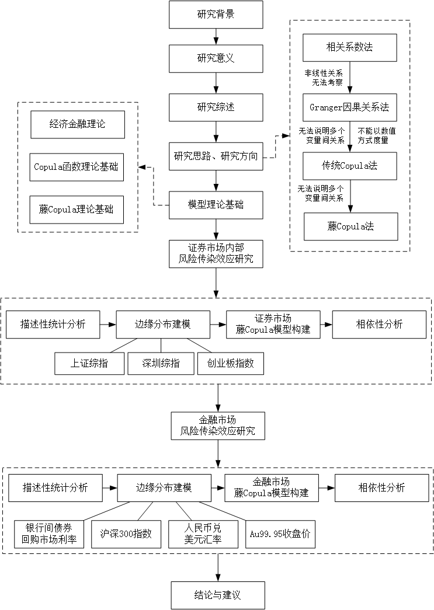

```{r setup, echo=F}

################# 第 1 章 R 程序代码  ####################


knitr::opts_knit$set(root.dir = getwd())
knitr::opts_chunk$set(echo = FALSE, results = 'hide')
knitr::opts_chunk$set(warning = FALSE, message=FALSE)
```

```{r prepare}
rm(list=ls())
options(digits=4)
options(scipen=100)
graphics.off()
Sys.setlocale("LC_ALL", "Chinese")
```

\cleardoublepage

\pagestyle{emptypage}

\renewcommand{\chapterlabel}{导论}

# 导论 {-}

## 选题背景和意义

### 选题背景

黄金兼具商品、货币以及投资属性，是国际市场上重要的避险工具，逐步发展为一种社会公认的价值判断
标准，其资产储备价值和投资增值价值远大于纸币和其他商品，其拥有量是一个国家实力的象征，是稳定
市场经济、抵御通货膨胀的重要后盾，也是大众投资者保值升值、预防通胀的重要选择之一，其在非正常
时期的避险作用是其他商品及货币无法比拟的。黄金现货价格与黄金期货价格的长期变动趋势较为相似。
但从短期内二者每次的波动幅度来看，黄金期货价格的波动要比黄金现货价格的波动幅度大，主要因为黄
金期货价格反映了供求双方对未来黄金价格走势的预期，从而导致期货价格的波动领先于现货价格的波动
。并且黄金期货在黄金现货的基础上，完善补充一些不足和问题。

金融市场的波动性可以看作是市场参与者对新息的反映，正是金融资产价格反复震荡给该市场带来了风险
，所以说价格波动的分析与研究是测度风险的基础。探究资产定价、风险预警等问题的前提条件是能够正
确描述金融市场波动特点。由于期货市场特殊的交易制度和运行规律，价格波动性较大，影响范围较广泛
。黄金由于具有特殊的金融属性，黄金期货市场价格波动是一种直接影响金融市场稳定性的重要经济风险
因素，因此有必要对黄金期货市场价格波动的风险进行分析与讨论。


### 选题意义

（一）理论意义

1.为黄金期货分析提供最新的分析模型

本文的主要贡献是引入了一种新兴的基于预测模型时间密度得分函数的时变参数框架。评分函数是引入时
变参数驱动机制的有效选择。特别是，通过适当地缩放评分函数，可以恢复标准的观察驱动模型，如Engle(1982)
和Bollerslev(1986)的GARCH模型，Engle和Russell(1998)的ACD模型，和Russell(2001)的ACI模型。并且
利用GAS模型可以构造出一系列新的时变波动模型。在时间序列过程中用来描述数据的参数时使用条件密度
函数的得分作为参数时变的主要驱动因素的另一个优点是，最大似然估计是直接的，似然函数以封闭的形
式存在。因此，ML估计易于实现，计算速度快。它定义了一个最陡的上升方向，以改善模型的局部拟合的
可能性或密度在时间t给定的当前位置的参数英尺，这提供了更新参数的自然方向。作为用于改善模型的
时变参数的最速上升算法。本质上，此更新过程类似于众所周知的牛顿拉夫森算法。此外，得分取决于完
全密度，而不仅仅取决于观测值的一阶或二阶矩，这使GAS框架区别于文献中大多数其他观察驱动的方法。
通过利用全密度结构，GAS模型引入了新的数据变换，可以用来更新时变参数信息。尽管GAS框架是由计量
经济学家开发的，但它具有足够的灵活性，可用于与使用时变参数模型有关的所有领域。本文仅以我国黄金
期货市场为例，引入GAS模型，提供一定的研究方向。

2.为风险测度提供详尽的研究框架

本文从宏观、微观两个角度全面分析讨论我国黄金期货市场价格波动的影响因素和未来走势。从宏观层面
本文采用GAS框架下模型进行拟合，并结合GARCH族进行参数估计；在微观层面，结合平均负日志分数(The
average negative log score,NLS)以及分位数损失(Quantile Loss,QL)和联合损失函数(Fissler and 
Ziege Loss,FZL)评判模型的性能体现，并最终使用在险价值VaR和ES测度市场风险，在险价值表示在一定
置信区间内，受到正常的波动因素影响下，金融资产的损失可能存在的最大值，即收益率密度曲线的一个
分位点。若$VaR>R_t$,则表明该模型在第t天具有良好的表现，预测成功，并采用Kupiec检验、条件覆盖测
试、动态分位数测试三种检验方法回测检验，进一步判断模型优劣。


（二）现实意义

1.为黄金期货交易参与各方投资组合提供参考

资产组合的波动率表示其市场风险，风险转移实质上就是风险的买卖，即人们对金融产品的波动率的买卖
。而市场风险在一定程度上影响经济活动中的资产配置效率和整体经济运行成本。因此，准确度量和分析
资产组合的风险，可以有效防范市场风险。通过研究黄金期货的价格波动信息，有助于洞悉其蕴含的市场
规律和风险变动趋势，进而帮助投资者选择合适的投资组合来获得收益，测量出其组合的风险程度，从而
来达到有效管控的目的。

2.为商业组织或机构以及政府监管市场提供支持

黄金期货市场的健康稳定发展是一个国家金融体系保持稳定的表现和坚强后盾，中国黄金期货年初在上海
期货交易所上市交易后，极大丰富了我国的商品期货的交易品种，但随着国际市场黄金期货价格的高速飞
涨和市场资金的逐利本能，大量的资金涌入黄金期货市场，市场的投机炒作风气开始蔓延，给市场的风险
监管造成很大的困难。

对市场的波动性以及市场中的风险状况的进行正确旳衡量和评价，有助于降低市场信息不对称程度，提高
市场的透明性，提高市场的效率，促进市场的稳定发展。对我国黄金期货市场风险的深入研究，为监管层
掌握其波动的规律和特征提供了相关理论基础和现实依据。从而使得监管层及时了解市场风险大小及其波
动趋势，可以提高政府以及相关机构的管理水平，为其市场监管提供很好的决策支持。

3.为其它期货交易品种的研究提供借鉴

黄金期货是中国境内首次上市交易的具有金融属性的期货品种，作为黄金衍生产品的黄金期货是中国第一
个真正意义上的金融期货产品。在投资者对其他期货市场波动的短期分析和预测中，但凡符合尖峰后尾等
特征的金融期货，本文中利用GAS模型框架对黄金期货的研究方法和理论体系都起到一定的示范和借鉴作
用。而且，由于黄金期货自身兼具商品属性，因此其研究方法同样适用于其它农产品和金属商品期货。

## 国内外研究现状述评

### 黄金期货市场风险测度研究综述

1.国外关于黄金期货市场风险测度的研究现状

国外发达国家较早推出黄金期货交易市场，例如纽约黄金期货市场和伦敦黄金期货市场，从而使得国外学
者对黄金期货市场的研究所采用的方法和模型都比较新颖和丰富。Chan等人(2004)考察了中国期货交易所
(铜、绿豆、大豆和小麦)四种期货合约的日波动性。我们发现收益对波动性具有非对称效应，即负收益对
波动性的影响大于正收益[@Chan2004]。Chiarella等人(2015)利用连续时间多因素随机波动模型，通过一
个广泛的黄金和原油期货及期货期权数据库来估计分析商品期货市场收益与波动的动态关系[@Chiarella2015]。
Lu(2014)利用VAR-DCC-BVGARCH模型对黄金市场和股票市场的波动溢出效应进行了测度，分析了两者之间
的关系，这些结果可以帮助投资者更好地管理包括这两种资产在内的投资组合的风险和收益[@Lu2014]。
Lee等人(2015)通过GARCH-VAR方法，剖析美国经济版块中相关公告的发布对美国黄金期货市场的影响情况
，结果表明宏观经济政策的发布与黄金期货市场的价格变动、成本、交易数目之间有着显著的相
关性[@Smales2015]。Baklaci等人(2016)发现新兴市场仍是一个尚未开发的领域，而大多数样本国家的黄
金期货存在波动传递，研究结果表明，新兴黄金期货市场的风险分散和跨市场对冲机会相当有限[@Baklaci2016]。

2.国内关于黄金期货市场风险测度的研究现状

由于2008年中国才推出黄金期货的市场，时间相比于比国外较晚，国内学者对此研究有一定的局限性，所
使用模型主流为传统的GARCH族模型，模型普遍较为简单，分析方向多集中于与其他金融市场的联动分析
和溢出效益等。王安羽(2011)通过GARCH族模型对我国黄金期货市场的波动进行拟合,并采用不同损失函数
对GARCH、TGARCH、EGARCH的波动率的预测精度做优劣比较。结果显示，非对称的GARCH模型为最优模型，
可以为我国投资者在市场风险测度VaR和预测上起到一定的作用[@王安羽2011]。王兆才(2012)采用基于不
同分布下的GARCH模型以及半参数方法来度量中国黄金期货市场中存在的市场风险，同时进行了不同模型
在测度黄金期货市场的优劣比较[@王兆才2012]。杨绍润(2016)运用VAR-GARCH模型对我国黄金期货市场的
波动和风险进行了深入剖析，实证结果表明ARIMA-GARCH模型可以较好地对价格走势分析与预测[@杨绍润2016]。
刘雪洁(2016)采用黄金主力连续合约作为研究标的，通过基于正态分布和t分布的GARCH模型和SV模型，
同时加入“杠杆效应”，刻画了我国黄金期货市场的波动特征[@刘雪洁2016]。钱子星(2016)构建OLS、ECM、
GARCH、ECM-GARCH、EGARCH这些模型，预测黄金期货的套期保值比率，并对比绩效，从而达到为交易经营
商套期保值提供借鉴的目的[@钱子星2016]。闫杰等人(2018)选取2008年到2016年的黄金期货和现货价格的
日频数据，拟合中国黄金期货价格波动性影响回归模型，开展波动性对现货价格的影响的深入研究。实证
结果发现条件异方差模型的GARCH项可以较好拟合黄金期货的价格波动[@闫杰2018]。何镇宇等人(2018)采用
基于结算价的收益率来作为黄金期货价格的日间波动，并建立ARMA-GARCH族模型对收益率数据进行剖析，结
果显示ARMA-GARCH-t模型能很好地刻画黄金期货收益率的尖峰厚尾性和波动风险[@何镇宇2018]。


3.评述

从上述研究文献可以看出，国外学者对黄金期货市场的分析中所运用的模型要比国内黄金期货市场要更加
丰富。尤其是国外发达国家的黄金期货市场，比如纽约和伦敦黄金期货市场，成立时间较我国要更为久远
，因此可获取的交易时间数据更多，研究样本量更大，从中可发现的发展规律及特点更多且可信度更高。
我国对黄金期货的研究存在的问题在于：我国黄金期货上市不久便时逢金融危机，使得金融数据出现大幅
震荡，因此对此特殊宏观形势下的样本分析所得到的结论准确性不高。其次，分析问题较为集中，绝大部
分还只是分析黄金期货市场与其它市场相关性的研究上，对黄金期货市场相关风险的研究还很不完善，而
一个市场风险的度量对一个市场的发展和监控是至关重要的，再者，模型比较单一陈旧，未使用现阶段很
多前沿方法来分析我国黄金期货市场。

### 广义自回归得分模型研究综述

1.国外关于GAS的研究现状

Creal等人(2013)创造性的提出了一类观测驱动的时间序列模型，称为广义自回归分数(GAS)模型。随时间
更新参数的是似然函数的比例分数。这种新方法为广泛的非线性模型引入时变参数提供了统一的框架
。该GAS模型包括其他众所周知的模型，如广义自回归条件异方差、自回归条件持续时间、自回归条件强
度和具有时变均值的泊松计数模型[@Creal2013]。Blasques等人(2014)在“2014年鹿特丹国际预测研讨会”
上展示了有关GAS的幻灯片[@Blasques2014]。Gao等人(2016)指出动态条件分数(DCS)模型是一种基于分数
函数的新型观测驱动模型。Harvey(2013)基于时变尺度提出了具有学生分布偏态的单变量DCS模型。Gao基
于对数方差对这些模型进行了重新描述，并将其推广到基于方差的模型中。将这些模型与AR(1)相结合，
形成新的模型。通过对四个国际股票指数的回归分析，结果发现这些AR-DCS模型在预测VaR和ES时，在95%
、99%和99.5%的置信水平上都表现良好[@Gao2016]。Gorgi等人(2018)介绍了一种多时间序列的混合频率
分数驱动动态模型，该模型利用混合数据采样加权方案对高频变量的分数贡献进行转换。所得到的动态模
型提供了一个灵活且易于实现的框架，通过使用来自高频变量的及时信息来预测低频时间序列变量。通过
对美国总体通胀和GDP增长预测的实证研究，验证了模型的样本内和样本外性能[@Gorgi2018]。Blazsek(2018)
比较了中美能源价格的动态条件评分（DCS）和标准金融时间序列模型的表现。考虑将广义t分布作为
误差项的替代方案，并考虑波动率的动态规范。使用萨尔瓦多，危地马拉和巴拿马的现货电价的数据集。
研究了各种DCS模型的识别，结果表明，对于大多数情况，DCS的样本内统计性能优于标准模型[@Blazsek2018]。
DeMelo(2018)指出在保险业中，保费估计和破产概率的估值从根本上取决于总索赔分配。DeMelo新提出了
广义自回归分数模型被组合以指定索赔数量和索赔严重性的非高斯分布[@DeMelo2018]。Koopman等人(2019)
提出了一种新的多变量动态模型来分析和预测全国足球联赛的比赛结果。所提出的动态模型是基于每周
匹配结果的高维面板的预测观测质量函数的得分。并实证研究了哪个因变量和哪个动态模型能够产生最佳
的预测结果。文章对欧洲六场大型足球比赛的比赛结果进行预测研究后发现，配对计数的动态模型提供了
最精确的预测[@Koopman2019]。Bernardi等人(2019)创造性的提出一种新的copula模型，该模型的相关参
数可根据广义自回归分数(GAS)动态演化，然后通过该模型来估计风险中的条件价值和条件预期缺口，衡
量极端事件对一家机构的影响。实证研究表明，该模型能够解释和预测1999-2015年系统性风险的演变[@Bernardi2019]。
Ardia等人(2019)发表了GAS模型在R软件中的安装包说明[@Ardia2019]。


2.国内关于GAS的研究现状

程明明(2016)首次采用(GAS)对我国股票市场波动率进行拟合。结果表明，模型可以很好地拟合上证综合
指数的波动率序列，并有着较好的预测效果[@程明明2016]。王杰等人(2017)通过广义自回归得分(GAS)模
型来刻画收益率的时变波动并对VaR进行滚动预测和回测检验，得到基于t分布的GAS模型有着较高的VaR预
测精度。邹玉梅等人(2018)将时变D藤与广义自回归得分模型结合，进而估计时变参数。并分
别对美元、欧元、日元、港元和英镑兑人民币的外汇汇率序列拟合边际分布，结果表明该模型较好的刻画
了变量间的相依关系[@邹玉梅2018]。叶五一等人(2018)采用2006年至2016年的28个行业指数数据，通过GAS
动态负荷因子的模型以及风险预期占比来分析行业间的风险溢出效应。结果表明，各个行业指数收益率
之间存在着较强的关联性[@叶五一2018]。沈银芳等人(2018)采用沪深300指数收益率序列，以沪深300股
指期货的推出日期作为分界点，通过广义自回归得分(GAS)模型，对我国股票市场波动率进行实证研究。得
出股指期货推出前后的收益率波动性有明显差异，结果表明沪深300股指期货的推出有一定的降低市场风
险和平稳股票市场的积极作用[@沈银芳2018]。沈根祥等人(2019)将日收益率与已实现的波动联合建模，
提出一种新的波动模型。选取尺度调整t分布和F分布作为日收益和已实现波动的分布，构建GAS-HEAVY模
型，并与同类模型对比，实证分析表明,不同损失函数的SPA检验下GAS-HEAVY模型的波动预测能力明显优
于同类模型[@沈根祥2019]。沈银芳(2019)通过新兴的广义自回归得分(GAS)模型对浙江省三大互联网金融
概念股：同花顺、生意宝和恒生电子的日收益率序列的均值和波动率建模，实证结果表明收益率序列之间
存在着较强的相关性和联动特征。论文指出可进一步进行收益和波动率的预测分析，为完善我国，尤其是
浙江省互联网金融市场的功能提供借鉴，有利于管控市场风险[@沈银芳2019]。


3.评述

只有深入认识和把握中国期货市场的特征和规律，掌握波动率的变化趋势，才能够正确衡量市场风险，在
恰当时机做出合理的风险决策，进而防范风险所产生的相关损失。对于金融时间序列数据的分析而言，大
多数金融资产收益率的分布一般具有尖峰肥尾的特征，因此通常会考虑一些肥尾分布，例如（有偏）学生
t分布（SKt）或者（有偏）广义误差分布（GED）。而对于波动模型，目前国内外学者多用传统的条件异
方差GARCH族模型来进行分析和讨论，但这类模型并没有充分利用分布中所蕴含的信息，对捕捉波动不太
敏感，对期货市场波动性的拟合有较大偏差。

从上述国内外GAS模型相关分析现状中可以看出：国外对GAS模型的研究和所应用到的场景较国内而言更为
丰富和全面，对该模型的特征分析得更为深入。目前国内学者对GAS模型相关研究较少，而且研究对象单
一，多为分析我国股票市场，例如上证综指和沪深300指数。其次，国内外多使用广义自回归GAS模型与Co
pula模型结合，分析金融市场的联动效应，少有文献采用该模型针对金融市场的波动和风险度量进行讨论
。最后，大部分学者侧重于阐述GAS模型的特征，未对其特例做进一步讨论和分析，例如Beta-t-Egarch、
GAS-GARCH-t。

## 研究方法及内容框架

### 研究方法

本文在分析过程中用到的研究方法主要有：

第一，文献分析法。本文在现有研究的基础上，通过对国内外有关GAS模型和黄金期货市场的相关理论和
文献进行梳理、归纳和总结，使得对现有研究的理论前沿、发展状况和最新成果具有较为全面的认识，并
指出目前的可改进模型和未来可能的发展方向，初步构建了本文的理论研究框架。

第二，定量与定性相结合。本文在探讨有关黄金期货市场风险的多种影响因素以及波动风险分析中采用了
定性分析的方法。在针对黄金市场主力合约数据构建GAS等模型分析时，运用极大似然估计和VaR计算以及
回测失败率计算时，定量实证检验模型的优劣和预测效果。

第三，比较分析方法。本文针对我国黄金期货市场价格构建不同残差分布下的常见GARCH族模型和GAS框架
，并且运用不同的误差函数进行模型选择，对比分析然后确定最优模型。

### 基本思路

本文从2009年至2019年我国黄金期货价格波动率出发，在构建拟合模型的基础上，重点对其进行风险预测
和管理研究。黄金期货时间序列具有集聚性、长记忆性、尖峰肥尾的特征，在传统异方差模型GARCH类对
数据拟合有一定缺陷的情况下，引入Creal(2013)提出的广义自回归得分模型(GAS)，比单纯依赖均值和高
阶矩，更能充分利用对数似然函数的得分函数来实时驱动时变参数，能够很好的解决金融时间序列这类问
题，然后结合风险测度的不同方法对模型进行优劣选择，进而探究我国黄金市场的风险管控及测度等问题
，并针对不同参与者提出相关建议。

本文研究框架如下：

```{r fig1,echo=FALSE,fig.cap="研究框架",cache=F,dev="png",results='markup'}

```

## 论文拟创新之处

Creal提出的广义自回归得分模允许模型参数随着对数似然函数的得分函数变化而变化，相比于GARCH族模
型而言，不仅同样可以扩展到非对称、长期记忆、聚集性等形式，还可以同时实现对序列均值和波动率的
刻画，比单纯依赖均值和高阶矩更能充分展示时变参数的演化过程，解决了参数估计和模型效率的弊端。
GAS的一个优良特性是，只要给出过去的信息和随机参数变量，即可进行极大似然估计，因此，可以扩展
到其他具有此特征的金融市场或者农产品等市场中。

中国黄金期货市场的模型相对简单，且多集中分析市场联动和溢出效应，尤其是对于市场风险测度，方法
比较单一，尚未形成一个相对详尽的系统分析。本文通过实证分析，结合分位数损失(QL)、联合损失函数
(FZL)以及平均负日志分数(NLS)评判模型的性能体现，并且利用详尽的在险价值VaR和ES风险测度框架，
为我国黄金期货市场中风险承受能力不同的参与者寻求其各自“最适”风险测度模型，为我国投资者和监管
者控制、规避风险提供依据。


\pagestyle{mpage}


<!-- # 参考文献 -->
[//]: # (\bibliography{Bibfile})

