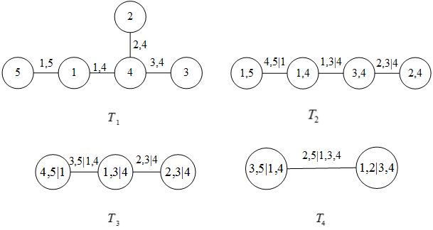

```{r setup, echo=F, message=F}

################# 第 4 章 R 程序代码  ####################


knitr::opts_knit$set(root.dir = getwd())
knitr::opts_chunk$set(echo = FALSE, results = 'hide')
knitr::opts_chunk$set(warning = FALSE, message=FALSE)
options(knitr.kable.NA = '')
```

```{r prepare}
rm(list=ls())
options(digits=4)
options(scipen=100)
graphics.off()
Sys.setlocale("LC_ALL", "Chinese")
windowsFonts(msyh=windowsFont("微软雅黑"))
library("kableExtra")
```

```{r import-data2}
rm(list=ls())
## getwd()
## path='F:/github_paper/vine-copula-Zeng'
## setwd(path)
## load package
library(readxl)
library(xlsx)
library(splines)
library(fBasics)
library(tseries)
library(forecast)
library(fGarch)
library(nleqslv)
library(knitr)
library(FinTS)
library(rugarch)
library(VineCopula)
## load data
norisk_rate=read.csv('./no_risk_rate.csv',header=T)
no_risk_rate=norisk_rate[,3];date=as.Date(norisk_rate[,2])
stock_test=read.xlsx2('./sample_data.xlsx',sheetIndex=1,header=T,startRow = 1,endRow = 2359,
                      colClasses=c('character','character','numeric','numeric','numeric','character','character',rep('numeric',5)))
debt_book_value_test=read.xlsx2('./sample_data.xlsx',sheetIndex=2,header=T,startRow = 1,endRow = 42,
                      colClasses=c(rep('character',3),'numeric'))
```

```{r import-sector-dd2}
data_dd=read.xlsx2("./sector_dd.xlsx",sheetIndex = 1,as.data.frame = TRUE,header = TRUE,
           colClasses = c("Date","numeric","numeric","numeric","numeric","numeric"))
dd_date=as.Date(data_dd[,1])
insurance=data_dd[,2]
multi_finance=data_dd[,3]
house=data_dd[,4]
stock=data_dd[,5]
bank=data_dd[,6]
```

# 基于RVine-Copula模型的金融板块间系统性风险传染效应研究

## 板块间系统性风险RVine-Copula模型构建

### 最优R藤结构选择

正如模型介绍部分所述，对于仅包含两个变量的情况，且这两个变量均服从[0,1]的均匀分布时，一定存在一个联结
函数$C$，使得二元联合分布函数可用两个变量的边缘分布函数表示。因此为了保证Copula函数一定存在，需对前面
计算得到的板块系统性风险指标进行累计概率密度转换，使用经过变换后服从[0,1]上均匀分布的新序列进行建模分
析^[Cherubini U, Luciano E, Vecchiato W. Copula methods in finance[M]. John Wiley & Sons, 2004.]。

经过累计概率密度转换后的序列K-S检验值如下表所示：

```{r test-uniform-distribution}
f_insurance=ecdf(data_dd[,2])
co_insurance=f_insurance(data_dd[,2])
f_multi_finance=ecdf(data_dd[,3])
co_multi_finance=f_multi_finance(data_dd[,3])
f_house=ecdf(data_dd[,4])
co_house=f_house(data_dd[,4])
f_stock=ecdf(data_dd[,5])
co_stock=f_stock(data_dd[,5])
f_bank=ecdf(data_dd[,6])
co_bank=f_bank(data_dd[,6])
```

```{r test-uniform, results='markup'}
test_uniform=data.frame(a=c(ks.test(co_insurance,'punif')[[1]],ks.test(co_insurance,'punif')[[2]]),
                    b=c(ks.test(co_multi_finance,'punif')[[1]],ks.test(co_multi_finance,'punif')[[2]]),
                    c=c(ks.test(co_house,'punif')[[1]],ks.test(co_house,'punif')[[2]]),
                    d=c(ks.test(co_stock,'punif')[[1]],ks.test(co_stock,'punif')[[2]]),
                    e=c(ks.test(co_bank,'punif')[[1]],ks.test(co_bank,'punif')[[2]]))
colnames(test_uniform)=c("保险板块","多元金融板块","房地产板块","券商信托板块","银行板块")
rownames(test_uniform)=c("K-S","P值")
kable(test_uniform,row.names =T,align = "c", caption="金融各板块系统性风险指标均匀分布检验",
      longtable = TRUE, booktabs = TRUE, linesep="")
```

由表 \@ref(tab:test-uniform) 可以看出，各板块经变换后的系统性风险指标在95%的置信水平上均接受原假设，表明新序列均服从[0,1]的均匀
分布。所以可进一步进行建模分析。

对板块间的系统性风险指标计算Kendall’s $\tau$相关系数，得到的相关系数矩阵如下表所示：

```{r cor, results='markup'}
copula_data=data.frame(insurance=co_insurance,
                       multi_finance=co_multi_finance,
                       house=co_house,
                       stock=co_stock,
                       bank=co_bank)
cor0=cor(copula_data,method = 'kendall')
colnames(cor0)=c("保险板块","多元金融板块","房地产板块","券商信托板块","银行板块")
rownames(cor0)=c("保险板块","多元金融板块","房地产板块","券商信托板块","银行板块")
kable(cor0,row.names =T,align = "c", caption="金融各板块系统性风险指标相关系数矩阵",
      longtable = TRUE, booktabs = TRUE, linesep="")
```

从表 \@ref(tab:cor)可以看出券商信托板块与其他板块的相关系数均较大，而银行板块与其他板块的相关系数较小。因此根据直观感
受，券商信托板块应在藤结构的核心位置，而银行板块位于藤结构的边缘部分。

依照藤理论的规则，藤结构的第一棵树中应包含5个节点，且节点间的边连接的应为相关系数较大的节点对，所以从
表中可筛选出相关系数排名前四的节点对分别为：券商信托—房地产、券商信托—多元金融、银行—保险、多元金融—房
地产。通过相应的组合，可得到第一棵树的结构如下图所示：

```{r vine-first-tree,echo=FALSE,fig.cap="金融板块间系统性风险R藤模型树T1结构图",cache=F,dev="png",results='markup',fig.height=2}
knitr::include_graphics("./vine_first_tree.png")
```

从图 \@ref(fig:vine-first-tree) 中可以发现，如果仅根据这四个节点对的信息所构造的藤结构包含了两个独立的部分，与前文模型介绍部分所描
述藤结构不符，因此需要将相关系数排名第五的节点对——券商信托—保险纳入藤结构的考虑范畴，所以经过调整的第
一棵树的结构为：

```{r vine-first-tree-adj,echo=FALSE,fig.cap="调整后的金融板块间系统性风险R藤模型树T1结构图",cache=F,dev="png",results='markup',fig.height=2}
knitr::include_graphics("./vine_first_tree_adj.png")
```

在第一棵树的基础上可以估计各边的Copula函数类型。确定后即可计算各序列的条件观测值，对新的条件观测值序列
再次计算Kendall相关系数矩阵，按照与构建第一棵树时相同的逻辑即可得到第二棵树的结构。随后重复该步骤，直
到一棵树中只存在两个节点。所以最终得到的各板块系统性风险藤结构矩阵表达式如下式所示：

```{r vine-fit}
RVM=RVineStructureSelect(copula_data,familyset=c(0:5),progress=TRUE,rotations=FALSE,method='mle')
RVM2=RVineMLE(copula_data,RVM,maxit=200)
```

```{r vine-marix, results='markup'}
vine_matrix=data.frame(RVM2$RVM$Matrix) 
rownames(vine_matrix)=c("A","B","C","D","E") 
colnames(vine_matrix)=c("A","B","C","D","E") 
kable(vine_matrix,row.names =T,align = "c", caption="各板块系统性风险藤结构矩阵表达式",    longtable = TRUE, booktabs = TRUE, linesep="") 
``` 

相应的藤结构图如下图所示：

```{r vine-fit-fig,echo=FALSE,fig.cap="金融板块间系统性风险R藤模型结构图",cache=F,dev="png",results='markup',fig.height=6}

```

图 \@ref(fig:vine-fit-fig) 中的1—5分别表示保险板块、多元金融板块、房地产板块、券商信托板块和银行板块。从图中可以看出，第一棵树
以券商信托板块为核心节点，与保险板块、多元金融板块和房地产板块均有连接，而银行板块仅与保险板块有连接，
处于整个结构的边缘位置，这与最初的分析保持一致；第二、三、四棵树则不存在分支，仅由一根主干连接。

### 板块间最优Copula函数确定

在确定最优的藤结构后，根据AIC、BIC准则即可得到藤结构中两两节点的边所对应的Copula函数及其参数。本文用作
备选的Copula函数包括以下六种类型：独立Copula、Gaussian-Copula、t-Copula、Clayton-Copula、Gumbel-Copula
和Frank-Copula。最终估计的结果如下表所示：

```{r rvm-summary1}
RVM_summary1=data.frame(summary(RVM2$RVM)[,c(1:2,4:6)])
```

```{r vine-copula, results='markup'}
kable(RVM_summary1,row.names =F,align = "c", caption="板块间系统性风险最优Copula形式表",
      longtable = TRUE, booktabs = TRUE, linesep="")
```

正如前文模型介绍中所述，不同的Copula函数可以反应不同的相依关系。从表 \@ref(tab:vine-copula) 中的第一棵树可以看出，券商信托板块
和保险板块之间为Gaussian-Copula函数，表明两板块间具有一定的相关关系，且上下尾具有对称性；保险板块与银
行板块之间和房地产板块与券商信托板块之间的Copula形式均为t-Copula函数，虽然也说明上尾和下尾的相关性具有
一定的对称性，但是上述两个板块间却是具有厚尾相关性，对极端值的变化更加敏感；而多元金融板块和券商信托板
块间则是以Clayton-Copula函数为最优连接形式，Claton-Copula函数最大的特点即是上下尾相关性非对称，且对下
尾的变化极端敏感，说明当多元金融板块或券商信托板块出现极端系统性风险损失时，另一板块可能会被迅速传染上
系统性风险。第二棵树中，在保险板块信息已知的前提下，券商信托板块与银行板块间和在券商信托板块信息已知的
前提下，保险板块与房地产板块间的Copula类型均为Gumbel-Copula型，说明这两个板块间对上尾系统性风险较为敏
感，对下尾损失部分却相关性不强；而当券商信托板块信息已知时，多元金融板块与房地产板块之间上下尾系统性风
险均较为敏感。在第三棵树中，可以发现在房地产板块与券商信托板块信息都明确时，多元金融板块与保险板块之间
服从独立Copula的形式，说明当信息已知足够多时，两板块间的系统性风险可能不存在互相影响的情况。同理，第四
棵树也是类似的情形，在保险、房地产和券商信托板块的系统性风险信息均清楚时，多元金融板块与银行板块间的相
关系数也为0，不具有一致性的关系^[针对各Copula形式的特征详见Cherubini U, Luciano E, Vecchiato W.于2004年所作专著《Copula methods in finance》。]。


## 金融板块间系统性风险传染效应分析

### 板块间尾部相依系数的计算与分析

在确定最优藤结构与各边的Copula类型后，通过极大似然估计法对整体藤Copula模型的参数进行估计，然后按照模型
介绍部分所述的尾部相依系数的计算方法与Kendall's $\tau$相关系数的计算方法，即可得到各板块间的相关关系。
按照上述思路，计算得到的板块间系统性风险尾部相依关系如下表所示：

```{r rvm-summary2}
RVM_summary2=data.frame(summary(RVM2$RVM)[,c(1:2,8:9)])
```

```{r vine-ultd, results='markup'}
kable(RVM_summary2,row.names =F,align = "c", caption="板块间系统性风险尾部相依系数表",
      longtable = TRUE, booktabs = TRUE, linesep="")
```

由于Copula函数的特性，对于尾部敏感的Copula才具有相应的尾部系数，所以只有t-Copula和阿基米德类Copula形式
才能计算出各自的尾部相依系数。从表 \@ref(tab:vine-ultd) 中可以看出，在没有任何已知信息时，保险板块与银行板块之间和房地产板块
与券商信托板块之间的上下尾相依系数都不低，分别为0.43、0.51，表明两板块间具有较强的尾部关系；而券商板块
与多元金融板块间的下尾相关系数达到0.79，说明当其中一个板块发生系统性风险时，另一板块也极有可能受到风险
的冲击，这是由于多元金融板块的特性决定，因为该板块的个股尽管不是标准的金融企业，但其涉及的主营业务却大
多是关于证券投资、信托等，与券商信托板块的业务较像，因此其下尾相依系数大到0.79。当存在部分已知信息时，
板块间的尾部相依系数均只有较为微弱的尾部关系存在，说明条件板块可能起到了风险催化的作用，需要注意的是，
在券商信托板块的信息已知时，尽管多元金融板块与房地产板块间是通过t-Copula函数进行连接，但尾部相依系数却
为0，其原因可从上一节的表 \@ref(tab:vine-copula) 中找到，该节点对的Copula函数第二个参数的估计值为21.49，而该参数可近似理解为t
分布的自由度，当t分布的自由度足够大时，t分布近似于标准正态分布，因此该节点对的t-Copula可近似为
Gaussian-Copula，表明多元金融板块与房地产板块几乎不存在尾部相依性。

### 板块间Kendall相关系数的计算与分析

依据上一目所述的思路，可得到各金融板块间基于藤Copula模型的Kendall's $\tau$相关系数。通过将无条件Kendall相关系数和有条件Kendall相关系数按照板块组合进行分类可得：

```{r rvm-summary3}
RVM_kendall=data.frame(summary(RVM2$RVM)[,c(1:2,7)])
```

```{r vine-kendall, results='markup'}
kendall=c(cor0[4,3],cor0[4,2],cor0[4,1],cor0[1,5],cor0[3,2],cor0[3,1],cor0[4,5],cor0[2,1],cor0[3,5],cor0[2,5])
vine_kendall=cbind(RVM_kendall,kendall)
colnames(vine_kendall)=c("tree","edge","cond-tau","tau")
kable(vine_kendall,row.names =F,align = "c", caption="板块间系统性风险无条件Kendall相关系数与有条件Kendall相关系数对照表",
      longtable = TRUE, booktabs = TRUE, linesep="")
```

如表 \@ref(tab:vine-kendall) 所示，可以发现在经过藤Copula模型变换后，虽然从相关性强弱的顺序来看，条件相关系数与无条件相关系数差
异不大，但从相关系数的数值上来看，板块间系统性风险的相关系数发生了较大的变化。不过，绝大多数的相关系数
在增加条件信息后有所下降，这表明条件板块在板块间系统性风险传染上实际是起着催化剂的作用，作为一种传染介
质，加快风险的传染。例如，在不考虑条件信息影响时，多元金融板块与房地产板块之间的Kendall相关系数达到了
0.59，但在已知券商信托板块风险时，多元金融板块与房地产板块之间的条件Kendall相关系数仅为0.22，相关性减
弱的较为明显，充分表明券商信托板块在系统性风险传染过程中的媒介作用。在所有的条件板块中，券商信托板块出
现的次数最多，保险板块其次，而多元金融板块和银行板块在藤结构中未出现过作为条件板块的情况。因此若要减弱
金融板块系统性风险的传染效应，应该更多的了解条件板块系统性风险的情况，提前调研条件板块的风险来源，并通
过政策、监管的干预，尽可能减少发生系统性风险损失的概率，削弱风险传染强度。


<!--# 参考文献 {-}-->
[//]: # (\bibliography{Bibfile})
	
