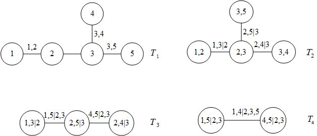
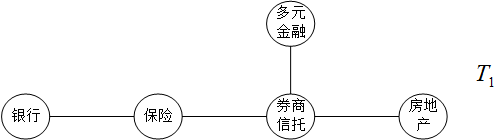
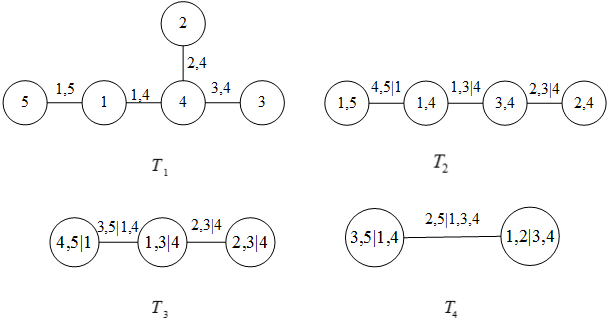

```{r setup, echo=F}
knitr::opts_knit$set(root.dir = getwd())
knitr::opts_chunk$set(echo = FALSE, results = 'hide')
knitr::opts_chunk$set(warning = FALSE, message=FALSE)
knitr::opts_chunk$set(fig.align="center"
                      ## ,out.width="0.9\\textwidth" # latex
                      ,out.width="80%" # for both latex and html
                      ,fig.width=5, fig.height=3
                      )
```

```{r prepare}
rm(list=ls())
options(digits=4)
options(scipen=100)
options(kableExtra.auto_format = FALSE) # word table
graphics.off()
Sys.setlocale("LC_ALL", "Chinese")
library(kableExtra)
```

**摘要**:本文利用沪市和深市上市的245个金融企业2009 年 7 月 1 日至 2019 年 6 月
30 日的收益率数据，以CCA模型为基础对金融各板块的系统性风险进行了测算，并对近十年
金融板块的系统性风险波动进行简要分析，构建藤 Copula 模型，并在此基础上计算板块间
的尾部相依系数、无条件 Kendall 相关系数和条件Kendall 相关系数，分析得到板块间系
统性风险的传染效应。实证结果表明：2009-2019年金融板块间系统性风险较大波动是由相
关国家政策的颁布或施行所导致，表明我国证券市场受政策的影响十分明显，市场的自主性
仍然较差，从板块间的风险传染来看，券商信托板块是金融板块系统性风险传染过程中的关
键。

**关键词**: 金融板块；系统性风险；CCA模型；藤 Copula 模型；传染效应

**JEL 分类号**: G14，G24 &emsp;**文献标识码**:A &emsp;**文章编号**:

# 引言

就我国目前的经济形式来看，如何防范化解系统性风险仍是当前最紧迫的事情。根据中央经
济工作会议的相关指示，要确保我国经济持续健康发展下去，必须要尽可能避免金融市场的
反常波动，坚决做好防范化解系统性风险的准备。近年来各金融部门的资产和信贷风险之间
的协同流动不断增加，致使系统性金融风险呈现显著的跨部门传导效应, 这意味着如果只侧
重于单个金融部门内部的风险传导，而忽视了机构间的关联性，就可能低估相互依赖的金融
机构对系统性金融风险的整体贡献，从而无法正确衡量金融系统中的风险溢出效应。同时我
国经济体制改革的政策对我国金融业带来了两大显著影响：第一是促进以单一盈利业务为主
的业务分业经营模式向包含多种创新业务的混业经营模式逐渐转变；第二是推动金融不断创
新，金融衍生产品快速发展，不同类型的市场参与主体之间因此有了更加紧密的联系，进而
导致证券市场中各个行业板块结构日益复杂化，其关联性和依存性增加，使得证券市场发生
系统性金融风险的可能性及系统风险程度大大增加。而且当系统性风险发生时，不仅影响金
融机构自身的发展，也会影响所在行业的稳定，甚至会影响国民经济乃至全球经济的稳定。不仅
如此，系统性风险往往呈现较强的传染性，某一个体受到系统性风险冲击时，会快速影响到
其它个体。在股票价格的调节过程中，及时发现板块间股价变动的联动性，也可以一定程度
上避免受到板块间风险传染的影响。

从国内国外的经济状况看，我国当前金融体系内的系统性风险正在加速酝酿，但是部分金融
机构或部门对金融风险的防范意识相对淡薄，而且在直面风险时的管理水平较弱。同时"金
融机构'太大而不能倒'（'too big to fail'）的传统观念正逐步向'太关联而不能倒'
（'too interconnected to fail'）的思想转变" [@李绍芳2018]。正是由于证券市场中的
各行业板块的股价日趋呈现出交叉联动的特点，研究证券市场板块间风险传染路径、机制以
及风险相关程度、影响力度，成为一个日渐紧迫的任务，也越来越具有现实意义，能够为相关政策制定及投资决策提供参考建议。

在金融风险管理领域内，由于金融风险具有显著的传染性，某一因素导致的行业重大经济损
失可能会通过各种渠道快速传染至其他行业，进而可能引发一种涉及整个经济体系的系统性
风险。由于不同行业、不同企业间潜在的关系会反应在各股股票价格的变动上，因此对于板
块波动和板块间波动关联的深入研究有助于我们更准确地认识到在实体经济当中不同行业间
的经济关系以及这种关系对各个行业的直接或间接的影响程度。

在投资领域内，投资者在进行投资时往往需要选择相关性较小的投资产品组成的资产组合以
规避风险的发生 [@Markowitz1952Portfolio]。因此更深入的了解证券市场行业板块之间的
关联性，有利于投资者对如何构建合适的投资组合，如何研判市场规律也起到一定的指导意
义。如果投资者忽视了个股间或者板块间的关联作用，就无法准确判断一个看似只会影响某
只个股或某个板块的突发性消息对整个证券市场可能带来的冲击，这就会在较大程度上损失
投资组合在未来盈利的稳健性。因此本文将首先通过CCA模型对我国证券市场金融各板块的
系统性风险进行度量，然后运用前沿的藤理论，将板块与板块组成一个整体，并且以Copula
为媒介，确定板块间风险的相关关系，进而对金融板块的风险传染进行分析探究。


## 国内外文献综述


### 关于系统性风险量化方法的研究

国内外对系统性风险的量化方法主要包括以下三种：

1.综合指标法

综合指标法，即通过构建一个综合指标，来反应当前金融系统的系统性风险状况，主要包括
两个步骤，一是选取对系统性风险影响较大的指标，二是采取一定的统计方法对指标进行综
合，从而得到能够衡量当前系统性风险整体状况的指数。当指数高于某一阀值时即表明当前
时期系统性风险较高。由于方法原理明了清晰，因此综合指数法在实践中被广泛地运用。典
型案例如许涤龙等（2015）选择具有代表性的银行、股票和外部金融市场等宏观性指标为子
指标，在赋权法的基础上延伸出CRITIC赋权法，构建出针对我国经济情形下的金融压力指标，
并以该指标为基础对我国的系统性金融风险预警系统的建设提出了建议 [@许涤龙2015]。唐
升等（2018）则注重更宏观的指标，其使用熵值法综合处理了泡沫经济指标、外部资本冲击
指标、宏观经济运行指标、金融机构经营指标等四类金融风险指标，进而构建出我国的系统
性金融风险指标 [@唐升2018]。综上，关于综合指标法的应用主要是通过宏观、微观和市场
三个层面构建子系统指标。之后学者们在综合指标法中逐渐引入金融市场数据，完善了系统
性风险测度和预警的指标体系。但综合指数法的弊病在于其始终无法反应金融机构间的风险
传染效应。

2．VaR 法

VaR法即风险价值法，最初由Baumol（1963）提出 [@baumol1963expected]。风险价值通俗
的含义即在一给定的概率水平下，一个金融资产在未来某一时期内出现的最大可能损失。该
方法自提出后首次运用于巴塞尔协议中，主要用来对金融资产的风险进行评价。此后，由于
风险价值法计算简单、且统计意义明确，因此在风险测度领域中得到了广泛的推广和使用。
但从VaR的计算方法可以看出，其也存在些许不足。因此学者后续对其进行了改进，主要包
括条件风险价值CoVaR和期望损失ES。条件风险价值CoVaR由Adrian等（2011）提出，一经提
出便受到广泛关注，其主要用于金融资产或投资组合一旦遭遇风险，其损失便会极大的情况
[@adrian2011]。在国内，大多数学者选用条件风险价值法来测度系统性风险。赵树然等
（2018）鉴于不同银行间可能存在较为复杂的动态关系，因此其利用高频数据，构建了样本
银行与金融系统之间的动态多条件CoVaR模型 [@赵树然2018]。并以此为前提，提出了一个
不同银行群体对整个银行体系系统性风险影响程度的指标，从群体的角度探究了各个银行同
金融系统之间的风险传染效应。但是CoVaR并非完美，其存在两个关键的缺陷：一是整个金
融体系的系统性风险并不直接简单等于运用该方法度量的单个机构风险溢出之和；二是由于
此方法基于高频数据，易造成尾部损失的总体严重性信息缺失，从而使得尾端风险度量失准。
由Artzner等（1999）提出的期望损失（Expected Short fall）是对VaR的进一步改进，改
进之处在于当预期损失可能超出VaR较多时，VaR方法的风险预警功能将大幅降低，近乎失效，
此时ES可明确给出超过临界风险值的条件期望 [@artzner1999]。因此，许多学者指出与VaR
相比，ES测度更具理论优势，在该方法下度量的风险精度更高，更具价值。杨子晖等（2019）
基于非线性的研究视角，通过构建预期损失指标（ES）进一步考察了各部门间极端风险的非
线性特征与金融风险的跨部门传染效应，并应用相关的网络关联指标，对金融系统整体以及
单个金融机构的极端风险的非线性关联展开分析 [@杨子晖2019]。

3．相关违约法

相关违约法主要是通过研究系统内各组成单元的违约概率，然后以Copula函数为基础，估计
出整个系统的违约概率，该违约概率的大小即反应了系统性风险的严重程度。其中尤以CCA
方法最为典型。未定权益分析模型以布莱克-舒尔斯-墨顿期权定价模型为基础，由Gray加以
研究完善。该方法假设系统内各组成单元的预期损失服从GPD分布，通过非参的方法测量出
系统的联合期望损失，以此实现对系统性风险的精确测度。在国内，率先运用CCA模型的学
者是宫晓琳（2012），其以CCA模型为基础计算出我国各经济部门的负债市场价值和资产市
场价值，对我国近十年的宏观金融风险进行了风险测度，清晰准确地展示了我国在这段时间
内金融机构系统性风险的动态变化 [@宫晓琳2012]。宋凌峰等（2018）通过收集保险业样本
股的资产负债表数据和证券市场数据，考虑到经济数据往往具有时变性的特征，因此创造性
的构建了MS-CCA模型，并由此计算出个保险业样本股的违约距离，实证研究了引起保险行业
系统性风险变化的内生因素 [@宋凌峰2018]。综合比较以上系统性风险度量方法，可以发现，
或有权益分析法具有如下显著特点：一是CCA方法综合考虑了研究对象的财务数据和资本市
场数据，具有一定的前瞻性；二是CCA方法能够反映研究对象的系统性风险随时间变化的特
征及趋势 [@苟文均2016]。

### 关于系统性风险传染效应测度方法的研究

目前国内外关于系统性风险传染效应测度方法可归纳为三种：统计模型法、尾部相关法和网
络模型法。

1．统计模型法

统计模型法即传统的统计计量模型，例如传统计量模型、向量自回归模型、Copula函数簇模
型等。王桂虎等（2018）以固定效应模型和面板logit模型为基础模型，构建了35个OECD样
本国家的保险行业资产负债流动性错配指数，并研究分析出该指数与金融危机之间的关系，
实证结果表明该指数同系统性风险之间具有显著的正相关关系 [@王桂虎2018]。郭娜等
（2018）先通过因子分析法构建出我国区域金融安全指数，然后将VAR模型与马尔科夫理论
相结合，识别出在不同经济时期，我国不同区域的系统性风险情况 [@郭娜2018]。喻开志等
（2018）则从VAR模型衍生使用关联性衡量方法（DY法）对汇率、房地产、股市和利差的关
联性进行度量，并以此为基础探究了国内金融系统性风险同短期国际资本流动之间的传染机
制 [@喻开志2018]。叶五一等（2018）将Copula模型与GAS模型相结合，从动态的角度研究
了我国28个行业相互之间的动态相关关系及系统性风险溢出的变化 [@叶五一2018]。

2．尾部分析法

尾部分析法主要包括∆CoVaR法、MES法和SRISK法，其核心思想是通过分析不同金融序列的尾
部相关性研究部门间系统性风险的传染效应。

（1）∆CoVaR法

∆CoVaR，即金融机构或部门在金融危机发生前后的条件在险价值CoVaR的差值，因此该指标
可以反映出其系统性风险贡献程度。而在研究过程中，可以通过将CoVaR和∆CoVaR结合的方
式，实时反映某一金融机构的系统性风险溢出水平。方意等（2018）通过计算∆CoVaR，并以
金融市场溢出效应的解析式为基础，分析出我国系统性风险在金融系统间溢出的渠道，并由
此将该系统性风险溢出过程划分为三个阶段，最后得出银行业、房地产市场及股票市场对系
统性风险的溢出效应有着显著影响的结论 [@方意2018]。张瑞等（2018）则考虑到金融机构
资产收益率的正负性可能对系统性风险的传染效应存在差异，因此其构建了非对称CoVaR模
型，通过计算平均溢出效应∆CoVaR估计我国上市银行对金融系统整体风险的溢出效应 [@张瑞2018]。

（2）MES 法

边际期望损失（MES）由Acharya、Engle和Richardson（2012）首次提出
[@acharya2012capital]。正如方法名称所示，其计算的是期望损失的边际值。因此该指标
也可以反映出其系统性风险贡献程度。例如刘璐等（2016）选取了我国三家保险业龙头企业
的股票收盘价数据，并放入DCC-GARCH 模型中得出这三家保险公司的波动率函数，然后通过
MES方法，得出三家企业各自对保险业系统性风险的贡献程度，最后总结了我国保险行业系
统性风险的规律 [@刘璐2016]。

（3）SRISK法

SRISK是一种计算系统各组成单元对系统性风险的贡献程度的指标，最早由Brownlees，
Christian和Engle提出 [@brownlees2017srisk]，属于较为新颖的方法。其计算思路与MES
法类似，但其综合考虑了负债规模、资本比率、市值等因素，以金融危机发生时单个金融机
构面临的预期资本缺口作为风险指标。Laeven等（2016）在SRISK模型的基础上得到了系统
性风险与银行规模成正相关，但系统性风险会随着银行资本的增加而减少的结论
[@laeven2016bank]。肖崎等（2018）结合分析企业经营状况时的杜邦分析法，同时由于研
究对象银行的特殊性，将非利息收入占比、不良贷款率等指标和国家GDP等指标纳入SRISK模
型中，实证研究了我国商业银行在轻型化转型过程中对银行业系统性风险的贡献程度 [@肖崎2018]。
Varotto和Zhao(2018)同时使用了期望损失模型和SRISK模型，探究了美国和欧洲
银行2004---2012年机构层面的系统性风险，得出一般的系统性风险主要受银行规模影响的
结论，研究结果提示"大而不能倒"的机构应受到高度关注 [@varotto2018systemic]。陈湘
鹏等（2019）则从方法比较的角度考虑，综合使用了MES、SES、∆CoVaR和SRISK等方法测量
我国金融系统在微观角度下的系统性金融风险，比较各方法的结果来看，SRISK法作为我国
微系统性金融风险的测量方法更好 [@陈湘鹏2019]。

3．网络模型法

矩阵法和网络分析法是网络模型法中具有代表性的测度方法。该方法的核心在于利用所研究
多个部门间共通的数据搭建起合理的网络结构，以此达到真实模拟系统性风险传染路径。李
绍芳等（2018）从尾部风险和溢出效应的视角出发，利用2007～2017年中国上市金融机构数
据，基于动态尾部事件驱动网络模型构建了中国金融机构体系的关联网络，并在此基础上分
析了金融机构关联水平与系统性风险之间的关系 [@李绍芳2018]。李政等（2019）则使用
TENET网络研究我国经济金融系统中不同行业间的系统性风险传染效应 [@李政2019]。研究
结论发现信息技术、房地产和材料行业是整个TENET网络中核心的三个行业，并在研究结论
中特别提到必须准确找到风险源头以有效控制系统性风险。

### 文献评述

目前国内学者在对行业信用风险进行度量时更多的是直接用行业整体的指标进行计算，但是
在计算时，相当于是先对行业样本股的相关指标求和，再通过模型的相应计算原理进行计算。
本文则是直接采用行业样本股的相关财务指标和市场数据计算个股的违约距离，然后再通过
加权平均个股的违约距离来指代整个行业的系统性风险，在一定程度上提高了对行业系统性
风险的测量精度。在研究系统性风险传染时，国内学者更多的是研究两个主体间的风险传染，
即使在研究多个主体时，也主要是将多个主体两两匹配，对配对的主体进行相应的研究。本
文则是运用藤理论，通过藤结构将多个主体联系在一起，从系统的角度研究多个主体间的系
统性风险传染，尽可能避免了对金融系统的割裂。

本文余下部分构成如下：第二部分是对本文在研究过程中所涉及的模型进
行简要介绍。分别对用于系统性风险测度的 CCA 模型，基于 Copula 模型的相依性
计量方法和藤 Copula 的理论进行了介绍。第三部分是以 CCA 模型为基础对金融
各板块的系统性风险进行计算，并对近十年金融板块的系统性风险波动进行简要
分析，寻找波动的原因并对整体趋势做一个评估。第四部分是通过 RVine-Copula
模型分析金融板块间的系统性风险传染效应。首先构建 RVine-Copula 模型，并在
此基础上计算板块间的尾部相依系数、无条件 Kendall 相关系数和条件 Kendall 相
关系数，分析得到板块间系统性风险的传染效应。最后是结论和建议。


# 模型介绍

## CCA模型

或有权益模型（Continent Claims Analysis，简称CCA）是在Black-Sholes-Merton(BSM)期
权定价模型的基础上，通过引入企业的资产负债表，将企业的财务数据与市场数据结合起来
构建风险资产负债表，进而对企业的风险进行整体分析的一种方法。BSM模型是一种为期权
等各类金融衍生工具提供理论定价的基础模型。该模型首先假设存在如下资产组合：由基础
资产和无风险利率构成，可以完全复制期权价格变动的资产组合。然后考虑在风险中性的前
提下，期权权益在当前时点的折现价值。在BSM模型基础上，CCA模型将一个企业的资产市场
价值（$A$）拆分为股权的市场资本价值（$E$）和债务的市场资本价值（$D$）。当一个企
业的债务市场价值高于该企业的资产市场价值时，表明该企业可能会存在违约行为，不能到
期及时偿还债务。需要注意的是，或有权益模型中的企业资产的价值和债务的价值均为市场
资本价值，不能通过企业财报得到直接数据。因此CCA方法指出，可通过以下方法间接计算
得到企业资产的市场价值，即将股权看为价值为$A$，交割价格为企业资产负债表中的债务
价值$B$的欧式看涨期权，根据BSM公式可得股权的市场价值为：
$$E=AN\left(d_1\right)-Be^{-rT}N\left(d_2\right)$$ 
{#eq:cca-equity}
$$d_1=\frac{\ln\left(\frac{A}{B}\right)+\left(r+\frac{\sigma^2_A}{2}\right)T}{\sigma_A\sqrt{T}}$$
{#eq:cca-equity-d1}
$$d_2=\frac{\ln\left(\frac{A}{B}\right)+\left(r-\frac{\sigma^2_A}{2}\right)T}{\sigma_A\sqrt{T}}=d_1-\sigma_A\sqrt{T}$$
{#eq:cca-equity-d2}
其中，$A$表示企业资产的市场价值，$N\left(\right)$表示标准正态
分布的分布函数，$B$表示企业资产负债表中的债务价值，$E$表示股权的市场资本价值，
$r$表示无风险利率，$T$表示当前时刻到到期日的时间（按年计算），$\sigma_A^2$表示企
业资产市场价值的波动率。

但是，[@eq:cca-equity]、[@eq:cca-equity-d1]、[@eq:cca-equity-d2]中$A$、
$\sigma_A^2$均未知，因此需增加一个条件：
$$\sigma_E=\frac{N\left(d_1\right)A}{E}\sigma_A$$
{#eq:cca-equity-sigma}
其中$\sigma_E$为股权波动率，可通过波动率模型得到。综上，通过联立
[@eq:cca-equity]、[@eq:cca-equity-d1]、[@eq:cca-equity-d2]和
[@eq:cca-equity-sigma]即可解出企业资产市场价值的波动率$\sigma_A^2$和企业资产的市
场价值$A$。

在求解债务市场价值时可将其看做债务账面价值($B$)与预期损失净现值（$P$）的差值，即：
$$D=B-P$$
{#eq:cca-debt-basic}
而预期损失净现值可看做为价值为$B$，行权价格为企业资产价值$A$的欧式看跌期权，通过对BSM公式的推导，
可得到预期损失净现值的计算公式：
$$P=Be^{-rT}N\left(-d_2\right)-AN\left(-d_1\right)$$
{#eq:cca-debt}
$$d_1=\frac{\ln\left(\frac{A}{B}\right)+\left(r+\sigma^2_A\right)T}{\sigma_A\sqrt{T}}$$
{#eq:cca-debt-d1}
$$d_2=\frac{\ln\left(\frac{A}{B}\right)+\left(r-\sigma^2_A\right)T}{\sigma_A\sqrt{T}}=d_1-\sigma_A\sqrt{T}$$
{#eq:cca-debt-d2}
通过联立[@eq:cca-debt]、[@eq:cca-debt-d1]、[@eq:cca-debt-d2]和[@eq:cca-equity-sigma]即可解得$P$，
进而计算出企业的违约距离$DD$,计算公式为:
$$DD=\frac{A-B}{A \cdot \sigma_A}$$
{#eq:dd}
企业的违约距离DD越短，违约概率越大，即企业的风险越大；违约距离DD越长，违约概率越
小，企业的风险越小。

## 基于 Copula 模型的传染效应测度方法

Copula理论简言之就是通过联结函数$C$，将多个变量的边缘分布联结起来，构成这些变量
的多元联合分布函数。Copula函数的表达形式为：
$$F\left(x_1,x_2,...,x_n\right)=C\left(F_1\left(x_1\right),F_2\left(x_2\right),...,F_n\left(x_n\right)\right)$$
{#eq:copula}
其中，$F\left(x_1,x_2,...,x_n\right)$表示变量$x_1,x_2,...,x_n$联合概率分布函数，
$C\left(\right)$表示$n$维联结函数，$F_n\left(x_n\right)$表示变量$x_n$的边缘分布
函数。若边缘分布函数的反函数均存在，则Copula函数的计算公式为：
$$C\left(u_1,u_2,...,u_n\right)=F\left(F_1^{-1}\left(x_1\right),F_2^{-1}\left(x_2\right),...,F_n^{-1}\left(x_n\right)\right)$$
{#eq:copula-solve}

在模型使用过程中，更多的是用式[@eq:copula-solve]。在已知多元联合分布函数和各边缘
分布函数时，就可以通过式[@eq:copula-solve]得到联结函数的形式及各参数值，进而可对
变量之间的相关程度进行研究。

在通过Copula函数度量变量间的相关程度时一般使用Kendall's $\tau$秩相关系数 
[@籍艳丽2009]及尾部相关系数。其中Kendall's $\tau$秩相关系数主要从一致性的角度对变量之
间的相关关系进行测度。结合Copula函数理论和Kendall's $\tau$的计算公式，可以得到使
用Copula模型时两个变量间的Kendall's $\tau$相关系数为：
$$\begin{array}{lcl}
\tau_{X,Y}=4\iint_{D}C\left(u,v\right)dC\left(u,v\right)-1
\end{array}$$
{#eq:copula-tau}
进而可根据Copula函数的形式以及相关参数得到两个变量间的Kendall's $\tau$ 相关系
数，并以此为依据进行下一步的分析。

而尾部相关系数包括上尾相关系数和下尾相关系数。其中上尾相关系数表示在变量$Y$的取
值在右尾时，$X$的取值也落在右尾概率，用公式表示为：
$$\lambda_u=\lim\limits_{u \to
1}P\left\{X>F_x^{-1}(u)\left|Y>F_y^{-1}(u)\right.\right\}$$
{#eq:lambda-u}
同理，下尾相关系数表示在变量$Y$的取值在左尾时，$X$的取值也落在左尾的概率，用公式表示为:
$$\lambda_l=\lim\limits_{u \to 0}P\left\{X \leq F_x^{-1}(u)\left|Y \leq
F_y^{-1}(u)\right.\right\}$$
{#eq:lambda-l}

## R 藤-Copula 模型

Copula模型中联结函数 $C$ 可起到联结各变量的作用。但是一旦面对高维变量的情况，就
会陷入"维数灾难"^[“维数灾难”是指随着维数的增加，需要的数据和计算量呈指数倍增长
的一种现象。]之中：一来会使得Copula函数的形式过于复杂，所需估计的参数过多，二来
甚至有Copula函数不存在的可能，不利于进一步的分析。因此在处理多元问题时需通过降维
的方式简化问题。Copula理论指出对于仅包含两个变量时，且这两个变量均服从U（0，1）
时，一定可以找到一个联结函数 $C$ ，使得其联合分布函数可由各变量的边缘函数直接构
成。因此，可通过所谓 Pair Copula的方法对多元Copula函数进行分解 [@Kjersti2016]。

按照Pair Copula分解方法，对于一个包含 $n$ 维变量的联合密度函数，将会存在 $n!/2$
种分解方法 [@aas2009] 。针对如此繁多的分解方法，Bedford和Cooke在2001年进行了归纳
总结，并依赖"图论"思想，提出了"藤"的模式 [@bedford2001probability]。藤Copula解决
了传统构建多元Copula函数所遇到的困难和问题。藤的类型主要包括C藤、D藤和R藤等类型，
其中最常用的是R藤。本文在建模时主要选择R藤结构，下面简要介绍R藤Copula模型。

不妨以一个包含五维变量的R藤模型为例。一个五维R藤包含四棵树，分别记为 $T_1$，
$T_2$， $T_3$， $T_4$，设五个变量分别为1,2,3,4,5，则对于第一棵树 $T_1$，
1,2,3,4,5也是其5个节点，节点与节点间的线段表示Copula函数的某一种类型。“|”之后
的变量表示条件变量。则可构造如下五维R藤模型的概念图：

```{r vine,echo=FALSE,fig.pos="H", fig.cap="五维R藤模型结构图",cache=F,dev=c("png","cairo_pdf"),results='markup',fig.height=6}

```

针对上述概念图可得到这五维变量的多元联合密度函数：

$$\begin{array}{lcl} f&=&f_1\cdot f_2\cdot f_3\cdot f_4\cdot f_5\cdot \\&
&c_{1,2}\cdot c_{2,3}\cdot c_{3,4}\cdot c_{3,5}\cdot \\&
&c_{1,3\left|2\right.}\cdot c_{2,5\left|3\right.}\cdot
c_{2,4\left|3\right.}\cdot \\& &c_{1,5\left|2,3\right.}\cdot
c_{4,5\left|2,3\right.}\cdot \\& &c_{1,4\left|2,3,5\right.}
\end{array}$$
{#eq:vine}

当然，五维R藤模型不止上述一种构造方法。为了简便表示R藤结构的形式，JF Dißmann提出
可用下三角矩阵描述这种结构信息 [@dissmann2010statistical]。例如，针对概念图中的
结构，可构造以下结构矩阵：

$$M=\left(\begin{matrix}
1&{}&{}&{}&{}\\
4&4&{}&{}&{}\\
5&5&2&{}&{}\\
3&2&5&3&{}\\
2&3&3&5&3
\end{matrix}\right)$$
{#eq:vine-matrix}

在矩阵[@eq:vine-matrix]中，对角线上的值与矩阵最后一行的值共同构成了图
\@ref(fig:vine)中第一棵树$T_1$的边，即集合
$\left\{\left\{1,2\right\},\left\{3,4\right\},\left\{2,3\right\},\left\{3,5\right\}\right\}$;
对角线上的值和矩阵倒数第二行的值在一矩阵最后一行为条件时，则共同构成了图
\@ref(fig:vine)中第二棵树$T_2$的边，即集合
$\left\{\left\{1,3\left|2\right.\right\},\left\{2,4\left|3\right.\right\},\left\{2,5\left|3\right.\right\}\right\}$
，同理可根据矩阵[@eq:vine-matrix]推导出树 $T_3$ 、 $T_4$ 。综上，当结构矩阵 $M$
唯一确定时，则R藤结构也确定下来，同时可以发现其没有特殊的结构限制，因而其灵活性
更好，可以用于处理变量过多，变量间关系较复杂的情况。


# 金融各板块系统性风险测度及分析

## 各板块样本股的选取

本文选取的样本均为在我国沪市和深市上市的金融企业，并以证监会和证交所制定的行业板
块分类标准进行划分。由于建模所需数据涉及上市公司的财务数据，因此本文不将2019年上
半年上市的企业纳入样本中。最终选择245只股票，其中银行板块的31只股票，券商信托板
块的41只股票，保险板块的7只股票、多元金融板块的25只股票和房地产板块的141只股票。
随着中国金融混业经营发展，地产与传统金融部门之间的风险传导不断增强 [@杨子晖2018]。
因此，现阶段对金融风险在中国传统金融部门和房地产部门间的传导效应展开深入研究十分
必要。借鉴杨子晖等的做法，将房地产板块也纳为本文的研究对象。本文的研究区间为2009
年7月1日至2019年6月30日。

```{r import-data}
rm(list=ls())
## load package
library(readxl)
library(xlsx)
library(splines)
library(fBasics)
library(tseries)
library(forecast)
library(fGarch)
library(nleqslv)
library(knitr)
library(FinTS)
library(rugarch)
library(VineCopula)
## load data
norisk_rate=read.csv('./no_risk_rate.csv',header=T)
no_risk_rate=norisk_rate[,3];date=as.Date(norisk_rate[,2])
stock_test=read.xlsx2('./sample_data.xlsx',sheetIndex=1,header=T,startRow = 1,endRow = 2359,
                      colClasses=c('character','character','numeric','numeric','numeric','character','character',rep('numeric',5)))
debt_book_value_test=read.xlsx2('./sample_data.xlsx',sheetIndex=2,header=T,startRow = 1,endRow = 42,
                      colClasses=c(rep('character',3),'numeric'))
```

CCA模型中到期期限一般取1年。因此本文选择中国人民银行发布的一年期定期整存整取利率
^[数据来源：中国人民银行调查统计司（http://www.pbc.gov.cn/diaochatongjisi/）。]，
作为无风险利率，无风险利率整体的波动趋势如图 \@ref(fig:norisk-rate) 所示。从图
\@ref(fig:norisk-rate) 中可以发现，无风险利率经过了先上升再下降的一个过程。

```{r norisk-rate,eval=T,fig.height=2.5, fig.width=6, fig.cap="2009-2019年一年期定期整存整取利率", fig.pos="h", dev=c("png","cairo_pdf"),fig.align='center',dev.args=list(family="Microsoft YaHei UI Light")}
par(oma=c(1,0,0,0),mar=c(2,4,2,2))
plot(date,no_risk_rate,type='l',ylim=c(1,4),lwd=2,xlab="",ylab="无风险利率")

```

## 样本股股权市场价值和债权账面价值的计算

本文在计算样本股股权市场价值时的计算方式为已发行股数与当日收盘价的乘积。同时，考
虑到部分样本股股价的计价方式分别为美元和港元，因此针对这部分样本股，分别使用交易
日当日人民币对美元汇率中间价和港币兑人民币汇率中间价^[数据来源：国家外汇管理局
（http://www.safe.gov.cn/safe/rmbhlzjj/）。]将各股股权市场价值转换为人民币计价的
金额。

而在计算债权账面价值时，可以通过公开消息得到的仅有个股债务账面价值的季度数据，而
本文在分析过程中，采用的均为当日数据，因此需对个股债务账面价值数据进行插值处理。
而在常见的插值方法中，三次光滑样条插值法由于其计算简单、稳定性好、收敛性有保证，
关键是显著的提高了插值函数的光滑性等优点，在数值逼近等问题的解决上得到了越来越多
的广泛应用 [@曹德欣2001三次样条插值函数的数值稳定性]。所以本文也采用三次样条法对
个股的季度债务账面价值进行插值，得到该股当日债务账面价值。

由于股票存在分红的情况，因此在分红前后，股价会存在较大变化，因此本文在搜集个股当
日收盘价数据时，选用的为考虑现金红利再投资的收盘价的可比价格。同时，由于部分样本
股股价的计价方式分别为美元和港元，因此针对这部分样本股，分别使用交易日当日相应汇
率将日收盘价转换为人民币计价的收盘价。

## 金融各板块违约距离的计算

在模型介绍部分已经介绍了CCA模型的原理：通过联立式[@eq:cca-equity]、
[@eq:cca-equity-d1]、[@eq:cca-equity-d2]和[@eq:cca-equity-sigma]解出企业资产的市
场价值$A$和企业资产市场价值的波动率$\sigma_A$，进而根据式[@eq:dd]得到个股的违约
距离。但在解该方程组时需注意两点：一是通过GJR-GARCH模型得到的股权波动率需要乘以$\sqrt{250}$得到
年化后的股权波动率^[本文假设一年共有250个交易日。同时由于方差具有可加性，因此年
化股权波动方差=$\sqrt{250}$×日股权波动方差，所以年化股权波动率= ×日股权波动
率。]；二是该方程组属于较复杂的非线性方程组，不存在解析解，因此本文通过调用R中的
nleqslv函数求解该非线性方程组：

首先定义新变量$AtoE=\frac{A}{E}$，然后对方程组中所有变量$A$转化为$AtoE \cdot E$，
最后经过适当变形可得到如下新的方程组：

$$\left\{\begin{array}{l} y_1=AtoE \cdot
N\left(d_1\right)-\frac{B}{E}e^{-rT}N\left(d_2\right)-1\\
d_1=\frac{\ln\left(AtoE \cdot
\frac{E}{B}\right)+\left(r+\frac{\sigma^2_A}{2}\right)T}{\sigma_A\sqrt{T}}\\
d_2==d_1-\sigma_A\sqrt{T}\\
y_2=N\left(d_1\right) \cdot AtoE \cdot \sigma_A-\sigma_E
\end{array}\right.$${#eq:cca-solve1}

令方程组[@eq:cca-solve1]中的$y_1$和 $y_2$趋近于0，通过Newton优化算法即可解得$A$和
$\sigma_A$的近似解。按照上述思路即可得到个股的违约距离序列。


按照上述的计算过程和分析思路即可得到所有样本股的违约距离。再以各股资产市场价值为
权重，加权平均即可得到各板块的系统性风险指标。

## 金融各板块系统性风险的分析

经过前文所述的计算流程后，得到的金融各板块的系统性风险指标如下图所示：

```{r import-sector-dd,fig.height=4.5,fig.width=6, fig.pos="H", fig.cap="各板块2009-2019年系统性风险时序图",dev=c("png","cairo_pdf"),out.width="100%",fig.align='center',dev.args=list(family="Microsoft YaHei UI Light")}
data_dd=read.xlsx2("./sector_dd.xlsx",sheetIndex = 1,as.data.frame = TRUE,header = TRUE,
           colClasses = c("Date","numeric","numeric","numeric","numeric","numeric"))
dd_date=as.Date(data_dd[,1])
insurance=data_dd[,2]
multi_finance=data_dd[,3]
house=data_dd[,4]
stock=data_dd[,5]
bank=data_dd[,6]
par(mfrow=c(3,2),oma=c(1,0,0,0),mar=c(2,4,2,2))
plot(dd_date,bank,type="l",ylim=c(0,6.5),main="(a) 银行板块",cex.main=1,cex.lab=1,xlab="",ylab="系统性风险")
plot(dd_date,multi_finance,type="l",ylim=c(0,6.5),main="(b) 多元金融板块",cex.main=1,cex.lab=1,xlab="",ylab="系统性风险")
plot(dd_date,stock,type="l",ylim=c(0,6.5),main="(c) 券商信托板块",cex.main=1,cex.lab=1,xlab="",ylab="系统性风险")
plot(dd_date,house,type="l",ylim=c(0,6.5),main="(d) 房地产板块",cex.main=1,cex.lab=1,xlab="",ylab="系统性风险")
plot(dd_date,insurance,type="l",ylim=c(0,6.5),main="(e) 保险板块",cex.main=1,cex.lab=1,xlab="",ylab="系统性风险")
```

图 \@ref(fig:import-sector-dd) (a) 展示了银行板块的系统性风险指标近十年的变化情
况。可以看出银行板块的违约距离经过了先下降后上升的过程。该板块从2009年至2015年所
承受的系统性风险一直处于上升的趋势，在2013年出现了第一次较为显著的突变，这主要与
那一时间点的钱荒事件有关，但从这段时间整体趋势来看银行的系统性风险上升的趋势较缓，
这与银行板块自身的特性有关：一是当市场波动开始加剧时，投资者的避险欲望逐渐变的强
烈，银行股作为证券市场的“稳定器”，其较高的安全边际受到投资者的青睐；二是银行极
难倒闭的观念已经深根于投资者的心中，因此银行板块的系统性风险仅处于温和的增长过程。
自2015年底起，银行板块承担的系统性风险开始显著减少，风险指标最高达到 
`r max(data_dd[,6])` ，并于2017年进入回调过程。整体来看，银行板块的风险距离
围绕3波动，所承受的系统性风险不大。

从图 \@ref(fig:import-sector-dd) (b) 中可以看出，多元金融板块的系统性风险指标大
致在2左右，且整体较平稳。其原因主要在于多元金融板块内部个股的特点决定。多元金融
企业广义上也可称非银机构，其组织形式主要包括以下五种：一是大型银行通过控股参与信
托、租赁等非银机构创立企业的形式；二是保险业依托于企业商业模式通过收购的方式进军
银行业或信托业，建立类银行机构的形式；三是实业和金融的融合，通过产融结合打通顶层
到底层的形式；四是从不良资产管理处置入手，为金融机构提供这部分金融服务而建设的企
业；五是政府机关参与的金融控股公司^[资料来源：东方财富网
（http://quote.eastmoney.com/web/BK07381）。]。通俗来讲，凡是涉及资金融通业务的
但不属于银行、保险、券商的个股均可划分至多元金融板块。例如经纬纺机（000666）虽然
主营业务为纺织机械，但其也有信托等业务。正因为该板块股票独有的多样性特征，使得其
整体系统性风险波动较为稳定。

图 \@ref(fig:import-sector-dd) (c) 描述了券商信托板块系统性风险指标的波动情况。
从2009年年中至2014年底风险距离尚且较为稳定，但自2015年年初起风险距离急速缩短达到
近十年的最低值 `r min(data_dd[,5])` 。不过随着国家调控政策的不断推行，风险距离又
逐渐拉长。然而需要注意的是，近两年券商信托板块的风险指标一直处于下降的趋势，说明
该板块所面临的系统性风险也在逐渐增强，需要加以重视。

从图 \@ref(fig:import-sector-dd) (d) 中可以发现，房地产板块的风险指标也较为平稳，
整体围绕风险距离2.5上下浮动，表明房地产板块近十年所承受的系统性风险较稳定。但在
浮动过程中，该板块的风险指标在2015年至2017年也经历了一次平稳期到波谷再到波峰最后
回归稳定期的过程，且其在2018年后虽然仍在2.5左右，但其波动性相较前期还是更强。


图 \@ref(fig:import-sector-dd) (e) 展示了保险板块系统性风险的时序情况。可以发现
保险板块经历了两次较为明显的系统性风险增大的过程，分别在2011年下半年和2015年。但
在2016年后，风险距离显著拉长，系统性风险大幅下降，并随后进入新一轮的均衡状态。但
该均衡状态的波动相比于2012年至2014年这一时期均衡状态要大，表明新一轮的系统性风险
可能正在酝酿。

综合这五个板块的系统性风险指标时序图来看，可以发现如下共性：

（1）各板块的系统性风险指标在2015年前均处于较稳定的状态，但在2015年却都有了显著
的下降，板块间区别仅在于下降幅度的差异，其中券商信托板块下降的最明显，银行板块下
降的最平稳，但其原因也仅在于银行板块风险指标下降的过程被拉长。这一次集体性的风险
增强最主要的原因是当时整个证券市场积累的杠杆、配资太过巨大，当证监会宣布彻查场外
配资时，整个证券市场犹如被点着引线的炸药，出现了让投资者至今仍然恐慌的崩盘。沪深
市场在2015年6月1日总市值尚有71.61万亿，但在短短三个月之后，总市值蒸发近34%，仅剩
46.88万亿^[数据来源：同花顺数据中心（http://data.10jqka.com.cn/）。]。上十次的千
股跌停对整个市场产生了巨大冲击。在金融板块中尤以券商信托板块受到的冲击最大，因为
券商本身就是通过市场盈利，市场的崩溃首先冲击的即是券商板块，对其产生的影响也最
大。

（2）尽管各板块的系统性风险在2015年急速增加，但自2016年起各板块的风险指标均有了
显著的好转。尽管去杠杆、查配资是2015年股灾的导火索，但随着政策的逐步推进，整个市
场也从加杠杆的疯狂中冷静下来，金融系统逐渐回归稳定，因此各板块的风险距离也快速回
升，表明金融板块的系统性风险也在减小。不过，也可以反向说明我国证券市场是市场自主
性较差，国家各项政策的实施对市场行情影响较为明显。

（3）随着"三去一降一补"五大任务的加紧落实，各板块的系统性风险指标也陆续于2017年
达到最大值，随后进入一段时间的回调期。但是，从各板块的时序图可以发现，各板块的风
险指标在2018年至2019年6月已经回归至均衡状态，但其波动浮动相较前五年依然有明显的
增大。可能的原因有三个：一是我国的经济面临下行压力，截止2019年三季度，尽管从GDP
总量来看较为乐观，但从GDP增速来看，按可比价格计算得到的同比增长率仅6.2%^[数据来
源：国家统计局（http://data.stats.gov.cn/）]，经济增长持续放缓，对整个市场的情绪
较为不利；二是监管层对IPO审核的放松，尽管这一举措有利于股市行情的复苏，但不排除
上市公司会有不惜一切套现的冲动，这增加了整个板块的系统性风险；三是股市行情的一路
下跌，使投资者的投资情绪大幅削弱，新资金较难入市，不利于股市的活跃。


# 金融板块间系统性风险传染效应分析

从上面的分析可以发现板块间的系统性风险具有较强的相依性风险关系。因此下面将通过藤
理论运用定量的方式研究板块间的风险传染效应，为当下如何更有效防范化解系统性风险提
供理论依据。

```{r import-data2}
rm(list=ls())
getwd()
## path='D:/github_paper/vine-copula-Zeng'
## setwd(path)
## load package
library(readxl)
library(xlsx)
library(splines)
library(fBasics)
library(tseries)
library(forecast)
library(fGarch)
library(nleqslv)
library(knitr)
library(FinTS)
library(rugarch)
library(VineCopula)
## load data
norisk_rate=read.csv('./no_risk_rate.csv',header=T)
no_risk_rate=norisk_rate[,3];date=as.Date(norisk_rate[,2])
stock_test=read.xlsx2('./sample_data.xlsx',sheetIndex=1,header=T,startRow = 1,endRow = 2359,
                      colClasses=c('character','character','numeric','numeric','numeric','character','character',rep('numeric',5)))
debt_book_value_test=read.xlsx2('./sample_data.xlsx',sheetIndex=2,header=T,startRow = 1,endRow = 42,
                      colClasses=c(rep('character',3),'numeric'))
```

```{r import-sector-dd2}
data_dd=read.xlsx2("./sector_dd.xlsx",sheetIndex = 1,as.data.frame = TRUE,header = TRUE,
           colClasses = c("Date","numeric","numeric","numeric","numeric","numeric"))
dd_date=as.Date(data_dd[,1])
insurance=data_dd[,2]
multi_finance=data_dd[,3]
house=data_dd[,4]
stock=data_dd[,5]
bank=data_dd[,6]
```

## 板块间系统性风险R Vine-Copula模型构建

### 最优R藤结构选择

正如模型介绍部分所述，对于仅包含两个变量的情况，且这两个变量均服从U（0，1）时，
一定存在一个联结函数C，使得其联合分布函数可用各变量的边缘分布函数构成。因此为了
确保联结函数一定存在，需对前面计算得到的板块系统性风险指标进行累计概率密度转换，
使用经过变换后服从U（0，1）的新序列进行建模分析 [@cherubini2004copula]。这里使用
K-S检验对变化后的序列检验其是否服从0-1上的均匀分布。经过累计概率密度转换后的序列
K-S检验值如表 \@ref(tab:test-uniform) 所示：

```{r test-uniform-distribution}
f_insurance=ecdf(data_dd[,2])# 保险违约距离的逆累积经验分布函数
co_insurance=f_insurance(data_dd[,2])#计算copula函数
f_multi_finance=ecdf(data_dd[,3])
co_multi_finance=f_multi_finance(data_dd[,3])
f_house=ecdf(data_dd[,4])
co_house=f_house(data_dd[,4])
f_stock=ecdf(data_dd[,5])
co_stock=f_stock(data_dd[,5])
f_bank=ecdf(data_dd[,6])
co_bank=f_bank(data_dd[,6])
```

```{r test-uniform, results='markup'}
##### ks检验是否为均匀分布（原假设：服从均匀分布）
test_uniform=data.frame(a=c(ks.test(co_insurance,'punif')[[1]],ks.test(co_insurance,'punif')[[2]]),
                    b=c(ks.test(co_multi_finance,'punif')[[1]],ks.test(co_multi_finance,'punif')[[2]]),
                    c=c(ks.test(co_house,'punif')[[1]],ks.test(co_house,'punif')[[2]]),
                    d=c(ks.test(co_stock,'punif')[[1]],ks.test(co_stock,'punif')[[2]]),
                    e=c(ks.test(co_bank,'punif')[[1]],ks.test(co_bank,'punif')[[2]]))
colnames(test_uniform)=c("保险板块","多元金融板块","房地产板块","券商信托板块","银行板块")
rownames(test_uniform)=c("K-S","P值")
knitr::kable(test_uniform,row.names =T,align = "c", caption="金融各板块系统性风险指标均匀分布检验",
      longtable = TRUE, booktabs = TRUE, linesep="")%>%
      kable_styling(full_width=T)%>%
      column_spec(1:4, width = c("0.85cm", "1.7cm", "2.6cm", "2.2cm", "2.6cm", "1.5cm"))
```

由表 \@ref(tab:test-uniform) 可以看出，各板块经变换后的系统性风险指标在95%的置信
水平上均接受原假设，表明新序列均服从[0,1]的均匀分布。所以可进一步进行建模分析。

对板块间的系统性风险指标计算Kendall’s $\tau$相关系数，得到的相关系数矩阵如 \@ref(tab:cor) 所示：

```{r cor, results='markup'}
copula_data=data.frame(insurance=co_insurance,
                       multi_finance=co_multi_finance,
                       house=co_house,
                       stock=co_stock,
                       bank=co_bank)
cor0=cor(copula_data,method = 'kendall')#计算相关系数矩阵
colnames(cor0)=c("保险板块","多元金融板块","房地产板块","券商信托板块","银行板块")
rownames(cor0)=c("保险板块","多元金融板块","房地产板块","券商信托板块","银行板块")
knitr::kable(cor0,row.names =T,align = "c", caption="金融各板块系统性风险指标相关系数矩阵",
      longtable = TRUE, booktabs = TRUE, linesep="")%>%
      kable_styling(full_width=T)%>%
      column_spec(1:4, width = c("3cm", "1.5cm", "2cm", "1.5cm", "2.5cm", "1cm"))
```

从表 \@ref(tab:cor)可以看出券商信托板块与其他板块的相关系数均较大，而银行板块与
其他板块的相关系数较小。因此根据直观感受，券商信托板块应在藤结构的核心位置，而银
行板块位于藤结构的边缘部分。

依照藤理论的规则，藤结构的第一棵树中应包含5个节点，且节点间的边连接的应为相关系
数较大的节点对，所以从表中可筛选出相关系数排名前四的节点对分别为：券商信托—房地
产、券商信托—多元金融、银行—保险、多元金融—房地产。如果仅根据这四个节点对的信息
所构造的藤结构包含了两个独立的部分，与前文模型介绍部分所描述藤结构不符，因此需要
将相关系数排名第五的节点对——券商信托—保险纳入藤结构的考虑范畴，所以经过调整的第
一棵树的结构为：

```{r vine-first-tree-adj,echo=FALSE,fig.pos="H",fig.cap="金融板块间系统性风险R藤模型树T1结构图",cache=F,dev=c("png","cairo_pdf"),dev.args=list(family="Microsoft YaHei UI Light"),results='markup',fig.height=2}

```

在第一棵树的基础上可以估计各边的Copula函数类型。确定后即可计算各序列的条件观测值，
对新的条件观测值序列再次计算Kendall相关系数矩阵，按照与构建第一棵树时相同的逻辑
即可得到第二棵树的结构。随后重复该步骤，直到一棵树中只存在两个节点。所以最终得到
的各板块系统性风险藤结构矩阵表达式如下式所示：

```{r vine-fit}
RVM=RVineStructureSelect(copula_data,familyset=c(0:5),progress=TRUE,rotations=FALSE,method='mle')
RVM2=RVineMLE(copula_data,RVM,maxit=200)
```

```{r vine-marix, results='markup'}
vine_matrix=data.frame(RVM2$RVM$Matrix) 
colnames(vine_matrix)=c("保险板块","多元金融板块","房地产板块","券商信托板块","银行板块")
rownames(vine_matrix)=c("保险板块","多元金融板块","房地产板块","券商信托板块","银行板块")
knitr::kable(vine_matrix,row.names =T,align = "c", caption="各板块系统性风险藤结
构矩阵表达式", longtable =TRUE, booktabs = TRUE, linesep="")%>%
kable_styling(full_width=T)%>%
      column_spec(1:4, width = c("3cm", "1.5cm", "2cm", "1.5cm", "2.5cm", "1cm"))
```

相应的藤结构图如下图所示：

```{r vine-fit-fig,echo=FALSE,fig.pos="H",fig.cap="金融板块间系统性风险R藤模型结构图",cache=F,dev=c("png","cairo_pdf"),dev.args=list(family="Microsoft YaHei UI Light"),results='markup',fig.height=6}

```

图 \@ref(fig:vine-fit-fig) 中的1—5分别表示保险板块、多元金融板块、房地产板块、券
商信托板块和银行板块。从图中可以看出，第一棵树以券商信托板块为核心节点，与保险板
块、多元金融板块和房地产板块均有连接，而银行板块仅与保险板块有连接，处于整个结构
的边缘位置，这与最初的分析保持一致；第二、三、四棵树则不存在分支，仅由一根主干连
接。

### 板块间最优Copula函数确定

在确定最优的藤结构后，根据AIC、BIC准则即可得到藤结构中两两节点的边所对应的Copula
函数及其参数。本文用作备选的Copula函数包括以下六种类型(括号的字母表示其代表字母)：
独立Copula(I)、Gaussian-Copula(N)、t-Copula(t)、Clayton-Copula(C)、
Gumbel-Copula(G)和Frank-Copula(F)。最终估计的结果如 \@ref(tab:vine-copula) 所示：

```{r rvm-summary1}
RVM_summary1=data.frame(summary(RVM2$RVM)[,c(1:2,4:6)])
```

```{r vine-copula, results='markup'}
colnames(RVM_summary1) <- c("树","边缘节点", "Copula类型", "参数1", "参数2")
knitr::kable(RVM_summary1,row.names =F,align = "c", caption="板块间系统性风险最优Copula形式表",
      longtable = TRUE, booktabs = TRUE, linesep="")%>%
      kable_styling(full_width=T)
```

在Copula模型中，不同的Copula函数可以反应不同的相依关系。从
表 \@ref(tab:vine-copula) 中的第一棵树可以看出，券商信托板块和保险板块之间为
Gaussian-Copula函数，表明券商信托板块和保险板块间的上下尾风险具有一定的对称性；
保险板块与银行板块之间和房地产板块与券商信托板块之间的Copula形式均为t-Copula函数，
虽然也说明上尾和下尾的相关性具有一定的对称性，但是上述两个板块间却是具有厚尾相关
性，对极端值的变化更加敏感；而多元金融板块和券商信托板块间则是以Clayton-Copula函
数为最优连接形式，Claton-Copula函数最大的特点即是上下尾相关性非对称，且对下尾的
变化极端敏感，说明当多元金融板块或券商信托板块出现极端系统性风险损失时，另一板块
可能会被迅速传染上系统性风险。第二棵树中，在保险板块信息已知的前提下，券商信托板
块与银行板块间和在券商信托板块信息已知的前提下，保险板块与房地产板块间的Copula类
型均为Gumbel-Copula型，说明这两个板块间对上尾系统性风险较为敏感，对下尾损失部分
却相关性不强；而当券商信托板块信息已知时，多元金融板块与房地产板块之间上下尾系统
性风险均较为敏感。在第三棵树中，可以发现在房地产板块与券商信托板块信息都明确时，
多元金融板块与保险板块之间服从独立Copula的形式，说明当信息已知足够多时，两板块间
的系统性风险可能不存在互相影响的情况。同理，第四棵树也是类似的情形，在保险、房地
产和券商信托板块的系统性风险信息均清楚时，多元金融板块与银行板块间的相关系数也为
0，表明也不会互相影响。


## 金融板块间系统性风险传染效应分析

在确定最优藤结构与各边的Copula类型后，通过极大似然估计法对整体藤Copula模型的参数
进行估计，然后按照模型介绍部分所述的尾部相依系数的计算方法与Kendall's $\tau$相关
系数的计算方法，即可得到各板块间的相关关系。按照上述思路，计算得到的板块间系统性
风险尾部相依关系、无条件Kendall相关系数和有条件Kendall相关系数如表 \@ref(tab:vine-kendall) 所示。

```{r rvm-summary3}
RVM_kendall=data.frame(summary(RVM2$RVM)[,c(1:2,8:9,7)])
```

```{r vine-kendall, results='markup'}
kendall=c(cor0[4,3],cor0[4,2],cor0[4,1],cor0[1,5],cor0[3,2],cor0[3,1],cor0[4,5],cor0[2,1],cor0[3,5],cor0[2,5])
vine_kendall=cbind(RVM_kendall,kendall)
colnames(vine_kendall)=c("树","边缘节点", "上尾部系数","下尾部系数","条件$\\tau$ 系数","$\\tau$ 系数")
knitr::kable(vine_kendall,row.names =F,align = "c", caption="板块间系统性风险Kendall $\\tau$ 系数",
      longtable = TRUE, booktabs = TRUE, linesep="", escape=FALSE)%>%
      kable_styling(full_width=T)%>%
      column_spec(1:4, width = c("1cm", "1.8cm", "2.5cm", "2.5cm", "2.5cm", "1cm"))
```

由于Copula函数的特性，对于尾部敏感的Copula才具有相应的尾部系数，所以只有t-Copula
和阿基米德类Copula形式才能计算出各自的尾部相依系数。从表 \@ref(tab:vine-kendall)
中可以看出，在没有任何已知信息时，保险板块与银行板块之间和房地产板块与券商信托板
块之间的上下尾相依系数都不低，分别为0.43、0.51，表明两板块间具有较强的尾部关系；
而券商板块与多元金融板块间的下尾相关系数达到0.79，说明当其中一个板块发生系统性风
险时，另一板块也极有可能受到风险的冲击，这是由于多元金融板块的特性决定，因为该板
块的个股尽管不是标准的金融企业，但其涉及的主营业务却大多是关于证券投资、信托等，
与券商信托板块的业务较像，因此其下尾相依系数大到0.79。当存在部分已知信息时，板块
间的尾部相依系数均只有较为微弱的尾部关系存在，说明条件板块可能起到了风险催化的作
用，需要注意的是，在券商信托板块的信息已知时，尽管多元金融板块与房地产板块间是通
过t-Copula函数进行连接，但尾部相依系数却为0，其原因可从表 \@ref(tab:vine-copula)
中找到，该节点对的Copula函数第二个参数的估计值为21.49，而该参数可近似理解为t分布
的自由度，当t分布的自由度足够大时，t分布近似于标准正态分布，因此该节点对的
t-Copula可近似为Gaussian-Copula，表明多元金融板块与房地产板块几乎不存在尾部相依
性。


在表 \@ref(tab:vine-kendall) 中，可以发现在经过藤Copula模型变换后，虽然从相关性
强弱的顺序来看，条件相关系数与无条件相关系数差异不大，但从相关系数的数值上来看，
板块间系统性风险的相关系数发生了较大的变化。不过，绝大多数的相关系数在增加条件信
息后有所下降，这表明条件板块在板块间系统性风险传染上实际是起着催化剂的作用，作为
一种传染介质，加快风险的传染。例如，在不考虑条件信息影响时，多元金融板块与房地产
板块之间的Kendall相关系数达到了0.59，但在已知券商信托板块风险时，多元金融板块与
房地产板块之间的条件Kendall相关系数仅为0.22，相关性减弱的较为明显，充分表明券商
信托板块在系统性风险传染过程中的媒介作用。在所有的条件板块中，券商信托板块出现的
次数最多，保险板块其次，而多元金融板块和银行板块在藤结构中未出现过作为条件板块的
情况。因此若要减弱金融板块系统性风险的传染效应，应该更多的了解条件板块系统性风险
的情况，提前调研条件板块的风险来源，并通过政策、监管的干预，尽可能减少发生系统性
风险损失的概率，削弱风险传染强度。

# 结论及建议

本文首先通过CCA模型计算出所研究板块样本股的违约距离，再以各样本股的资产市场价值
为权重计算出各板块的加权违约距离，并以此作为度量各板块系统性风险的指标。在此基础
上，使用各板块系统性风险序列拟合藤Copula模型，经过最优藤结构选取，最优Copula形式
选取，得到金融板块的风险传染结构图，通过计算各节点间的尾部相依系数和Kendall's
$\tau$ 相关系数分析金融板块间的系统性风险传染效应及传染强度。本文主要的研究结论
如下：

（1）从各板块的系统性风险指标来看，虽然各板块的系统性风险在2015年前均处于较稳定
的状态，但实际上证券市场积累的杠杆、配资已经十分庞大，所以当证监会宣布彻查场外配
资时，所有金融板块的系统性风险在2015年下半年都有了显著的增加，其中尤以券商信托板
块最为严重。不过随着国家政策的逐步推进，整个市场也从加杠杆的疯狂中冷静下来，所以
从2016年起各板块的风险指标均有了显著的好转。但是各板块的风险指标在2018年至2019年
6月虽然已经回归至均衡状态，但其波动浮动相较前五年依然有明显的增大，其原因有以下
三个：一是我国当前宏观经济增速近几年一直处于下降的趋势，二是监管层出于提高市场活
跃性所对IPO审核的放松，反而增加了整个板块的系统性风险，三是股市行情的一路下跌，
投资者对市场的信心始终无法恢复。纵观近十年系统性风险指标的变化，可以看出每一次大
的变化基本是由相关国家政策的颁布或施行所导致，表明我国证券市场受政策的影响十分明
显，市场的自主性仍然较差。

（2）从板块间的风险传染来看，在藤结构的第一棵树中，券商信托板块处于核心节点的位
置，而银行板块处于整个结构的边缘位置，仅与保险板块有连接，表明券商信托板块属于金
融板块中的风险核心，并且从Copula的类型来说，券商信托板块与其他板块间均为对尾部变
化比较敏感的Copula形式，说明当券商信托板块出现系统性风险损失时，其他板块都有可能
受到系统性风险的感染。而在藤结构的第二、三、四棵树中，板块间均通过条件板块进行连
接，可以发现当存在条件板块时，原始板块间的相关系数均有所下降，可以推断出条件板块
的催化作用。而在所有的条件板块中，券商信托板块出现的次数最多，保险板块其次，而多
元金融板块和银行板块在藤结构中未出现过作为条件板块的情况，再次表明券商信托板块是
金融板块系统性风险传染过程中的关键点。

基于以上结论，提出如下政策建议：

（1）充分考虑市场基础，做好多部门政策协调工作。在对各板块的系统性风险指标分析时
发现，系统性风险突变的背后可能都有一项重大国家政策的颁布或实施，充分体现出我国政
策市的特点，因此监管部门在制定相关政策时应当在充分考虑政策对市场稳定性、金融活力
等因素的影响程度的前提下，达到对市场监管的目标，同时应当尽早做好多部门监管政策协
调工作，确保各监管部门统一口径，实现金融资源的充分利用。

（2）加强券商信托行业监管力度，控制系统性风险传染。在分析板块间传染效应时发现，
券商信托板块始终处于系统性风险的核心点，且在以条件板块为分析维度时，券商信托板块
作为条件板块的次数也最多，表明该板块往往也起着风险催化剂的作用。鉴于此，监管部门
可适度加强对券商信托行业的政策管控力度，在不引起整个行业剧震的前提下，尽可能避免
券商信托板块黑犀牛事件的发生，从源头上控制系统性风险在金融板块间的传染。

（3）通过连续性的政策发布增加市场参与者的投资活力。在国家逐步推进"三去一降一补"
政策的过程中，可以发现，整个金融市场的系统性风险有明显的减弱，但近两年随着政策的
完全落地，金融板块系统性风险指标的波动性也逐渐增强，市场活跃度也不及以前。因此政
府需要通过连续性的政策调动投资者的信心，增强市场活性，推动证券市场的平稳发展。

\centering
**Systemic Risk Measurement and Contagion Effect Research among Financial
Sectors of China'Securities Markets**

JIN Lin &emsp; ZENG Yuanzheng &emsp; WANG Mengyuan

(School of Statistics and Mathematics, Zhongnan University of Economics and Law)

\justifying 

**Abstract:** Based on the rate of return and other financial data of 245
financial enterprises listed in Shanghai and Shenzhen stock market from July 1,
2009 to June 30, 2019, this paper calculates the systematic risk of each
financial sector based on CCA model, and analyzes the systematic risk
fluctuation of financial sectors from 2009 to 2019. Based on the Vine-Copula
model, the contagious effects of systemic risk across sectors are revealed by
analyzing the tail dependence coefficients, unconditional Kendall' correlation
coefficients, and conditional Kendall' correlation coefficients.The empirical
results show that the great fluctuation of systemic risks
among financial sectors from 2009 to 2019 is caused by the promulation or
implementation of relevant economic policies, which indicates that China's
securities markets are mainly affected by econimic policies and still lack of
market autonomy. From the perspective of risk contagion among sectors, the
securities and trust sector is the key in the contagion process of systemic
risks among the financial sectors.

**Key Words:**financial sectors；systemic risk；CCA model；Vine-Copula model；contagion effect 

# 参考文献
[//]: # "\bibliography{Bibfile}"

