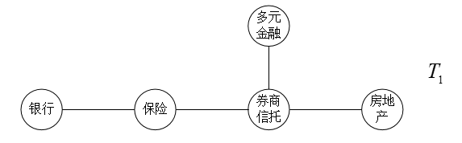

```{r setup, echo=F}
################# 第 3 章 R 程序代码  ####################
knitr::opts_knit$set(root.dir = getwd())
knitr::opts_chunk$set(echo = FALSE, results = 'hide')
knitr::opts_chunk$set(warning = FALSE, message=FALSE)
```

```{r prepare}
rm(list=ls())
options(digits=4)
options(scipen=100)
graphics.off()
Sys.setlocale("LC_ALL", "Chinese")
library("kableExtra")
```

# 简介

就我国目前的经济形式来看，如何防范化解系统性风险仍是当前最紧迫的事情。根据2019年
中央经济工作会议的相关指示，要确保我国经济持续健康发展下去，必须要尽可能避免金融
市场的反常波动，坚决做好防范化解系统性风险的准备。近年来各金融部门的资产和信贷风
险之间的协同流动不断增加，致使系统性金融风险呈现显著的跨部门传导效应, 这意味着如
果只侧重于单个金融部门内部的风险传导，而忽视了机构间的关联性，就可能低估相互依赖
的金融机构对系统性金融风险的整体贡献，从而无法正确衡量金融系统中的风险溢出效应。
同时我国经济体制改革的政策对我国金融业带来了两大显著影响：首先是促进以单一盈利业
务为主的业务分业经营模式向包含多种创新业务的混业经营模式逐渐转变；其次是推动金融
不断创新，金融衍生产品快速发展，不同类型的市场参与主体之间因此有了更加紧密的联系，
进而导致证券市场中各个行业板块结构日益复杂化，其关联性和依存性增加，使得证券市场
发生系统性金融风险的可能性及系统风险程度大大增加。而且当系统性风险发生时，不仅影
响金融机构自身的发展，影响所在行业的稳定，甚至会影响国民经济乃至全球经济的稳定。
不仅如此，系统性风险往往呈现较强的传染性，某一个体受到系统性风险冲击时，会快速影
响到其它个体。在股票价格的调节过程中，及时发现板块间股价变动的联动性，也可以一定
程度上避免受到板块间风险传染的影响。

从国内国外的经济状况看，我国当前金融体系内的系统性风险正在加速酝酿，但是部分金融
机构或部门对金融风险的防范意识相对淡薄，而且在直面风险时的管理水平较弱。同时"金
融机构'太大而不能倒'（'too big to fail'）的传统观念正逐步向'太关联而不能倒'（'too
interconnected to fail'）的思想转变" [@李绍芳2018]。正是由于证券市场中的各行业板
块的股价日趋呈现出交叉联动的特点，研究证券市场板块间风险传染路径、机制以及风险相
关程度、影响力度，为政策制定及投资决定提供参考建议，成为一个日渐紧迫的任务，越来
越具有现实意义。

在金融风险管理领域内，由于金融风险具有显著的传染性，某一因素导致的行业重大经济损
失可能会通过各种渠道快速传染至其他行业，进而可能引发一种涉及整个经济体系的系统性
风险。由于不同行业、不同企业间潜在的关系会反应在各股股票价格的变动上，因此对于板
块波动和板块间波动关联的深入研究有助于我们更准确地认识到在实体经济当中不同行业间
的经济关系以及这种关系对各个行业的直接或间接的影响程度。

在投资领域内，投资者在进行投资时往往需要选择相关性较小的投资产品组成的资产组合以
规避风险的发生 [@Markowitz1952Portfolio]。因此更深入的了解证券市场行业板块之间的
关联性，有利于投资者对如何构建合适的投资组合，如何研判市场规律也起到一定的指导意
义。如果投资者忽视了个股间或者板块间的关联作用，就无法准确判断一个看似只会影响某
只个股或某个板块的突发性消息对整个证券市场可能带来的冲击，这就会在较大程度上损失
投资组合在未来盈利的稳健性。因此本文将首先通过CCA模型对我国证券市场金融各板块的
系统性风险进行度量，然后运用前沿的藤理论，将板块与板块组成一个整体，并且以Copula
为媒介，确定板块间风险的相关关系，进而对金融板块的风险传染进行分析探究。

## 国内外文献综述

### 关于系统性风险定义的研究

从近年的文献看，当前关于系统性金融风险的定义尚没有一个统一的标准的定义，但大致可
分为四种：一是从金融系统的功能出发来定义系统性风险，代表学者为Minsky（1986）和
Billio（2012），他们认为系统性金融风险是指突发性的、猛烈的金融事件极大地干扰了金
融系统的正常的运行秩序，而由此引致的信息延滞等将导致投资者的信心严重丧失，金融机
构和金融市场的服务及资源配置功能受到极大的冲击
[@mishkin1999international;@billio2012econometric]。二是从实体市场经济受危机影响
的程度出发，这种定义也是国际经济组织常用的定义（BIS，FSB，IMF（2011）；韩心灵等
（2017），其认为系统性金融风险产生的原因是在实体市场中的交易双方未能及时按照交易
条款的规定履行自己的责任和义务，损害了金融系统原本正常的投融资功能，并由此导致各
经济体的经济发展速度放缓甚至倒推以及居民生活满意度的降低 [@韩心灵2017]）。三是从
金融危机对各经济体系的危害严重程度出发，认为这种系统性金融风险会极大的冲击现有金
融体系的稳定，而且其影响程度极广，危害程度极深，可能对整个金融系统的正常运行都会
带来巨大冲击，甚至会导致经济运行紊乱（范小云等，2002） [@范小云2013]。四是从传染
性的角度出发，认为系统性金融风险是由某一个突发事件引起的，但由于不同金融机构、金
融市场间的关联作用，导致该突发事件的危害通过这一"关联作用"传递至其他金融机构乃至
整个金融体系，引发一系列的经济破坏效应（Kaufman（1996）；巴曙松等（2013））
[@kaufman1996bank;@巴曙松2013]。

### 关于系统性风险量化方法的研究

国内外对系统性风险的量化方法主要包括以下三种：

1.综合指标法

综合指标法，即通过构建一个综合指标，来反应当前金融系统的系统性风险状况，主要包括
两个步骤，一是选取对系统性风险影响较大的指标，二是采取一定的统计方法对指标进行综
合，从而得到能够衡量当前系统性风险整体状况的指数。当指数高于某一阀值时即表明当前
时期系统性风险较高。由于方法原理明了清晰，因此综合指数法在实践中被广泛地运用。典
型案例如许涤龙等（2015）选择具有代表性的银行、股票和外部金融市场等宏观性指标为子
指标，在赋权法的基础上延伸出CRITIC赋权法，构建出针对我国经济情形下的金融压力指标，
并以该指标为基础对我国的系统性金融风险预警系统的建设提出了建议 [@许涤龙2015]。唐
升等（2018）则注重更宏观的指标，其使用熵值法综合处理了泡沫经济指标、外部资本冲击
指标、宏观经济运行指标、金融机构经营指标等四类金融风险指标，进而构建出我国的系统
性金融风险指标 [@唐升2018]。综上，关于综合指标法的应用主要是通过宏观、微观和市场
三个层面构建子系统指标。之后学者们在综合指标法中逐渐引入金融市场数据，完善了系统
性风险测度和预警的指标体系。但综合指数法的弊病在于其始终无法反应金融机构间的风险
传染效应。

2．VaR 法

VaR法即风险价值法，最初由Baumol（1963）提出 [@baumol1963expected]。风险价值通俗
的含义即在一给定的概率水平下，一个金融资产在未来某一时期内出现的最大可能损失。该
方法自提出后首次运用于巴塞尔协议中，主要用来对金融资产的风险进行评价。此后，由于
风险价值法计算简单、且统计意义明确，因此在风险测度领域中得到了广泛的推广和使用。
但从VaR的计算方法可以看出，其也存在些许不足。因此学者后续对其进行了改进，主要包
括条件风险价值CoVaR和期望损失ES。条件风险价值CoVaR由Adrian等（2011）提出，一经提
出便受到广泛关注，其主要用于金融资产或投资组合一旦遭遇风险，其损失便会极大的情况
[@adrian2011]。在国内，大多数学者选用条件风险价值法来测度系统性风险。赵树然等
（2018）鉴于不同银行间可能存在较为复杂的动态关系，因此其利用高频数据，构建了样本
银行与金融系统之间的动态多条件CoVaR模型 [@赵树然2018]。并以此为前提，提出了一个
不同银行群体对整个银行体系系统性风险影响程度的指标，从群体的角度探究了各个银行同
金融系统之间的风险传染效应。但是CoVaR并非完美，其存在两个关键的缺陷：一是整个金
融体系的系统性风险并不直接简单等于运用该方法度量的单个机构风险溢出之和；二是由于
此方法基于高频数据，易造成尾部损失的总体严重性信息缺失，从而使得尾端风险度量失准。
由Artzner等（1999）提出的期望损失（Expected Short fall）是对VaR的进一步改进，改
进之处在于当预期损失可能超出VaR较多时，VaR方法的风险预警功能将大幅降低，近乎失效，
此时ES可明确给出超过临界风险值的条件期望 [@artzner1999]。因此，许多学者指出与VaR
相比，ES测度更具理论优势，在该方法下度量的风险精度更高，更具价值。杨子晖等（2019）
基于非线性的研究视角，通过构建预期损失指标（ES）进一步考察了各部门间极端风险的非
线性特征与金融风险的跨部门传染效应，并应用相关的网络关联指标，对金融系统整体以及
单个金融机构的极端风险的非线性关联展开分析 [@杨子晖2019]。

3．相关违约法

相关违约法主要是通过研究系统内各组成单元的违约概率，然后以Copula函数为基础，估计
出整个系统的违约概率，该违约概率的大小即反应了系统性风险的严重程度。其中尤以CCA
方法最为典型。未定权益分析模型以布莱克-舒尔斯-墨顿期权定价模型为基础，由Gray加以
研究完善。该方法假设系统内各组成单元的预期损失服从GPD分布，通过非参的方法测量出
系统的联合期望损失，以此实现对系统性风险的精确测度。在国内，率先运用CCA模型的学
者是宫晓琳（2012），其以CCA模型为基础计算出我国各经济部门的负债市场价值和资产市
场价值，对我国近十年的宏观金融风险进行了风险测度，清晰准确地展示了我国在这段时间
内金融机构系统性风险的动态变化 [@宫晓琳2012]。宋凌峰等（2018）通过收集保险业样本
股的资产负债表数据和证券市场数据，考虑到经济数据往往具有时变性的特征，因此创造性
的构建了MS-CCA模型，并由此计算出个保险业样本股的违约距离，实证研究了引起保险行业
系统性风险变化的内生因素 [@宋凌峰2018]。综合比较以上系统性风险度量方法，可以发现，
或有权益分析法具有如下显著特点：一是CCA方法综合考虑了研究对象的财务数据和资本市
场数据，具有一定的前瞻性；二是CCA方法能够反映研究对象的系统性风险随时间变化的特
征及趋势 [@苟文均2016]。

### 关于系统性风险传染效应测度方法的研究

目前国内外关于系统性风险传染效应测度方法可归纳为三种：统计模型法、尾部相关法和网
络模型法。

1．统计模型法

统计模型法即传统的统计计量模型，例如传统计量模型、向量自回归模型、Copula函数簇模
型等。王桂虎等（2018）以固定效应模型和面板logit模型为基础模型，构建了35个OECD样
本国家的保险行业资产负债流动性错配指数，并研究分析出该指数与金融危机之间的关系，
实证结果表明该指数同系统性风险之间具有显著的正相关关系 [@王桂虎2018]。郭娜等
（2018）先通过因子分析法构建出我国区域金融安全指数，然后将VAR模型与马尔科夫理论
相结合，识别出在不同经济时期，我国不同区域的系统性风险情况 [@郭娜2018]。喻开志等
（2018）则从VAR模型衍生使用关联性衡量方法（DY法）对汇率、房地产、股市和利差的关
联性进行度量，并以此为基础探究了国内金融系统性风险同短期国际资本流动之间的传染机
制 [@喻开志2018]。叶五一等（2018）将Copula模型与GAS模型相结合，从动态的角度研究
了我国28个行业相互之间的动态相关关系及系统性风险溢出的变化 [@叶五一2018]。

2．尾部分析法

尾部分析法主要包括∆CoVaR法、MES法和SRISK法，其核心思想是通过分析不同金融序列的尾
部相关性研究部门间系统性风险的传染效应。

（1）∆CoVaR法

∆CoVaR，即金融机构或部门在金融危机发生前后的条件在险价值CoVaR的差值，因此该指标
可以反映出其系统性风险贡献程度。而在研究过程中，可以通过将CoVaR和∆CoVaR结合的方
式，实时反映某一金融机构的系统性风险溢出水平。方意等（2018）通过计算∆CoVaR，并以
金融市场溢出效应的解析式为基础，分析出我国系统性风险在金融系统间溢出的渠道，并由
此将该系统性风险溢出过程划分为三个阶段，最后得出银行业、房地产市场及股票市场对系
统性风险的溢出效应有着显著影响的结论 [@方意2018]。张瑞等（2018）则考虑到金融机构
资产收益率的正负性可能对系统性风险的传染效应存在差异，因此其构建了非对称CoVaR模
型，通过计算平均溢出效应∆CoVaR估计我国上市银行对金融系统整体风险的溢出效应 [@张瑞2018]。

（2）MES 法

边际期望损失（MES）由Acharya、Engle和Richardson（2012）首次提出
[@acharya2012capital]。正如方法名称所示，其计算的是期望损失的边际值。因此该指标
也可以反映出其系统性风险贡献程度。例如刘璐等（2016）选取了我国三家保险业龙头企业
的股票收盘价数据，并放入DCC-GARCH 模型中得出这三家保险公司的波动率函数，然后通过
MES方法，得出三家企业各自对保险业系统性风险的贡献程度，最后总结了我国保险行业系
统性风险的规律 [@刘璐2016]。

（3）SRISK法

SRISK是一种计算系统各组成单元对系统性风险的贡献程度的指标，最早由Brownlees，
Christian和Engle提出 [@brownlees2017srisk]，属于较为新颖的方法。其计算思路与MES法类似，但其综合考虑了负债规
模、资本比率、市值等因素，以金融危机发生时单个金融机构面临的预期资本缺
口作为风险指标。Laeven等（2016）在SRISK模型的基础上得到了系统性风险与银行规模成
正相关，但系统性风险会随着银行资本的增加而减少的结论 [@laeven2016bank]。肖崎等（2018）结合分析企业
经营状况时的杜邦分析法，同时由于研究对象银行的特殊性，将非利息收入占比、不良贷款
率等指标和国家GDP等指标纳入SRISK模型中，实证研究了我国商业银行在轻型化转型过程中
对银行业系统性风险的贡献程度 [@肖崎2018]。Varotto和Zhao(2018)同时使用了期望损失模型和SRISK模
型，探究了美国和欧洲银行2004---2012年机构层面的系统性风险，得出一般的系统性风险
主要受银行规模影响的结论，研究结果提示"大而不能倒"的机构应受到高度关注 [@varotto2018systemic]。陈湘鹏等
（2019）则从方法比较的角度考虑，综合使用了MES、SES、∆CoVaR和SRISK等方法测量我国
金融系统在微观角度下的系统性金融风险，比较各方法的结果来看，SRISK法作为我国微系
统性金融风险的测量方法更好 [@陈湘鹏2019]。

3．网络模型法

矩阵法和网络分析法是网络模型法中具有代表性的测度方法。该方法的核心在于利用所研究
多个部门间共通的数据搭建起合理的网络结构，以此达到真实模拟系统性风险传染路径。李
绍芳等（2018）从尾部风险和溢出效应的视角出发，利用2007～2017年中国上市金融机构数
据，基于动态尾部事件驱动网络模型构建了中国金融机构体系的关联网络，并在此基础上分
析了金融机构关联水平与系统性风险之间的关系 [@李绍芳2018]。李政等（2019）则使用
TENET网络研究我国经济金融系统中不同行业间的系统性风险传染效应 [@李政2019]。研究
结论发现信息技术、房地产和材料行业是整个TENET网络中核心的三个行业，并在研究结论
中特别提到必须准确找到风险源头以有效控制系统性风险。


## 研究内容和方法

本文可分为五个部分，各部分的主要内容如下：

第一部分是导论，主要是阐述当前我国的经济形势，探究板块间系统性风险传染的目的，其
他学者在相关领域的研究现状，本文整体的研究内容与方法。其中文献综述主要从系统性风
险的金融理论、系统性风险的量化、系统性风险传染效应测度三个角度对国内外文献进行了
归纳总结。

第二部分是对本文在研究过程中所涉及的模型进行介绍。首先对用于系统性风险测度的CCA
模型进行介绍，指明选用 CCA 模型的原因以及 CCA模型的计算方法；然后介绍 Copula 模
型的基本原理以及基于 Copula模型的相依性计量方法；最后介绍藤 Copula 的理论基础，
包括多元 Copula分解及常见的藤结构。

第三部分是以CCA模型为基础对金融各板块的系统性风险进行计算。但是在计算中，本文并
非直接使用板块指数等整体性指标计算板块的系统性风险，而是通过化整为零，先计算各板
块样本股的违约距离，再进行汇总得到板块的系统性风险，尽可能减小系统性风险测度过程
中存在的误差。基于CCA模型的计算原理，该部分先对计算时所需的指标进行处理。然后通
过R语言的nleqslv函数可以求解样本股以及所属版块的违约距离。最后对近十年金融板块的
系统性风险波动进行简要分析，寻找波动的原因并对整体趋势做一个评估。

第四部分是通过RVine-Copula模型分析金融板块间的系统性风险传染效应。该部分主要分为
两节：第一节是构建RVine-Copula模型，首先使用第三部分计算得到的各板块违约距离序列
通过经验分布函数转换为[0,1]上的均匀分布，然后以新序列为基础确定最优的R藤结构
形式，将金融板块的基本网络搭建出来，并进行相应的分析，最后确定并估计藤结构中节点
与节点间边的Copula类型及参数值，通过分析Copula的类型和相应的取值，分析板块间的上
尾相关性或下尾相关性；第二节是在第一节的基础上计算板块间的尾部相依系数、无条件
Kendall相关系数和条件Kendall相关系数，分析得到板块间系统性风险的传染效应。

第五部分是结论。该部分主要总结了本文在实证研究过程得到的结论。


在实证研究过程中，本文主要用到CCA模型和Copula模型。但在实际应用中，本文则将这两
个模型和藤结构有机结合起来，构建了CCA-Vine-Copula模型来测度各金融板块间系统性风
险的传染效应。首先通过CCA模型利用定量分析法进行计算，得到金融各板块样本股的违约
距离，进而汇总得到的板块整体的系统性风险；然后运用描述性研究法，对近十年以来各板
块的系统性风险进行分析，确定风险波动的原因；最后则是利用藤Copula模型，对板块间的
风险传染效应进行探究，利用定量分析法对藤结构、板块间Copula函数的形式和板块间尾部
相依系数、无条件Kendall系数与条件Kendall系数进行分析，尽可能全面的对金融板块间的
系统性风险传染有深刻的探究。

## 本文的创新点

本文将从以下两个方面进行创新：

1．目前国内学者在对行业信用风险进行度量时更多的是直接用行业整体的指标进行计算，
但是在计算时，相当于是先对行业样本股的相关指标求和，再通过模型的相应计算原理进行
计算。本文则是直接采用行业样本股的相关财务指标和市场数据计算个股的违约距离，然后
再通过加权平均个股的违约距离来指代整个行业的系统性风险，在一定程度上提高了对行业
系统性风险的测量精度。

2．在研究系统性风险传染时，国内学者更多的是研究两个主体间的风险传染，即使在研究
多个主体时，也主要是将多个主体两两匹配，对配对的主体进行相应的研究。本文则是运用
藤理论，通过藤结构将多个主体联系在一起，从系统的角度研究多个主体间的系统性风险传
染，尽可能避免了对金融系统的割裂。


# 模型理论基础

## CCA模型理论基础

### Black-Sholes-Merton期权定价模型

布莱克-舒尔斯-墨顿模型（Black-Scholes-Merton model），简称为BSM模型，是一种为期
权等其他各类金融衍生工具提供理论定价的基础模型。该模型首先假设存在如下资产组合：
由基础资产和无风险利率构成，可以完全复制期权价格变动的资产组合。然后考虑在风险中
性的前提下，期权权益在当前时点的折现价值。模型具体形式如下：

$$C = SN\left(d_1\right) - Le^{-rT}N\left(d_2\right)$$ 
{#eq:bsm-model}

其中：

$$d_1= \frac{\ln\frac{S}{L}+\left(r+\frac{\sigma ^2}{2} \right)T}{\sigma\sqrt
T}$$
{#eq:bsm-d1}

$$d_2=\frac{\ln\frac{S}{L}+\left(r-\frac{\sigma ^2}{2} \right)T}{\sigma\sqrt
T}=d_1-\sigma\sqrt T$$
{#eq:bsm-d2}

在[@eq:bsm-model]、[@eq:bsm-d1]、[@eq:bsm-d2]式中，$C$表示在假定风险中性的条件下，所研究期权权益的理论交易价格，$S$表示期权所对应的理论资产组合中基础金融资产在当前时点的价格，$N\left(d_n\right)$表示标准正态分布的分布函数（$\frac{1}{\sqrt {2\pi}}\int_{-\infty}^{d_n}{e^{-\frac{x^2}{2}}}dx$），
$L$表示所研究期权在到期时或交割时的价格，$r$表示无风险利率，$T$表示期权有效时间，但需以年为计量单位，$\sigma^2$表示期权所
对应的金融资产的波动率。在使用该BSM期权定价公式时，有如下五个基本假设：

（1）基础资产的对数收益率服从正态分布；

（2）无风险利率和该金融资产的收益较为稳定；

（3）在市场中进行交易时没有交易成本和税赋；

（4）该金融资产不存在红利或其他特殊收益；

（5）该期权为欧式期权，在期权到期日前不可提前行权 [@black1973pricing]。

只有在上述假设成立时，使用BSM公式对期权的定价才具有准确性。


### CCA模型理论

或有权益模型（Continent Claims Analysis，简称CCA）是在Black-Sholes-Merton期权定
价模型的基础上，通过引入企业的资产负债表，将企业的财务数据与市场数据结合起来构建
风险资产负债表，进而对企业的风险进行整体分析的一种方法。CCA模型将一个企业的资产
市场价值（$A$）拆分为股权的市场资本价值（$E$）和债务的市场资本价值（$D$）。当一个企业
的债务市场价值高于该企业的资产市场价值时，表明该企业可能会存在违约行为，不能到期
及时偿还债务。需要注意的是，或有权益模型中的企业资产的价值和债务的价值均为市场资
本价值，不能通过企业财报得到直接数据。因此CCA方法指出，可通过以下方法间接计算得
到企业资产的市场价值，即将股权看为价值为$A$，交割价格为企业资产负债表中的债务价值$B$
的欧式看涨期权，根据BSM公式可得股权的市场价值为：

$$E=AN\left(d_1\right)-Be^{-rT}N\left(d_2\right)$${#eq:cca-equity}

$$d_1=\frac{\ln\left(\frac{A}{B}\right)+\left(r+\frac{\sigma^2_A}{2}\right)T}{\sigma_A\sqrt{T}}$$
{#eq:cca-equity-d1}

$$d_2=\frac{\ln\left(\frac{A}{B}\right)+\left(r-\frac{\sigma^2_A}{2}\right)T}{\sigma_A\sqrt{T}}=d_1-\sigma_A\sqrt{T}$$
{#eq:cca-equity-d2}

其中，$A$表示企业资产的市场价值，$N\left(\right)$表示标准正态分布的分布函数，$B$
表示企业资产负债表中的债务价值，$E$表示股权的市场资本价值，$r$表示无风险利率，
$T$表示当前时刻到到期日的时间（按年计算），$\sigma_A^2$表示企业资产市场价值的波
动率。

但是，[@eq:cca-equity]、[@eq:cca-equity-d1]、[@eq:cca-equity-d2]中$A$、
$\sigma_A^2$均未知，因此需增加一个条件：

$$\sigma_E=\frac{N\left(d_1\right)A}{E}\sigma_A$$
{#eq:cca-equity-sigma}

其中$\sigma_E$为股权波动率，可通过波动率模型得到。综上，通过联立
[@eq:cca-equity]、[@eq:cca-equity-d1]、[@eq:cca-equity-d2]和
[@eq:cca-equity-sigma]即可解出企业资产市场价值的波动率$\sigma_A^2$和企业资产的市
场价值$A$。

在求解债务市场价值时可将其看做债务账面价值($B$)与预期损失净现值（$P$）的差值，即：

$$D=B-P$$
{#eq:cca-debt-basic}

而预期损失净现值可看做为价值为$B$，行权价格为企业资产价值$A$的欧式看跌期权，通过对BSM公式的推导，
可得到预期损失净现值的计算公式：

$$P=Be^{-rT}N\left(-d_2\right)-AN\left(-d_1\right)$$
{#eq:cca-debt}

$$d_1=\frac{\ln\left(\frac{A}{B}\right)+\left(r+\sigma^2_A\right)T}{\sigma_A\sqrt{T}}$$
{#eq:cca-debt-d1}

$$d_2=\frac{\ln\left(\frac{A}{B}\right)+\left(r-\sigma^2_A\right)T}{\sigma_A\sqrt{T}}=d_1-\sigma_A\sqrt{T}$$
{#eq:cca-debt-d2}

通过联立[@eq:cca-debt]、[@eq:cca-debt-d1]、[@eq:cca-debt-d2]和[@eq:cca-equity-sigma]即可解得$P$，
进而计算出企业的违约距离$DD$,计算公式为^[违约距离的计算公式有两种，一种为本文式（1-8），另一种为DD=d2，其中第二种计算方法仅在资产对数收益率服从标准正态分布时较为准确，第一种方法更具有普遍性，因此本文以第一种计算方法为主。]:

$$DD=\frac{A-B}{A \cdot \sigma_A}$$
{#eq:dd}

企业的违约距离DD越短，违约概率越大，即企业的风险越大；违约距离DD越长，违约概率越
小，企业的风险越小。

## Copula函数理论基础

### Sklar定理

Sklar定理是Copula理论的基础。Copula理论简言之就是通过联结函数$C$，将多个变量的边
缘分布联结起来，构成这些变量的多元联合分布函数。特别的，对于仅包含两个变量的情
况，且这两个变量均服从U（0，1）时，一定存在一个联结函数C，使得其联合分布函数可由
各变量的边缘函数直接构成。


Copula函数的表达形式为：

$$F\left(x_1,x_2,...,x_n\right)=C\left(F_1\left(x_1\right),F_2\left(x_2\right),...,F_n\left(x_n\right)\right)$${#eq:copula}

其中，$F\left(x_1,x_2,...,x_n\right)$表示变量$x_1,x_2,...,x_n$联合概率分布函数，
$c\left(\right)$表示$n$维联结函数，$F_n\left(x_n\right)$表示变量$x_n$的边缘分布
函数。若边缘分布函数的反函数均存在，则Copula函数的计算公式为：

$$c\left(u_1,u_2,...,u_n\right)=F\left(F_1^{-1}\left(x_1\right),F_2^{-1}\left(x_2\right),...,F_n^{-1}\left(x_n\right)\right)$$
{#eq:copula-solve}

在模型使用过程中，更多的是用式[@eq:copula-solve]。在已知多元联合分布函数和各边缘
分布函数时，就可以通过式[@eq:copula-solve]得到联结函数的形式及各参数值，进而可对
变量之间的相关程度进行研究。


### 基于Copula模型的传染效应测度方式

在通过Copula函数度量变量间的相关程度时一般使用Kendall's $\tau$秩相关系数 [@籍艳丽2009]及尾部相关
系数进行判断。

其中Kendall's $\tau$秩相关系数主要从一致性的角度对变量之间的相关关系进行测度。
设$\left(x_i,y_i\right)$和$\left(x_j,y_j\right)$是随机变量$X$，$Y$的两组情况，当
$\left(x_j-x_i\right)\left(y_j-y_i\right)>0$时，即$x_j-x_i$与$y_j-y_i$同号时，则
认为随机变量$X$和$Y$具有一致性。反之，当
$\left(x_j-x_i\right)\left(y_j-y_i\right)<0$时，即$x_j-x_i$与$y_j-y_i$异号时，则
认为随机变量$X$和$Y$是不一致的。根据这一原理，可得到Kendall's $\tau$秩相关系数的
计算公式为：

$$\tau_{X,Y}=P\left[\left(x_j-x_i\right)\left(y_j-y_i\right)>0\right]-P\left[\left(x_j-x_i\right)\left(y_j-y_i\right)<0\right]$$
{#eq:tau}

结合Copula函数理论和Kendall's $\tau$的计算公式，可得到在使用Copula模型时，两个变
量间的Kendall's $\tau$相关系数，推导过程如下：

$$\begin{array}{lcl}
\tau_{X,Y}&=&P\left[\left(X_1-X_2\right)\left(Y_1-Y_2\right)>0\right]-P\left[\left(X_1-X_2\right)\left(Y_1-Y_2\right)<0\right]
\\&=&P\left[\left(X_1-X_2\right)\left(Y_1-Y_2\right)>0\right]-\left\{1-P\left[\left(X_1-X_2\right)\left(Y_1-Y_2\right)>0\right]\right\}
\\&=&2P\left[\left(X_1-X_2\right)\left(Y_1-Y_2\right)>0\right]-1
\\&=&2\left\{P\left(X_2<X_1,Y_2<Y_1\right)+P\left(X_1<X_2,Y_1<Y_2\right)\right\}-1
\\&=&2\left\{\iint_{D}P\left(X_2<X,Y_2<Y\right)dC\left(F\left(x\right),G\left(y\right)\right)\right.
\\& &\left.+\iint_{D}P\left(X_2>X,Y_2>Y\right)dC\left(F\left(x\right),G\left(y\right)\right)\right\}-1
\\&=&2\left\{\iint_{D}C\left(F\left(x\right),G\left(y\right)\right)dC\left(F\left(x\right),G\left(y\right)\right)\right.
\\& &\left.+\iint_{D}\left(1-F\left(x\right)-G\left(y\right)+C\left(F\left(x\right),G\left(y\right)\right)\right)dC\left(F\left(x\right),G\left(y\right)\right)\right\}-1
\\&=&2\left\{\iint_{D}C\left(u,v\right)dC\left(u,v\right)+\iint_{D}\left(1-u-v+C\left(u,v\right)\right)dC\left(u,v\right)\right\}-1
\\&=&2\left\{\iint_{D}C\left(u,v\right)dC\left(u,v\right)+1-\frac{1}{2}-\frac{1}{2}+\iint_{D}C\left(u,v\right)dC\left(u,v\right)\right\}-1
\\&=&4\iint_{D}C\left(u,v\right)dC\left(u,v\right)-1
\end{array}$$
{#eq:copula-tau}

进而可根据Copula函数的形式以及相关参数得到两个变量间的Kendall's $\tau$ 相关系
数，并以此为依据进行下一步的分析。

而尾部相关系数包括上尾相关系数和下尾相关系数。

其中上尾相关系数表示在变量$Y$的取值在右尾时，$X$的取值也落在右尾概率，用公式表示为：

$$\lambda_u=\lim\limits_{u \to
1}P\left\{X>F_x^{-1}(u)\left|Y>F_y^{-1}(u)\right.\right\}$$
{#eq:lambda-u}

同理，下尾相关系数表示在变量$Y$的取值在左尾时，$X$的取值也落在左尾的概率，用公式表示为:

$$\lambda_l=\lim\limits_{u \to 0}P\left\{X \leq F_x^{-1}(u)\left|Y \leq
F_y^{-1}(u)\right.\right\}$$
{#eq:lambda-l}

## VineCopula模型理论基础

### Pair Copula分解原理

正如前文对Sklar定理的阐述，联结函数$C$可起到联结各变量的作用。但是一旦面对多元变
量的情况，就会陷入"维数灾难"^[“维数灾难”是指随着维数的增加，计算量呈指数倍增长的
一种现象。]之中：一来会使得Copula函数的形式过于复杂，所需估计的参数过多，二来甚
至有Copula函数不存在的可能，不利于进一步的分析。因此在处理多元问题时需通过降维的
方式简化问题。在Sklar定理中特别提到对于仅包含两个变量时，且
这两个变量均服从U（0，1）时，一定可以找到一个联结函数$C$，使得其联合分布函数可由各
变量的边缘函数直接构成。因此，可通过Pair Copula的方法对多元Copula函数进行分解。

例如，针对二维变量的情况有：

$$f\left(x_1,x_2\right)=c_{1,2}\left\{F_1\left(x_1\right),F_2\left(x_2\right)\right\}\cdot
f_1\left(x_1\right)\cdot f_2\left(x_2\right)$$
{#eq:paircopula-2}

根据链式法则可得：

$$f\left(x_1\left|x_2\right.\right)=\frac{f\left(x_1,x_2\right)}{f_2\left(x_2\right)}=c_{1,2}\left\{F_1\left(x_1\right),F_2\left(x_2\right)\right\}\cdot
f_1\left(x_1\right)$$
{#eq:paircopula-2-cond}

针对三维变量的情况可得到：

$$\begin{array}{lcl} f\left(x_1,x_2,x_3\right)&=&f_1\left(x_1\right)\cdot
f\left(x_2\left|x_1\right.\right)\cdot f\left(x_3\left|x_1,x_2\right.\right)
\\&=&f_1\left(x_1\right)\cdot
c_{1,2}\left(F_1\left(x_1\right),F_2\left(x_2\right)\right)\cdot
f_2\left(x_1\right)\cdot f\left(x_3\left|x_1,x_2\right.\right) \end{array}
$$
{#eq:paircopula-3}

其中$f\left(x_3\left|\right.x_1,x_2\right)$需通过变换条件，达到求解的目的，具体
转换方法如下：

$$\begin{array}{lcl}
f\left(x_3\left|x_1,x_2\right.\right)&=&\frac{f\left(x_2,x_3\left|x_1\right.\right)}{f\left(x_2\left|x_1\right.\right)}
\\&=&\frac{c_{23\left|1\right.}\left(F\left(x_2\left|x_1\right.\right),F\left(x_3\left|x_1\right.\right)\right)\cdot
f\left(x_2\left|x_1\right.\right)\cdot
f\left(x_3\left|x_1\right.\right)}{f\left(x_2\left|x_1\right.\right)}
\\&=&c_{23\left|1\right.}\left(F\left(x_2\left|x_1\right.\right),F\left(x_3\left|x_1\right.\right)\right)\cdot
f\left(x_3\left|x_1\right.\right)
\\&=&c_{23\left|1\right.}\left(F\left(x_2\left|x_1\right.\right),F\left(x_3\left|x_1\right.\right)\right)\cdot
c_{1,3}\left(F_1\left(x_1\right),F_3\left(x_3\right)\right)\cdot
f_3\left(x_3\right) \end{array}$$
{#eq:paircopula-3-1}

因此，可得到$f\left(x_1,x_2,x_3\right)$经过Pair Copula方法展开后的结果为：

$$\begin{array}{lcl} f\left(x_1,x_2,x_3\right)&=&f_1\left(x_1\right)\cdot
f_2\left(x_2\right)\cdot f_3\left(x_3\right)\cdot \\&
&c_{1,2}\left(F_1\left(x_1\right),F_2\left(x_2\right)\right)\cdot
c_{1,3}\left(F_1\left(x_1\right),F_3\left(x_3\right)\right)\cdot \\&
&c_{23\left|1\right.}\left(F\left(x_2\left|x_1\right.\right),F\left(x_3\left|x_1\right.\right)\right)
\end{array}$$
{#eq:paircopula3-2}

但是，需要注意的是，在假定$x_1$，$x_2$，$x_3$不可相互替代时，我们在前面计算
$f\left(x_1,x_2,x_3\right)$时采用的是$f_1\left(x_1\right)\cdot
f\left(x_2\left|x_1\right.\right)\cdot f\left(x_3\left|x_1,x_2\right.\right)$变
换得到的，但我们也可以证明$f_2\left(x_2\right)\cdot
f\left(x_3\left|x_2\right.\right)\cdot f\left(x_1\left|x_2,x_3\right.\right)$同
样可以推导至$f\left(x_1,x_2,x_3\right)$，不过此时再进行Pair Copula分解时，得到的
结果为：

$$\begin{array}{lcl} f\left(x_1,x_2,x_3\right)&=&f_1\left(x_1\right)\cdot
f_2\left(x_2\right)\cdot f_3\left(x_3\right)\cdot \\&
&c_{1,2}\left(F_1\left(x_1\right),F_2\left(x_2\right)\right)\cdot
c_{2,3}\left(F_2\left(x_2\right),F_3\left(x_3\right)\right)\cdot \\&
&c_{13\left|2\right.}\left(F\left(x_1\left|x_2\right.\right),F\left(x_3\left|x_2\right.\right)\right)
\end{array}$$
{#eq:paircopula3-3}

可以发现式[@eq:paircopula3-2]与式[@eq:paircopula3-3]存在较大差异。在三维变量的情
况下，共存在$3！/2=3$种分解方式，而每种分解方式得到的结果均不同。因此在研究分析
时，具体选择哪一种分析方式就成为了一个新的问题。关于该问题将在下一节进行解释和回
答。

### 规则藤结构概述

按照PairCopula分解原理，对于一个包含n维变量的联合密度函数，将会存在n!/2种分解方
法 [@aas2009] 。
针对如此繁多的分解方法，Bedford和Cooke在2001年进行了归纳总结，并依赖"图论"思想，提
出了"藤"的模式 [@bedford2001probability]。藤Copula解决了
传统构建多元Copula函数所遇到的困难和问题。藤的类型主要包括C藤、D藤和R藤。由于本
文在建模时主要采用的为R藤结构，因此主要介绍R藤Copula模型的概况。

不妨以一个包含五维变量的R藤模型为例。一个五维R藤包含四棵树，分别记为$T_1$，
$T_2$，$T_3$，$T_4$，设五个变量分别为1,2,3,4,5，则对于第一棵树$T_1$，1,2,3,4,5也
是其5个节点，节点与节点间的线段表示Copula函数的某一种类型。“|”之后的变量表示条件
变量。

则可构造如下五维R藤模型的概念图：

```{r vine,echo=FALSE,fig.cap="五维R藤模型结构图",cache=F,dev=c("cairo_pdf"),results='markup',fig.height=6}
knitr::include_graphics("D:/github_repo/vine-copula-Zeng/vine.png")
```

针对上述概念图可得到这五维变量的多元联合密度函数：

$$\begin{array}{lcl} f&=&f_1\cdot f_2\cdot f_3\cdot f_4\cdot f_5\cdot \\&
&c_{1,2}\cdot c_{2,3}\cdot c_{3,4}\cdot c_{3,5}\cdot \\&
&c_{1,3\left|2\right.}\cdot c_{2,5\left|3\right.}\cdot
c_{2,4\left|3\right.}\cdot \\& &c_{1,5\left|2,3\right.}\cdot
c_{4,5\left|2,3\right.}\cdot \\& &c_{1,4\left|2,3,5\right.}
\end{array}$$
{#eq:vine}

当然，五维R藤模型不止上述一种构造方法。为了简便表示R藤结构的形式，JF Dißmann提出
可用下三角矩阵描述这种结构信息 [@dissmann2010statistical]。例如，针对概念图中的结构，可构造以下结构矩阵：

$$M=\left(\begin{matrix}
1&{}&{}&{}&{}\\
4&4&{}&{}&{}\\
5&5&2&{}&{}\\
3&2&5&3&{}\\
2&3&3&5&3
\end{matrix}\right)$$
{#eq:vine-matrix}

在矩阵[@eq:vine-matrix]中，对角线上的值与矩阵最后一行的值共同构成了图
\@ref(fig:vine)中第一棵树$T_1$的边，即集合
$\left\{\left\{1,2\right\},\left\{3,4\right\},\left\{2,3\right\},\left\{3,5\right\}\right\}$;
对角线上的值和矩阵倒数第二行的值在一矩阵最后一行为条件时，则共同构成了图
\@ref(fig:vine)中第二棵树$T_2$的边，即集合
$\left\{\left\{1,3\left|2\right.\right\},\left\{2,4\left|3\right.\right\},\left\{2,5\left|3\right.\right\}\right\}$，
同理可根据矩阵[@eq:vine-matrix]推导出树$T_3$、$T_4$。综上，当结构矩阵$M$唯一确定
时，则R藤结构也确定下来，同时可以发现其没有特殊的结构限制，因而其灵活性更好，可
以用于处理变量过多，变量间关系较复杂的情况。


# 基于CCA模型的金融各板块系统性风险测度

## CCA模型参数的选择与计算

### 各板块样本股的选择

本文选取的样本均为在我国沪市和深市上市的金融企业，并以证监会和证交所制定的行业板
块分类标准进行划分。由于建模所需数据涉及上市公司的财务数据，因此本文不将2019年上
半年上市的企业纳入样本中。最终共包括银行板块的31只股票，券商信托板块的41只股票，
保险板块的7只股票、多元金融板块的25只股票和房地产板块的141只股票。随着中国金融混
业经营发展，地产与传统金融部门之间的风险传导不断增强 [@杨子晖2018]。因此，现
阶段对金融风险在中国传统金融部门和房地产部门间的传导效应展开深入研究十分必要。借
鉴杨子晖等的做法，将房地产板块也纳为本文的研究对象。本文的研究区间为2009年7月1日
至2019年6月30日。

由于本文在测度板块系统性风险时，是先计算各板块样本股的违约距离，再通过加权平均的
方式计算得到，而且涉及的样本股数量过多，因此下面在计算各股违约距离时不妨以平安银
行（股票代码：000001）为例，其他股票的计算方式与分析过程类似。

```{r import-data}
rm(list=ls())
 getwd()
## path='F:/github_paper/vine-copula-Zeng'
## setwd(path)
## load package
library(readxl)
library(xlsx)
library(splines)
library(fBasics)
library(tseries)
library(forecast)
library(fGarch)
library(nleqslv)
library(knitr)
library(FinTS)
library(rugarch)
library(VineCopula)
## load data
norisk_rate=read.csv('./no_risk_rate.csv',header=T)
no_risk_rate=norisk_rate[,3];date=as.Date(norisk_rate[,2])
stock_test=read.xlsx2('./sample_data.xlsx',sheetIndex=1,header=T,startRow = 1,endRow = 2359,
                      colClasses=c('character','character','numeric','numeric','numeric','character','character',rep('numeric',5)))
debt_book_value_test=read.xlsx2('./sample_data.xlsx',sheetIndex=2,header=T,startRow = 1,endRow = 42,
                      colClasses=c(rep('character',3),'numeric'))
```

### 到期期限与无风险利率的选择

CCA模型中到期期限一般取1年。因此本文选择中国人民银行发布的一年期定期整存整取利率
^[数据来源：中国人民银行调查统计司
（http://www.pbc.gov.cn/diaochatongjisi/）。]，作为无风险利率，无风险利率整体的
波动趋势如图 \@ref(fig:norisk-rate) 所示：

```{r norisk-rate,eval=T,fig.height=3.5, fig.width=6, fig.cap="2009-2019年一年期定期整存整取利率", dev=c("png","cairo_pdf"),fig.align='center',out.width="1.0\\textwidth",dev.args=list(family="Microsoft YaHei UI Light")}
plot(date,no_risk_rate,type='l',ylim=c(1,4),lwd=2,xlab="日期",ylab="无风险利率")
```

从图 \@ref(fig:norisk-rate) 中可以发现，无风险利率经过了先上升再下降的一个过程。
在2008年全球金融危机爆发后，全球投资情绪都较为低落，大量资金转投向无风险产品；同
时，央行作为国家指定的专门维护金融系统运行稳定的机构，为了避免损失的进一步扩大，
通过提高无风险利率，保证国家经济的平稳发展。从2012年3季度到2014年年底，无风险利
率趋稳。但是从2015年开始，无风险利率经过了多次显著的下调。主要原因可概括为"内忧
外患"：首先，出于应对2008年经济危机所施行的“4万亿计划”^[2008年9月，国际金融危机
全面爆发后，中国经济增速快速回落，经济面临硬着陆的风险。为了应对这种危局，中国政
府于2008年11月推出了进一步扩大内需、促进经济平稳较快增长的十项措施。初步匡算，实
施这十大措施，到2010年底约需投资4万亿元。]，使得国内产能过剩，上游企业背负了较大
债务，国家面临通货紧缩的压力；其次，国内经济发展放缓，房产等投资减速，企业效益欠
佳，国内许多实业企业都出现了资金链紧张情况，只有网络等虚拟经济在创新中驱动发展；
最后，作为全球最大印钞机的美联储反复提出加息，要收回钞票，这给全球带来了巨大的流
动性缺口。所以，央行通过多次降息，释放流动性，一来鼓励投资者进行实业投资，刺激市
场，推动经济的健康发展，二来通过补充流动性，对冲美联储带来的流动性缺口。

### 样本股股权市场价值和债权账面价值的计算

本文在计算样本股股权市场价值时的计算方式为已发行股数与当日收盘价的乘积。同时，考
虑到部分样本股股价的计价方式分别为美元和港元，因此针对这部分样本股，分别使用交易
日当日人民币对美元汇率中间价和港币兑人民币汇率中间价^[数据来源：国家外汇管理局
（http://www.safe.gov.cn/safe/rmbhlzjj/）。]将各股股权市场价值转换为人民币计价的
金额。

而在计算债权账面价值时，可以通过公开消息得到的仅有个股债务账面价值的季度数据，而
本文在分析过程中，采用的均为当日数据，因此需对个股债务账面价值数据进行插值处理。
而在常见的插值方法中，三次光滑样条插值法由于其计算简单、稳定性好、收敛性有保证，
关键是显著的提高了插值函数的光滑性等优点，在数值逼近等问题的解决上得到了越来越多
的广泛应用 [@曹德欣2001三次样条插值函数的数值稳定性]。所以本文也采用三次样条法对个股的季度债务账面价值进行插
值，得到该股当日债务账面价值。以平安银行为例，经过插值后得到的日债务账面价值如图
\@ref(fig:cubspline) 所示:

```{r cubicspline}
n=length(stock_test$Stkcd)
  ## cubic spline
debt_book_value=spline(debt_book_value_test$Accper,debt_book_value_test$debt_book_value,n+1)
debt_book_value_date=as.Date(debt_book_value_test$Accper)
```

```{r cubspline,eval=T,fig.height=3.5, fig.width=6,fig.cap ="平安银行插值后日债务账面价值", dev=c("cairo_pdf"),fig.align='center',out.width="1.0\\textwidth",dev.args=list(family="Microsoft YaHei UI Light")}
plot(debt_book_value_test$debt_book_value/10000000000,type="p",xlab="日期
",ylab="日债务账面价值(百亿)",xaxt='n',cex.axis=0.6 )
axis(1, at=1:41,labels = debt_book_value_test$Accper)
lines(debt_book_value$x,debt_book_value$y/10000000000)
```

图 \@ref(fig:cubspline) 中展示了平安银行经过三次样条插值后的债务市场价值。图中的
空心点表示平安银行近十年季报中的债务账面价值，曲线表示其日债务市场价值。可以发现
曲线平滑度较高，曲线首尾两端均为真实值，且曲线穿过所有空心点，表明插值符合三次样
条插值的规范，插值效果较好，可以用于模型的分析。

### 样本股股权波动率的计算

（一）样本股对数收益率描述性统计分析

由于股票存在分红的情况，因此在分红前后，股价会存在较大变化，因此本文在搜集个股当
日收盘价数据时，选用的为考虑现金红利再投资的收盘价的可比价格。同时，由于部分样本
股股价的计价方式分别为美元和港元，因此针对这部分样本股，分别使用交易日当日相应汇
率将日收盘价转换为人民币计价的收盘价。下面以平安银行为例：
```{r return}
price=stock_test[,'price_new']
date=as.Date(stock_test[,'Trddt'])
price_rt=diff(log(price))
```

```{r log-return,eval=T,fig.height=2.5,fig.width=6,fig.cap = "平安银行2009-2019年日收盘价和对数收益率时序图", dev=c("cairo_pdf"),fig.align='center',out.width="1.0\\textwidth",dev.args=list(family="Microsoft YaHei UI Light")}
par(mfrow=c(1,2))
plot(date,price,type="l",main="(a)平安银行2009-2019年收盘价时序图",cex.main=0.8,cex.axis=0.6,ylab="收盘价",xlab="日期",cex.lab=0.8)
plot(date[-1],price_rt,type="l",cex.main=0.95,las=1,main='(b)平安银行2009-2019年对数收益率时序图',cex.main=0.8,cex.axis=0.6,ylab="对数收益率",xlab="日期",cex.lab=0.8)
``` 
如图 \@ref(fig:log-return) 所示，从日收盘价时序图可以看出，平安银行整体行情向
好，但其中也经过了4次较大的波动；从平安银行近十年对数收益率时序图看，该股的收益
率在2013年上半年、2015年全年和2018年全年波动幅度较大，具有明显的"波动性聚集"特
征。需要注意的是，平安银行的股价和对数收益率自2010年中下旬出现不连续的特征，其原
因在于当时深发展A正在与该股协调进行资产重组的事宜，但是由于该事件可能影响较大，
且不确定性较高，因此深交所发文该股自2010年6月30日起停牌，并于2010年9月1日复牌
^[数据来源：深证证券交易所信息披露
（http://www.szse.cn/disclosure/listed/bulletinDetail/）。]。

平安银行对数收益率的相关描述性统计量如表 \@ref(tab:price-rt-stats) 所示：

```{r price-rt-stats, results='markup',cache=F,eval=T}
library("kableExtra")
price_rt_stats=basicStats(price_rt)
JB=jarque.bera.test(price_rt)
price_rt_stats_desc=as.data.frame(t(c(price_rt_stats[c(7,14,16,15),1],as.numeric(JB[[1]][1]))))
colnames(price_rt_stats_desc) <- c("均值","标准差","偏态系数","峰态系数","J-B统计量")

knitr::kable(price_rt_stats_desc,row.names =F,align = "l", caption="平安银行对数收益率描述性统计量",
      longtable = TRUE, booktabs = TRUE, linesep="")%>%
          kable_styling(full_width = T)
```

从表 \@ref(tab:price-rt-stats) 中可以看出，
对数收益率的偏度为`r price_rt_stats_desc[1,3] `，
峰度为`r price_rt_stats_desc[1,4]` ，表明对数收益率具有右偏尖峰的特征。

而J-B统计量的值为`r price_rt_stats_desc[1,5]`，显然大于5%显著性水平对应的临界
值，拒绝对数收益率服从正态分布的原假设。

（二）样本股对数收益率单位根检验

由于只有对平稳时间序列时建模才有统计意义。因此本文将使用ADF检验法和PP检验法对平安银行的对数收益率进行平稳性检验，检验结果如表 \@ref(tab:adf-test) 所示：

```{r adf-test, results='markup'}
ADF=adf.test(price_rt)
PP=pp.test(price_rt)
adf_test=data.frame(a=c(ADF$statistic[1],PP$statistic[1]),b=c(0.0001,0.0001))
colnames(adf_test)=c("检验统计量的值","P值")
rownames(adf_test)=c("ADF检验","PP检验")

knitr::kable(adf_test,row.names =T,align = "l", caption="平安银行对数收益率平稳性检验",
      longtable = TRUE, booktabs = TRUE, linesep="")%>%
      kable_styling(full_width=T)
```

从表 \@ref(tab:adf-test) 中可以看出，平安银行对数收益率两种检验的P值均小于1%，说
明平安银行的对数收益率序列已经平稳，可进行下一步的检验。

（三）样本股对数收益率自相关、偏自相关检验

接下来对平安银行的对数收益率进行自相关检验和偏自相关检验，主要方法为通过观察ACF
图和PACF图的特征判断对数收益率的自相关性。绘制的自相关和偏自相关图如下图所示：

```{r acf-pacf2,eval=T, fig.cap="Shibor收益率自相关图和偏自相关图",dev=c("cairo_pdf"),out.width="1.0\\textwidth",dev.args=list(family="Microsoft YaHei UI Light")}
par(mfrow=c(1,2))
acf(price_rt,main="",xlab="滞后期",ylab="ACF",lag.max=20,ylim=c(-0.2,0.8))#画自相关图
title(main="(a)the ACF of Return",cex.main=0.95)
pacf(price_rt,main="",xlab="滞后期",ylab="PACF",lag.max=20,ylim=c(-0.2,0.2))#画偏自相关图
title(main="(b)the PACF of Return",cex.main=0.95)
```
```
从图 \@ref(fig:acf-pacf) 中可以看出，在判断自相关性时，ACF图中的自相关系数在滞后
阶数20阶以内均在95%置信区间内，表明序列不具有自相关性，MA项为0阶；在判断偏自相关
性时，PACF图中的偏自相关系数在滞后阶数20阶以内也均在95%置信区间内，表明序列不具
有偏自相关性，AR项为0阶。因此，可不用拟合ARMA模型，经标准化后得到的残差平方时序
图如下图所示：

```{r resi2, eval=T,fig.height=3, fig.width=5,fig.cap="平安银行对数收益率去均值后残差平方时序图", dev=c("cairo_pdf"),fig.align='center',out.width="1.0\\textwidth",dev.args=list(family="Microsoft YaHei UI Light")}
resi=price_rt-mean(price_rt)
resi2=(price_rt-mean(price_rt))^2
plot(date[-1],resi2,type='l',xlab='时间',ylab='对数收益率去均值后残差的平方',cex.lab=0.6,cex.axis=0.6)
```

从图 \@ref(fig:resi2) 中可以看出，去均值化后的残差依然有较显著的波动性聚集特征。
因此需进一步对该去均值化后的残差进行ARCH效应检验。

（四）样本股对数收益率ARCH效应检验

本文在进行ARCH效应检验时，采用LM统计量进行判断。对去均值化后的残差平方进行ARCH效应检验，计算得到的LM
统计量的值为`r ArchTest(resi2,lag=5)[[1]][1]`，对应的P值为0.0001，在5%的显著性水平上拒绝残差独立的原
假设，表明去均值化后的残差平方存在ARCH效应。因此需对对数收益率的残差拟合GARCH模型，以消除ARCH效应。

（五）样本股对数收益率GARCH模型的拟合和股权波动率的计算

从平安银行对数收益率的描述性统计量中可以看出，收益率序列具有明显的有偏性，表明正
负信息的冲击不完全对称。因此在计算股权波动率时，本文通过GJR-GARCH模型拟合平安银
行对数收益率的残差序列^[GJR-GARCH能够捕捉到一个GARCH 模型无法描述的一个实证现
象，即t−1 时刻的负面冲击与正面冲击对 t时刻的方差有不完全相同的影响，因此本文以
GJR-GARCH模型建模。]。同时出于模型简洁性的考虑，本文仅考虑GJR-GARCH(1,1)、
GJR-GARCH(1,2)和GJR-GARCH(2,1)三种模型形式。三种模型的拟合结果如下表所示：

```{r garch}
gjrgarch11_spec = ugarchspec(
  variance.model = list(model="gjrGARCH", garchOrder=c(1,1)),
  mean.model = list(armaOrder=c(0,0),include.mean=F))
garchfit11 = ugarchfit(spec=gjrgarch11_spec, data=price_rt)

gjrgarch12_spec = ugarchspec(
  variance.model = list(model="gjrGARCH", garchOrder=c(1,2)),
  mean.model = list(armaOrder=c(0,0),include.mean=F))
garchfit12 = ugarchfit(spec=gjrgarch12_spec, data=resi)

gjrgarch21_spec = ugarchspec(
  variance.model = list(model="gjrGARCH", garchOrder=c(2,1)),
  mean.model = list(armaOrder=c(0,0),include.mean=F))
garchfit21 = ugarchfit(spec=gjrgarch21_spec, data=resi)
```

```{r gjr-garch, results='markup'}
garchfit11_coef=data.frame(garchfit11@fit$matcoef)
garchfit12_coef=data.frame(garchfit12@fit$matcoef)
garchfit21_coef=data.frame(garchfit21@fit$matcoef)
garchfit_coef=list(garchfit11_coef=garchfit11_coef,
                   garchfit12_coef=garchfit12_coef,
                   garchfit21_coef=garchfit21_coef)
for(j in 1:3){
  for(i in 1:nrow(garchfit_coef[[j]])){
    garchfit_coef[[j]][i,5]=paste(substr(garchfit_coef[[j]][i,1],1,7),
                           if(garchfit_coef[[j]][i,4]<=0.01){'***'}
                           else{if(garchfit_coef[[j]][i,4]>0.01 & garchfit_coef[[j]][i,4]<=0.05){'**'}
                             else{if(garchfit_coef[[j]][i,4]>0.05 & garchfit_coef[[j]][i,4]<=0.1){'*'}
                               else{''}}},
                           sep='',collapse = '')
  }
}
coef_result=data.frame(row.names=c('omega','alpha1','alpha2','beta1','beta2','gamma1','gamma2','AIC','BIC'))
coef_result[,1]=c(garchfit_coef$garchfit11_coef[1:2,5],'',
                  garchfit_coef$garchfit11_coef[3,5],'',
                  garchfit_coef$garchfit11_coef[4,5],'',signif(infocriteria(garchfit11)[1:2],5))
coef_result[,2]=c(garchfit_coef$garchfit12_coef[1:2,5],'',
                  garchfit_coef$garchfit12_coef[3:5,5],'',signif(infocriteria(garchfit12)[1:2],5))
coef_result[,3]=c(garchfit_coef$garchfit21_coef[1:4,5],'',
                  garchfit_coef$garchfit21_coef[5:6,5],signif(infocriteria(garchfit21)[1:2],5))
colnames(coef_result)=c('GJR-GARCH(1,1)','GJR-GARCH(1,2)','GJR-GARCH(2,1)')
knitr::kable(coef_result,row.names =T,align = "l", caption="平安银行对数收益率GJR-GARCH模型拟合结果",
      longtable = TRUE, booktabs = TRUE, linesep="")%>%
      kable_styling(full_width=T)
```

```{r gjrgarch-resi}
gjr_resi=residuals(garchfit11,standardize=T)
gjr_resi2=gjr_resi^2
```

从表 \@ref(tab:gjr-garch) 中可以看出，GJR-GARCH(1,1)的AIC值和BIC值在三个模型中均
是最小的，说明该模型在三个模型中模型拟合效果较好。而且该模型的alpha、beta、gamma
系数在1%的显著性水平下均显著，表明该模型的参数估计的准确性也较高。同时原序列经过
GJR-GARCH(1,1)模型拟合后得到的标准化残差平方序列的LM统计量的值
为`r ArchTest(gjr_resi2,lag=5)[[1]][1]`，
对应的P值为`r ArchTest(gjr_resi2,lag=5)[[3]][1]`，在5%的显著性水平上接受残差独立
的原假设，表明经GJR-GARCH模型处理后已消除ARCH效应。最终平安银行对数收益率的模型解析式如下式所
示：

$$\left\{\begin{array}{l}
r_t=0.0002496+\varepsilon _t\\
\varepsilon_t=\sigma_tz_t\\
\sigma_t^2=0.0000011+\left(0.0570125\varepsilon_{t-1}^2-0.0262933I_{t-1}\varepsilon_{t-1}^2 \right)+0.9550297\sigma _{t - 1}^2
\end{array}\right.$$
{#eq:gjr-garch}

从式[@eq:gjr-garch]中可以看出参数$\alpha$、 $\beta$ 和$\gamma$之和小于1，
表明整个过程是平稳的 [@terasvirta2009introduction]，可用于进一步的分析。
但需要注意的是式[@eq:gjr-garch]中 $\gamma$ 项的系数为负，其原因在于平安银行属于典型的大盘股，总市值达
到3000多亿元，且其业绩优良，属于蓝筹股的范畴，因此其抗跌性较强，当股价下跌时，其股权波动率反而有所下降。

## 金融各板块系统性风险计算与分析

### 金融各板块违约距离的计算

在模型介绍部分已经介绍了CCA模型的原理：通过联立式[@eq:cca-equity]、
[@eq:cca-equity-d1]、[@eq:cca-equity-d2]和[@eq:cca-equity-sigma]解出企业资产的市
场价值$A$和企业资产市场价值的波动率$\sigma_A$，进而根据式[@eq:dd]得到个股的违约
距离。但在解该方程组时需注意两点：一是通过GJR-GARCH模型得到的股权波动率需要乘以$\sqrt{250}$得到
年化后的股权波动率^[本文假设一年共有250个交易日。同时由于方差具有可加性，因此年
化股权波动方差=$\sqrt{250}$×日股权波动方差，所以年化股权波动率= ×日股权波动
率。]；二是该方程组属于较复杂的非线性方程组，不存在解析解，因此本文通过调用R中的
nleqslv函数求解该非线性方程组：

首先定义新变量$AtoE=\frac{A}{E}$，然后对方程组中所有变量$A$转化为$AtoE \cdot E$，最后经过适当变形可得到如下新的方程组：

$$\left\{\begin{array}{l} y_1=AtoE \cdot
N\left(d_1\right)-\frac{B}{E}e^{-rT}N\left(d_2\right)-1\\
d_1=\frac{\ln\left(AtoE \cdot
\frac{E}{B}\right)+\left(r+\frac{\sigma^2_A}{2}\right)T}{\sigma_A\sqrt{T}}\\
d_2==d_1-\sigma_A\sqrt{T}\\
y_2=N\left(d_1\right) \cdot AtoE \cdot \sigma_A-\sigma_E
\end{array}\right.$$
{#eq:cca-solve1}

令方程组[@eq:cca-solve1]中的$y_1$和 $y_2$趋近于0，通过Newton优化算法即可解得$A$和
$\sigma_A$的近似解。按照上述思路即可得到个股的违约距离序列。例如平安银行近十年的
违约距离序列如下图所示：

```{r cca-solve}
### cca
##输入时间
r=stock_test$norisk_rate[-1]/100
T=1
B=debt_book_value$y[-c(1:2)]
##输入股权波动率和股权价值
EquityTheta=garchfit11@fit$sigma*sqrt(250)
E=stock_test$stock_market_value_new[-1]
##KMV 方程变形及求解
EtoB=E/B
x0=matrix(rep(1,2*nrow(stock_test)),nrow=nrow(stock_test))
z=list();Va=vector();AssetTheta=vector()
for (i in 1:(nrow(stock_test)-1)) {
  KMVfun=function(x){
    y=numeric(2);
    d1=(log(x[1]*EtoB[i])+(r[i]+0.5*x[2]^2)*T)/(x[2]*sqrt(T));
    d2=d1-x[2]*sqrt(T);
    y[1]=x[1]*pnorm(d1)-exp(-r[i]*T)*pnorm(d2)/EtoB[i]-1;
    y[2]=pnorm(d1)*x[1]*x[2]-EquityTheta[i];
    y
  }
  z[[i]]<-nleqslv(x0[i,], KMVfun, method="Newton") 
  Va[i]<-z[[i]]$x[1]*E[i]
  AssetTheta[i]<-z[[i]]$x[2]
}
##计算违约距离
DD=(Va-B)/(Va*AssetTheta)
```

```{r pinganbank-dd,fig.height=3, fig.width=6,fig.cap="平安银行2009-2019年违约距离时序图", dev=c("cairo_pdf"),fig.align='center',out.width="1.0\\textwidth",dev.args=list(family="Microsoft YaHei UI Light")}
datedd=as.Date(stock_test$Trddt[-1])
plot(datedd,DD,type='l',ylab="违约距离",xlab="")
#dev=c("cairo_pdf")
```

从图 \@ref(fig:pinganbank-dd) 中可以看出，2009-2019年平安银行的违约距离大部分在2上下
徘徊，但中间经过了三次巨大的波动：第一次大波动发生在2012年下半年，原因有二，一是
平安银行董事长和行长均在当年提出离职；二是从整个银行业来看，在已知的上市银行中，
有7家银行不良贷款和不良贷款增长率都有所增加，其中尤以平安银行最为严重，在当年新
增不良贷款近35.75亿，总共达68.66亿，不良率从0.53%暴涨至0.95%，增长幅度接近翻倍，
尽管其当年净利润同2011年比增加近30%，达到130多亿，但随即在2013年第一季度中，平安
银行净利润同比增幅就暴跌至上市银行中倒数第一，这导致了平安银行的违约距离自2012年
年中开始急速下降，一度降至0.63，违约概率极高，风险极大。第二次显著波动则发生在
2015年上半年，整个中国股市进入恐慌的一年，股市崩盘，上证指数近乎腰斩，导致了平安
银行的违约距离也紧跟大盘显著缩短。第三次猛烈波动是在2017年，但这一次波动却是利好
的波动，从宏观角度看，中国实体经济的增长向好，2017年经济增长率同比增长0.2个百分
点，从微观层面看，随着金融治理的加强，平安银行不良贷款率、不良贷款增长率也在下
降，两方面原因使得该股的违约距离增加，发生系统性风险的概率下降。

按照上述的计算过程和分析思路即可得到所有样本股的违约距离。再以各股资产市场价值为
权重，加权平均即可得到各板块的系统性风险指标。加权平均的过程主要通过Excel的数据
透视表功能和VLOOKUP函数实现。


### 金融各板块系统性风险的分析
```{r import-sector-dd,fig.height=4.5,fig.width=6, fig.pos="H", fig.cap="各板块2009-2019年系统性风险时序图",dev=c("cairo_pdf"),fig.align='center',out.width="1.0\\textwidth",dev.args=list(family="Microsoft YaHei UI Light")}
data_dd=read.xlsx2("./sector_dd.xlsx",sheetIndex = 1,as.data.frame = TRUE,header = TRUE,
           colClasses = c("Date","numeric","numeric","numeric","numeric","numeric"))
dd_date=as.Date(data_dd[,1])
insurance=data_dd[,2]
multi_finance=data_dd[,3]
house=data_dd[,4]
stock=data_dd[,5]
bank=data_dd[,6]
par(mfrow=c(3,2),oma=c(0,0,0,0),mar=c(2,4,2,2))
plot(dd_date,bank,type="l",ylim=c(0,6.5),main="银行板块",cex.main=0.8,cex.lab=0.8,xlab="",ylab="系统性风险")
plot(dd_date,multi_finance,type="l",ylim=c(0,6.5),main="多元金融板块",cex.main=0.8,cex.lab=0.8,xlab="",ylab="系统性风险")
plot(dd_date,stock,type="l",ylim=c(0,6.5),main="券商信托板块",cex.main=0.8,cex.lab=0.8,xlab="",ylab="系统性风险")
plot(dd_date,house,type="l",ylim=c(0,6.5),main="房地产板块",cex.main=0.8,cex.lab=0.8,xlab="",ylab="系统性风险")
plot(dd_date,insurance,type="l",ylim=c(0,6.5),main="保险板块",cex.main=0.8,cex.lab=0.8,xlab="",ylab="系统性风险")

```
经过前文所述的计算流程后，各板块的系统性风险指标如下图所示：


图 \@ref(fig:import-sector-dd) 展示了银行板块的系统性风险指标近十年的变化情况。可
以看出银行板块的违约距离经过了先下降后上升的过程。该板块从2009年至2015年所承受
的系统性风险一直处于上升的趋势，在2013年出现了第一次较为显著的突变，这主要与那一
时间点的钱荒事件有关，但从这段时间整体趋势来看银行的系统性风险上升的趋势较缓，这
与银行板块自身的特性有关：一是当市场波动开始加剧时，投资者的避险欲望逐渐变的强
烈，银行股作为证券市场的“稳定器”，其较高的安全边际受到投资者的青睐；二是银行极难
倒闭的观念已经深根于投资者的心中，因此银行板块的系统性风险仅处于温和的增长过程。
自2015年底起，银行板块承担的系统性风险开始显著减少，
风险指标最高达到 `r max(data_dd[,6])` ，并于2017年进入回调过程。
整体来看，银行板块的风险距离围绕3波动，所承受的系统性风险不大。


从图 \@ref(fig:import-sector-dd) 中可以看出，多元金融板块的系统性风险指标大致
在2左右，且整体较平稳。其原因主要在于多元金融板块内部个股的特点决定。多元金融企
业广义上也可称���非银机构，其组织形式主要包括以下五种：一是大型银行通过控股参与信
托、租赁等非银机构创立企业的形式；二是保险业依托于企业商业模式通过收购的方式进军
银行业或信托业，建立类银行机构的形式；三是实业和金融的融合，通过产融结合打通顶层
到底层的形式；四是从不良资产管理处置入手，为金融机构提供这部分金融服务而建设的企
业；五是政府机关参与的金融控股公司^[资料来源：东方财富网
（http://quote.eastmoney.com/web/BK07381）。]。通俗来讲，凡是涉及资金融通业务的
但不属于银行、保险、券商的个股均可划分至多元金融板块。例如经纬纺机（000666）虽然
主营业务为纺织机械，但其也有信托等业务。正因为该板块股票独有的多样性特征，使得其
整体系统性风险波动较为稳定。


图 \@ref(fig:import-sector-dd) 描述了券商信托板块系统性风险指标的波动情况。从2009
年年中至2014年底风险距离尚且较为稳定，但自2015年年初起风险距离急速缩短达到近十年
的最低值 `r min(data_dd[,5])` 。不过随着国家调控政策的不断推行，风险距离又逐渐拉长。然
而需要注意的是，近两年券商信托板块的风险指标一直处于下降的趋势，说明该板块所面临
的系统性风险也在逐渐增强，需要加以重视。


从图 \@ref(fig:import-sector-dd) 中可以发现，房地产板块的风险指标也较为平稳，整体
围绕风险距离2.5上下浮动，表明房地产板块近十年所承受的系统性风险较稳定。但在浮动
过程中，该板块的风险指标在2015年至2017年也经历了一次平稳期到波谷再到波峰最后回归
稳定期的过程，且其在2018年后虽然仍在2.5左右，但其波动性相较前期还是更强。


图 \@ref(fig:import-sector-dd) 展示了保险板块系统性风险的时序情况。可以发现保
险板块经历了两次较为明显的系统性风险增大的过程，分别在2011年下半年和2015年。但在
2016年后，风险距离显著拉长，系统性风险大幅下降，并随后进入新一轮的均衡状态。但该
均衡状态的波动相比于2012年至2014年这一时期均衡状态要大，表明新一轮的系统性风险可
能正在酝酿。

综合这五个板块的系统性风险指标时序图来看，可以发现如下共性：

（1）各板块的系统性风险指标在2015年前均处于较稳定的状态，但在2015年却都有了显著
的下降，板块间区别仅在于下降幅度的差异，其中券商信托板块下降的最明显，银行板块下
降的最平稳，但其原因也仅在于银行板块风险指标下降的过程被拉长。这一次集体性的风险
增强最主要的原因是当时整个证券市场积累的杠杆、配资太过巨大，当证监会宣布彻查场外
配资时，整个证券市场犹如被点着引线的炸药，出现了让投资者至今仍然恐慌的崩盘。沪深
市场在2015年6月1日总市值尚有71.61万亿，但在短短三个月之后，总市值蒸发近34%，仅剩
46.88万亿^[数据来源：同花顺数据中心（http://data.10jqka.com.cn/）。]。上十次的千
股跌停对整个市场产生了巨大冲击。在金融板块中尤以券商信托板块受到的冲击最大，因为
券商本身就是通过市场盈利，市场的崩溃首先冲击的即是券商板块，对其产生的影响也最
大。

（2）尽管各板块的系统性风险在2015年急速增加，但自2016年起各板块的风险指标均有了
显著的好转。尽管去杠杆、查配资是2015年股灾的导火索，但随着政策的逐步推进，整个市
场也从加杠杆的疯狂中冷静下来，金融系统逐渐回归稳定，因此各板块的风险距离也快速回
升，表明金融板块的系统性风险也在减小。不过，也可以反向说明我国证券市场是典型的"
政策市"，国家各项政策的实施对市场行情影响较为明显。

（3）随着"三去一降一补"五大任务的加紧落实，各板块的系统性风险指标也陆续于2017年
达到最大值，随后进入一段时间的回调期。但是，从各板块的时序图可以发现，各板块的风
险指标在2018年至2019年6月已经回归至均衡状态，但其波动浮动相较前五年依然有明显的
增大。可能的原因有三个：一是我国的经济面临下行压力，截止2019年三季度，尽管从GDP
总量来看较为乐观，但从GDP增速来看，按可比价格计算得到的同比增长率仅6.2%^[数据来
源：国家统计局（http://data.stats.gov.cn/）]，经济增长持续放缓，对整个市场的情绪
较为不利；二是监管层对IPO审核的放松，尽管这一举措有利于股市行情的复苏，但不排除
上市公司会有不惜一切套现的冲动，这增加了整个板块的系统性风险；三是股市行情的一路
下跌，使投资者的投资情绪大幅削弱，新资金较难入市，不利于股市的活跃。

综上所述，可以发现板块间的系统性风险具有较强的相依性风险关系。因此本文将在下一节
通过藤理论运用定量的方式研究板块间的风险传染效应，从投资者和市场监管两个角度，提
出相应的建议，为当下如何更有效防范化解系统性风险提供理论依据。


# 基于RVineCopula模型的金融板块间系统性风险传染效应研究

```{r import-data2}
rm(list=ls())
getwd()
## path='D:/github_paper/vine-copula-Zeng'
## setwd(path)
## load package
library(readxl)
library(xlsx)
library(splines)
library(fBasics)
library(tseries)
library(forecast)
library(fGarch)
library(nleqslv)
library(knitr)
library(FinTS)
library(rugarch)
library(VineCopula)
## load data
norisk_rate=read.csv('./no_risk_rate.csv',header=T)
no_risk_rate=norisk_rate[,3];date=as.Date(norisk_rate[,2])
stock_test=read.xlsx2('./sample_data.xlsx',sheetIndex=1,header=T,startRow = 1,endRow = 2359,
                      colClasses=c('character','character','numeric','numeric','numeric','character','character',rep('numeric',5)))
debt_book_value_test=read.xlsx2('./sample_data.xlsx',sheetIndex=2,header=T,startRow = 1,endRow = 42,
                      colClasses=c(rep('character',3),'numeric'))
```

```{r import-sector-dd2}
data_dd=read.xlsx2("./sector_dd.xlsx",sheetIndex = 1,as.data.frame = TRUE,header = TRUE,
           colClasses = c("Date","numeric","numeric","numeric","numeric","numeric"))
dd_date=as.Date(data_dd[,1])
insurance=data_dd[,2]
multi_finance=data_dd[,3]
house=data_dd[,4]
stock=data_dd[,5]
bank=data_dd[,6]
```

## 板块间系统性风险RVine-Copula模型构建

### 最优R藤结构选择

正如模型介绍部分所述，对于仅包含两个变量的情况，且这两个变量均服从U（0，1）时，
一定存在一个联结函数C，使得其联合分布函数可用各变量的边缘分布函数构成。因此为了
确保联结函数一定存在，需对前面计算得到的板块系统性风险指标进行累计概率密度转换，
使用经过变换后服从U（0，1）的新序列进行建模分析 [@cherubini2004copula]。

经过累计概率密度转换后的序列K-S检验值如下表所示：

```{r test-uniform-distribution}
f_insurance=ecdf(data_dd[,2])# 保险违约距离的逆累积经验分布函数
co_insurance=f_insurance(data_dd[,2])#计算copula函数
f_multi_finance=ecdf(data_dd[,3])
co_multi_finance=f_multi_finance(data_dd[,3])
f_house=ecdf(data_dd[,4])
co_house=f_house(data_dd[,4])
f_stock=ecdf(data_dd[,5])
co_stock=f_stock(data_dd[,5])
f_bank=ecdf(data_dd[,6])
co_bank=f_bank(data_dd[,6])
```

```{r test-uniform, results='markup'}
# ks检验是否为均匀分布（原假设：服从均匀分布）
test_uniform=data.frame(a=c(ks.test(co_insurance,'punif')[[1]],ks.test(co_insurance,'punif')[[2]]),
                    b=c(ks.test(co_multi_finance,'punif')[[1]],ks.test(co_multi_finance,'punif')[[2]]),
                    c=c(ks.test(co_house,'punif')[[1]],ks.test(co_house,'punif')[[2]]),
                    d=c(ks.test(co_stock,'punif')[[1]],ks.test(co_stock,'punif')[[2]]),
                    e=c(ks.test(co_bank,'punif')[[1]],ks.test(co_bank,'punif')[[2]]))
colnames(test_uniform)=c("保险板块","多元金融板块","房地产板块","券商信托板块","银行板块")
rownames(test_uniform)=c("K-S","P值")
knitr::kable(test_uniform,row.names =T,align = "c", caption="金融各板块系统性风险指标均匀分布检验",
      longtable = TRUE, booktabs = TRUE, linesep="")%>%
      kable_styling(full_width=T)%>%
      column_spec(1:4, width = c("0.85cm", "1.7cm", "2.6cm", "2.2cm", "2.6cm", "1.5cm"))
```

由表 \@ref(tab:test-uniform) 可以看出，各板块经变换后的系统性风险指标在95%的置信
水平上均接受原假设，表明新序列均服从[0,1]的均匀分布。所以可进一步进行建模分析。

对板块间的系统性风险指标计算Kendall’s $\tau$相关系数，得到的相关系数矩阵如下表所示：

```{r cor, results='markup'}
copula_data=data.frame(insurance=co_insurance,
                       multi_finance=co_multi_finance,
                       house=co_house,
                       stock=co_stock,
                       bank=co_bank)
cor0=cor(copula_data,method = 'kendall')#计算相关系数矩阵
colnames(cor0)=c("保险板块","多元金融板块","房地产板块","券商信托板块","银行板块")
rownames(cor0)=c("保险板块","多元金融板块","房地产板块","券商信托板块","银行板块")
knitr::kable(cor0,row.names =T,align = "c", caption="金融各板块系统性风险指标相关系数矩阵",
      longtable = TRUE, booktabs = TRUE, linesep="")%>%
      kable_styling(full_width=T)%>%
      column_spec(1:4, width = c("3cm", "1.5cm", "2cm", "1.5cm", "2.5cm", "1cm"))
```

从表 \@ref(tab:cor)可以看出券商信托板块与其他板块的相关系数均较大，而银行板块与
其他板块的相关系数较小。因此根据直观感受，券商信托板块应在藤结构的核心位置，而银
行板块位于藤结构的边缘部分。

依照藤理论的规则，藤结构的第一棵树中应包含5个节点，且节点间的边连接的应为相关系
数较大的节点对，所以从表中可筛选出相关系数排名前四的节点对分别为：券商信托—房地
产、券商信托—多元金融、银行—保险、多元金融—房地产。通过相应的组合，可得到第一棵
树的结构如下图所示：

```{r vine-first-tree,echo=FALSE,fig.cap="金融板块间系统性风险R藤模型树T1结构图",cache=F,dev=c("cairo_pdf"),dev.args=list(family="Microsoft YaHei UI Light"),results='markup',fig.height=2}

```

从图 \@ref(fig:vine-first-tree) 中可以发现，如果仅根据这四个节点对的信息所构造的
藤结构包含了两个独立的部分，与前文模型介绍部分所描述藤结构不符，因此需要将相关系
数排名第五的节点对——券商信托—保险纳入藤结构的考虑范畴，所以经过调整的第一棵树的
结构为：

```{r vine-first-tree-adj,echo=FALSE,fig.cap="调整后的金融板块间系统性风险R藤模型树T1结构图",cache=F,dev=c("cairo_pdf"),dev.args=list(family="Microsoft YaHei UI Light"),results='markup',fig.height=2}

```

在第一棵树的基础上可以估计各边的Copula函数类型。确定后即可计算各序列的条件观测
值，对新的条件观测值序列再次计算Kendall相关系数矩阵，按照与构建第一棵树时相同的
逻辑即可得到第二棵树的结构。随后重复该步骤，直到一棵树中只存在两个节点。所以最终
得到的各板块系统性风险藤结构矩阵表达式如下式所示：

```{r vine-fit}
RVM=RVineStructureSelect(copula_data,familyset=c(0:5),progress=TRUE,rotations=FALSE,method='mle')
RVM2=RVineMLE(copula_data,RVM,maxit=200)
```

```{r vine-marix, results='markup'}
vine_matrix=data.frame(RVM2$RVM$Matrix) 
rownames(vine_matrix)=c("A","B","C","D","E") 
colnames(vine_matrix)=c("A","B","C","D","E") 
knitr::kable(vine_matrix,row.names =T,align = "c", caption="各板块系统性风险藤结
构矩阵表达式", longtable =TRUE, booktabs = TRUE, linesep="")%>%
kable_styling(full_width=T)

``` 

相应的藤结构图如下图所示：

```{r vine-fit-fig,echo=FALSE,out.width="1.0\\textwidth",fig.cap="金融板块间系统性风险R藤模型结构图",cache=F,dev=c("cairo_pdf"),dev.args=list(family="Microsoft YaHei UI Light"),results='markup',fig.height=6}
knitr::include_graphics("./vine_fit.png")
```

图 \@ref(fig:vine-fit-fig) 中的1—5分别表示保险板块、多元金融板块、房地产板块、券
商信托板块和银行板块。从图中可以看出，第一棵树以券商信托板块为核心节点，与保险板
块、多元金融板块和房地产板块均有连接，而银行板块仅与保险板块有连接，处于整个结构
的边缘位置，这与最初的分析保持一致；第二、三、四棵树则不存在分支，仅由一根主干连
接。

### 板块间最优Copula函数确定

在确定最优的藤结构后，根据AIC、BIC准则即可得到藤结构中两两节点的边所对应的Copula
函数及其参数。本文用作备选的Copula函数包括以下六种类型：独立Copula、
Gaussian-Copula、t-Copula、Clayton-Copula、Gumbel-Copula和Frank-Copula。最终估计
的结果如下表所示：

```{r rvm-summary1}
RVM_summary1=data.frame(summary(RVM2$RVM)[,c(1:2,4:6)])
```

```{r vine-copula, results='markup'}
knitr::kable(RVM_summary1,row.names =F,align = "c", caption="板块间系统性风险最优Copula形式表",
      longtable = TRUE, booktabs = TRUE, linesep="")%>%
      kable_styling(full_width=T)
```

正如前文模型介绍中所述，不同的Copula函数可以反应不同的相依关系 [@demarta2005t]。
从表 \@ref(tab:vine-copula) 中的第一棵树可以看出，券商信托板块和保险板块之间为
Gaussian-Copula函数，表明券商信托板块和保险板块间的上下尾风险具有一定的对称性；
保险板块与银行板块之间和房地产板块与券商信托板块之间的Copula形式均为t-Copula函
数，虽然也说明上尾和下尾的相关性具有一定的对称性，但是上述两个板块间却是具有厚尾
相关性，对极端值的变化更加敏感；而多元金融板块和券商信托板块间则是以
Clayton-Copula函数为最优连接形式，Claton-Copula函数最大的特点即是上下尾相关性非
对称，且对下尾的变化极端敏感，说明当多元金融板块或券商信托板块出现极端系统性风险
损失时，另一板块可能会被迅速传染上系统性风险。第二棵树中，在保险板块信息已知的前
提下，券商信托板块与银行板块间和在券商信托板块信息已知的前提下，保险板块与房地产
板块间的Copula类型均为Gumbel-Copula型，说明这两个板块间对上尾系统性风险较为敏
感，对下尾损失部分却相关性不强；而当券商信托板块信息已知时，多元金融板块与房地产
板块之间上下尾系统性风险均较为敏感。在第三棵树中，可以发现在房地产板块与券商信托
板块信息都明确时，多元金融板块与保险板块之间服从独立Copula的形式，说明当信息已知
足够多时，两板块间的系统性风险可能不存在互相影响的情况。同理，第四棵树也是类似的
情形，在保险、房地产和券商信托板块的系统性风险信息均清楚时，多元金融板块与银行板
块间的相关系数也为0，表明也不会互相影响^[针对各Copula形式的特征详见Cherubini U,
Luciano E, Vecchiato W.于2004年所作专著《Copula methods in finance》。]。


## 金融板块间系统性风险传染效应分析

### 板块间尾部相依系数的计算与分析

在确定最优藤结构与各边的Copula类型后，通过极大似然估计法对整体藤Copula模型的参数
进行估计，然后按照模型介绍部分所述的尾部相依系数的计算方法与Kendall's $\tau$相关
系数的计算方法，即可得到各板块间的相关关系。按照上述思路，计算得到的板块间系统性
风险尾部相依关系如下表所示：

```{r rvm-summary2}
RVM_summary2=data.frame(summary(RVM2$RVM)[,c(1:2,8:9)])
```

```{r vine-ultd, results='markup'}
knitr::kable(RVM_summary2,row.names =F,align = "c", caption="板块间系统性风险尾部相依系数表",
      longtable = TRUE, booktabs = TRUE, linesep="")%>%
      kable_styling(full_width=T)
```

由于Copula函数的特性，对于尾部敏感的Copula才具有相应的尾部系数，所以只有t-Copula
和阿基米德类Copula形式才能计算出各自的尾部相依系数。从表 \@ref(tab:vine-ultd) 中
可以看出，在没有任何已知信息时，保险板块与银行板块之间和房地产板块与券商信托板块
之间的上下尾相依系数都不低，分别为0.43、0.51，表明两板块间具有较强的尾部关系；而
券商板块与多元金融板块间的下尾相关系数达到0.79，说明当其中一个板块发生系统性风险
时，另一板块也极有可能受到风险的冲击，这是由于多元金融板块的特性决定，因为该板块
的个股尽管不是标准的金融企业，但其涉及的主营业务却大多是关于证券投资、信托等，与
券商信托板块的业务较像，因此其下尾相依系数大到0.79。当存在部分已知信息时，板块间
的尾部相依系数均只有较为微弱的尾部关系存在，说明条件板块可能起到了风险催化的作
用，需要注意的是，在券商信托板块的信息已知时，尽管多元金融板块与房地产板块间是通
过t-Copula函数进行连接，但尾部相依系数却为0，其原因可从上一节的表
\@ref(tab:vine-copula) 中找到，该节点对的Copula函数第二个参数的估计值为21.49，而
该参数可近似理解为t分布的自由度，当t分布的自由度足够大时，t分布近似于标准正态分
布，因此该节点对的t-Copula可近似为Gaussian-Copula，表明多元金融板块与房地产板块
几乎不存在尾部相依性。

### 板块间Kendall相关系数的计算与分析

依据上一目所述的思路，可得到各金融板块间基于藤Copula模型的Kendall's $\tau$相关系
数。通过将无条件Kendall相关系数和有条件Kendall相关系数按照板块组合进行分类可得：

```{r rvm-summary3}
RVM_kendall=data.frame(summary(RVM2$RVM)[,c(1:2,7)])
```

```{r vine-kendall, results='markup'}
kendall=c(cor0[4,3],cor0[4,2],cor0[4,1],cor0[1,5],cor0[3,2],cor0[3,1],cor0[4,5],cor0[2,1],cor0[3,5],cor0[2,5])
vine_kendall=cbind(RVM_kendall,kendall)
colnames(vine_kendall)=c("tree","edge","cond-tau","tau")
knitr::kable(vine_kendall,row.names =F,align = "c", caption="板块间系统性风险无条件Kendall相关系数与有条件Kendall相关系数对照表",
      longtable = TRUE, booktabs = TRUE, linesep="")%>%
      kable_styling(full_width=T)
```

如表 \@ref(tab:vine-kendall) 所示，可以发现在经过藤Copula模型变换后，虽然从相关
性强弱的顺序来看，条件相关系数与无条件相关系数差异不大，但从相关系数的数值上来
看，板块间系统性风险的相关系数发生了较大的变化。不过，绝大多数的相关系数在增加条
件信息后有所下降，这表明条件板块在板块间系统性风险传染上实际是起着催化剂的作用，
作为一种传染介质，加快风险的传染。例如，在不考虑条件信息影响时，多元金融板块与房
地产板块之间的Kendall相关系数达到了0.59，但在已知券商信托板块风险时，多元金融板
块与房地产板块之间的条件Kendall相关系数仅为0.22，相关性减弱的较为明显，充分表明
券商信托板块在系统性风险传染过程中的媒介作用。在所有的条件板块中，券商信托板块出
现的次数最多，保险板块其次，而多元金融板块和银行板块在藤结构中未出现过作为条件板
块的情况。因此若要减弱金融板块系统性风险的传染效应，应该更多的了解条件板块系统性
风险的情况，提前调研条件板块的风险来源，并通过政策、监管的干预，尽可能减少发生系
统性风险损失的概率，削弱风险传染强度。


# 结论
## 结论及建议 

### 一、研究结论 

本文首先通过CCA模型计算出所研究板块样本股的违约距离，再以各样本股的资产市场价值
为权重计算出各板块的加权违约距离，并以此作为度量各板块系统性风险的指标。在此基础
上，使用各板块系统性风险序列拟合RVine-Copula模型，经过最优藤结构选取，最优Copula
形式选取，得到金融板块的风险传染结构图，通过计算各节点间的尾部相依系数和
Kendall's $\tau$相关系数分析金融板块间的系统性风险传染效应及传染强度。在研究过程
中得出以下研究结论：

（1）从各板块的系统性风险指标来看，虽然各板块的系统性风险在2015年前均处于较稳定
的状态，但实际上证券市场积累的杠杆、配资已经十分庞大，所以当证监会宣布彻查场外配
资时，所有金融板块的系统性风险在2015年下半年都有了显著的增加，其中尤以券商信托板
块最为严重。不过随着国家政策的逐步推进，整个市场也从加杠杆的疯狂中冷静下来，所以
从2016年起各板块的风险指标均有了显著的好转。但是各板块的风险指标在2018年至2019年
6月虽然已经回归至均衡状态，但其波动浮动相较前五年依然有明显的增大，其原因有以下
三个：一是我国当前宏观经济增速近几年一直处于下降的趋势，二是监管层出于提高市场活
跃性所对IPO审核的放松，反而增加了整个板块的系统性风险，三是股市行情的一路下跌，
投资者对市场的信心始终无法恢复。纵观近十年系统性风险指标的变化，可以看出每一次大
的变化都是由相关国家政策的颁布或施行所导致，表明我国证券市场受政策的影响十分明
显，市场的自主性较差，属于典型的"政策市"。

（2）从板块间的风险传染来看，在藤结构的第一棵树中，券商信托板块处于核心节点的位
置，而银行板块处于整个结构的边缘位置，仅与保险板块有连接，表明券商信托板块属于金
融板块中的风险核心，并且从Copula的类型来说，券商信托板块与其他板块间均为对尾部变
化比较敏感的Copula形式，说明当券商信托板块出现系统性风险损失时，其他板块都有可能
受到系统性风险的感染。而在藤结构的第二、三、四棵树中，板块间均通过条件板块进行连
接，可以发现当存在条件板块时，原始板块间的相关系数均有所下降，可以推断出条件板块
的催化作用。而在所有的条件板块中，券商信托板块出现的次数最多，保险板块其次，而多
元金融板块和银行板块在藤结构中未出现过作为条件板块的情况，再次表明券商信托板块是
金融板块系统性风险传染过程中的关键点。


### 二、政策建议 

基于本文研究过程中得到的结论，提出如下政策建议：

（1）充分考虑市场基础，做好多部门政策协调工作。在对各板块的系统性风险指标分析时
发现，系统性风险突变的背后可能都有一项重大国家政策的颁布或实施，充分体现出我国政
策市的特点，因此监管部门在制定相关政策时应当在充分考虑政策对市场稳定性、金融活力
等因素的影响程度的前提下，达到对市场监管的目标，同时应当尽早做好多部门监管政策协
调工作，确保各监管部门统一口径，实现金融资源的充分利用。

（2）加强券商信托行业监管力度，控制系统性风险传染。在分析板块间传染效应时发现，
券商信托板块始终处于系统性风险的核心点，且在以条件板块为分析维度时，券商信托板块
作为条件板块的次数也最多，表明该板块往往也起着风险催化剂的作用。鉴于此，监管部门
可适度加强对券商信托行业的政策管控力度，在不引起整个行业剧震的前提下，尽可能避免
券商信托板块黑犀牛事件的发生，从源头上控制系统性风险在金融板块间的传染。

（3）通过连续性的政策发布增加市场参与者的投资活力。在国家逐步推进"三去一降一补"
政策的过程中，可以发现，整个金融市场的系统性风险有明显的减弱，但近两年随着政策的
完全落地，金融板块系统性风险指标的波动性也逐渐增强，市场活跃度也不及以前。因此政
府需要通过连续性的政策调动投资者的信心，增强市场活性，推动证券市场的平稳发展。

### 三、研究展望 

本文在以下几个方面尚存些许的不足：

（1）二元Copula理论现在已经发展的较为成熟，除了本文所提到的六种Copula形式，还有
Joe-Copula等多种新颖的Copula函数，除此外还可以对Copula增加旋转，所以实际上Copula
的种类已经十分繁多，但本文却仅仅选取了最常见的六种形式，可能无法准确的描述板块间
系统性风险的真实结构。

（2）本文在研究时假设近十年的藤结构及Copula形式不发生改变，但这与实际情况不符。
因此在进一步的研究过程中可将藤结构与马尔科夫链结合，Copula也转换为时变Copula，研
究不同时间段金融板块间系统性风险传染的结构，进而可以动态的体现板块间风险传染的规
律。


# 参考文献 
[//]: # (\bibliography{Bibfile})
