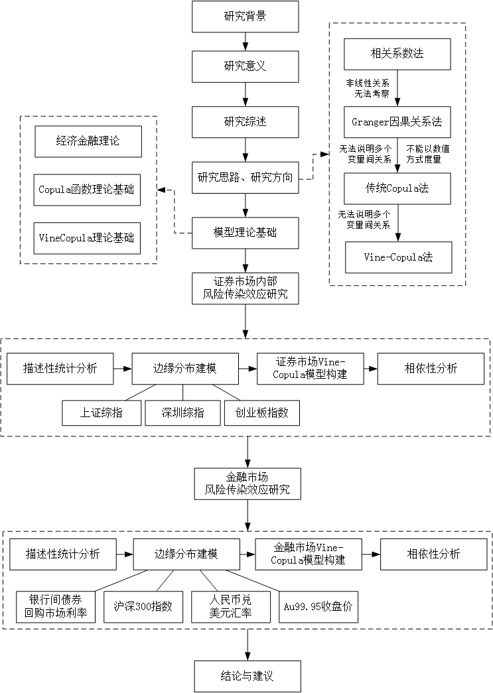

**TODO**
- [ ] 实证分析写成两章，分别是股票市场内部风险传染和金融市场风险传染


```{r setup, echo=F}
knitr::opts_knit$set(root.dir = getwd())
knitr::opts_chunk$set(echo = FALSE, results = 'hide')
knitr::opts_chunk$set(warning = FALSE, message=FALSE)
```

```{r prepare}
rm(list=ls())
options(digits=4)
options(scipen=100)
graphics.off()
Sys.setlocale("LC_ALL", "Chinese")
```


# 选题意义及研究综述

## 选题理论及现实意义

### 研究背景

随着金融基础设施的日趋完善、金融产品的日益丰富以及金融业态的飞速发展，金融市场之间的联系也愈发紧密。在高
度关联的金融系统中，一旦系统内部某一金融市场发生危机，其风险将通过传染渠道迅速蔓延至其他金融市场，进而引
发系统性的金融风险。而系统性风险对实体经济的破坏性远大于单一金融市场的危机。例如2008年的次贷危机，早期仅
为房屋信贷危机的发生，但随着投资者对按揭证券逐步丧失信心，人们纷纷向相应金融机构清偿这批证券，这使得一些
以按揭证券化为主营业务的金融机构最先受到牵连，由于没有外来资金的流入，使得流动性危机大规模爆发，全球金融
市场崩溃，随之而来的便是公司破产、裁员，失业率迅速升高，实体经济受到巨大冲击。尽管现在距这场“金融海啸”已
十年有余，并且各大经济体也纷纷采取了积极宽松的财政政策和货币政策，但是和早期的繁盛相比依然有所差距。

改革开放以来，我国已初步建成多功能、全方位的金融市场体系，金融监管和调控体系日益完善。随着金融业改革创新
的深化，我国已成为重要的世界金融大国。在货币市场上，我国实行稳健的货币政策，利率市场化改革进程不断加快，
逐步取消了贷款利率（除个人住房贷款）浮动下限、放宽了存款利率的浮动上限，近年来央行注重把握货币供给量的
松紧适度，采取了一系列降息、降准等措施；在资本市场上，我国已初步形成多层次资本市场体系并逐步启动了沪港通、
深港通，实现多样化投融资渠道；在外汇市场上，我国实行有管理的浮动汇率制度，2015年人民币被纳入特别提款权
（SDR）篮子货币后推动了人民币国际化进程。然而，不同的金融市场间并不是简单地、线性地相加在一起，市场间存
在相互作用、相互影响，由于金融风险的“多米诺骨牌效应”，极有可能牵一发而动全身。

从宏观层面看，虽然我国未来的金融形势整体看好，但当前和今后一个时期我国金融领域仍处于风险高发期，在国内外
多重因素压力下，风险点多面广，呈现隐蔽性、复杂性、突发性、传染性、危害性特点。2019年2月21日，中国人民银
行在成都召开的金融稳定工作会议中也明确指出“防范化解金融风险特别是防止发生系统性金融风险，是金融工作的根本
性任务，要把主动防范化解系统性金融风险放在更加重要的位置”。为了尽早发现系统性风险，及时防范其所带来的风险
损失，宏观审慎的风险监管政策是必需的，既要防止“黑天鹅”事件的发生，也要防止“灰犀牛”风险的发生。

在当前的经济形式下，迫切需要从风险溢出的角度，了解金融危机期间金融市场之间的极端尾部联动关系的变化情况，
以及他们之间的风险溢出情况，全面掌握危机传染在金融市场上的表现，为金融危机的防范提供预警，为政策制定者提
供政策建议，为投资者提供风险提示。从最大程度上减少金融危机的不良影响是一个值得高度重视和深入研究的问题。

### 研究意义

金融系统呈现的紧耦合性和强关联性等多重复杂形态[@王献东2016]，使得不同市场间的风险传染绝不局限于两两市场
之间，换言之，一旦某个金融市场爆发危机，其不仅会引起自身的大幅波动，而且还会导致危机以自身为中心沿着风险传
染渠道向其他金融市场扩散，最终引致整个金融系统的剧震，即风险传染效应。作为经济建设和维护国家金融安全的核
心内容,守住不发生系统性金融风险并着力提升金融服务实体经济能力已经成为新时代金融工作的基本准则。
因此,分析我国金融市场内部各市场之间的风险传染路径、探究系统性金融风险传导机制、完善跨市场风险传染的理论框架、建设适合我国金融市场的风险预警机制对我国以货币政策和宏观审慎政策作为“双支柱”来防范系统性金融风险的调
控框架具有重要意义：

（1）有利于完善跨市场风险传染的理论框架

风险传染是系统性风险的重要特征。对跨市场风险传染的理论机理和现实路径等内容展开研究，有利于完善理论框架，
提升对系统性风险的根本原因、传播途径和形成机制等方面的理解和认知。对系统性风险的清晰认识是保证金融稳定的
关键。提升对系统性风险的全面认知，有利于金融监管部门更好地协调金融市场监管框架，统筹不同市场的金融政策，
完善跨市场、跨部门的信息共享机制，从根本上对系统性风险加以防范和化解。

（2）有利于提前识别风险隐患并发出预警信号

金融风险的隐蔽性、传染性使得风险预警、防控的难度加大。本文在对主要金融市场风险进行动态测量的基础上，对跨
市场风险传染问题展开理论和实证研究。作为金融市场监管的有效补充和延伸，建立金融市场系统性风险预警机制的重
要性和紧迫性日益显著。提前预警有利于在危机发生前做好防范应急工作，及时制定应对策略，减少金融风险对经济发
展和金融体系造成的负面影响，进一步完善金融安全网络，从而满足宏观审慎监管需求，保障经济在新常态下可持续发
展。

（3）有利于为金融市场的宏观审慎监管提供有益启示

宏观审慎监管作为微观审慎监管的延伸和扩展，是一种能够维护金融稳定、防止金融系统负外部溢出的自上而下的监管
模式。防范系统性风险是宏观审慎监管框架的重要内容。本文从宏观审慎监管的实践需求出发，以中国主要金融市场为
研究对象，探究跨市场的风险传染机理，可以为完善金融监管框架提供理论支撑和数据佐证，提出有价值的监管启示，
丰富宏观审慎监管策略。

## 国内外研究现状述评

### 金融市场内部风险传染路径


### 风险传染的测度方法

当前主流的测度风险传染路径的方法有实证分析法、复杂网络方法以及构建人工金融市场的方法，其中实证分析的方法
是最常用的研究方法，主要包括概率分析、相关系数分析、VaR模型、GARCH族模型、Copula函数族和事件研究法等。[@王宇2019]


# 本文的主要内容、基本思路、研究方法及论文提纲

## 主要内容

本文的具体内容安排如下：

导论。这部分主要介绍本文的研究背景，通过当今经济的发展背景来说明研究市场相关性的重要性，以此来阐述本文的研
究意义。其次，本文从“金融市场内部风险传染路径”和“	风险传染的测度方法”两个方面介绍当前国内外学者对风险传染
的研究。然后指出本文的研究思路、研究方法，确定本文的整体研究框架。最后点明本文可能存在的创新及不足。

第一章：模型理论基础。首先介绍基本的经济金融理论：第一，因为本文的研究对象为主要金融市场，因此有必要的对金
融市场的划分理论进行相应的说明，指明本文选择货币市场、资本市场、外汇市场和黄金市场代替整个金融市场的依据；
第二，因为本文的落脚点在“尾部风险相依性”，是对主要的数个金融子市场进行风险传染研究，因此对金融市场关联理论
的介绍也是必需的。然后介绍Copula函数理论基础：第一，因为构建Copula模型时，需要知道对应资产的边缘分布，由于
金融资产往往具有波动性聚集和尖峰厚尾的特点，因此学术界一般用GARCH模型来对金融资产的收益率序列进行拟合，所
以第一部分主要介绍GARCH模型的相关理论；第二，介绍Copula模型构建的基本原理————Sklar定理和常见的Copula函数形
式，对Copula函数的基本特征进行简单的述评。第三，介绍如何根据Copula模型得到相关系数以度量两个市场间的相依程
度。最后介绍Vine-Copula模型的理论基础：第一，通过Sklar定理进行多元Copula分解，并介绍Vine-Copula模型里规则
藤的基本结构；第二，详细介绍规则藤的具体分类C-Vine、D-Vine与R-Vine。

第二章：证券市场内部风险传染效应研究。由于证券市场是所有金融市场中交易频率最高、参与者最多、复杂程度最大的
一个市场，因此本文先对证券市场内部的风险传染效应进行研究。首先选取上海综指、深圳综指和创业板指数的对数收益
率序列分别作为主板市场（沪市、深市）和二板市场（创业板市场）的反映指标，确定数据区间为2010年到2019年；其次
对处理后的数据进行描述性统计分析；然后，通过平稳性检验、自相关性检验和ARCH效应检验，确定各市场最优的ARMA-G
ARCH模型，用得到的标准化残差拟合并选取最优的Copula函数，最后选择最优Vine-Copula，通过计算Kendall秩相关系数
和上下尾相依系数来分析证券市场内部各市场间的相依关系。

第三章：金融市场风险传染效应研究。根据金融市场划分理论，金融市场可分为货币市场、资本市场、外汇市场和黄金市
场，因此本章就这四个金融子市场之间的风险传染效应进行研究。首先选取能代表这四个市场的替代指标————隔夜银行间
债券回购市场收益率、沪深300指数收益率、人民币兑美元汇率（间接标价法）收益率和上海交易所黄金现货（Au99.95）
收益率。选取理由如下：第一，银行间债券回购市场是中国交易量最大的货币交易市场，市场交易活跃,产品期限品种齐
全, 报价连续, 价格形成发现机制完备,能较好地反映市场整体流动性；第二，当前市场中的股票指数，只是分别表征了
两个市场各自的行情走势，沪深300指数则是反映沪深两个市场整体走势的“晴雨表”，指数样本选自沪深两个证券市场，
覆盖了大部分流通市值，成份股为市场中市场代表性好，流动性高，交易活跃的主流投资股票，能够反映市场主流投资的
收益情况；第三，首先美国是世界最大的经济体，（中华人民共和国商务部官网），然后就单一国家而言，2018年我国与
美国的货物进出口贸易总额居于首位，达到6335.20亿美元，因此以人民币兑美元的汇率反应我国的汇率市场具有较好的
代表性；第四，Au99.95是我国上海黄金市场第一只对个人客户开放的纸黄金产品，选用Au99.95可以反映黄金市场数年来
的整体走向。其次，对各收益率序列进行描述性统计分析、平稳性检验、自相关性检验和ARCH效应检验，确定针对各市场
市场最优的ARMA-GARCH模型，并得到各自的标准化残差序列。然后拟合并选取最优的Copula函数，并选择最优Vine结构，
用以拟合Vine-Copula模型。最后通过其秩相关系数和上下尾相依系数来分析金融系统内部各市场间的风险传染情况。

结论与建议。总结本文的研究结论、研究成果，并将理论联系实际，针对中国防范系统性金融风险的对策建议展开分析。
通过探讨当前我国金融监管存在的问题，根据研究结论和见解提出具体的对策建议。

## 基本思路



## 研究方法


## 论文提纲

* 导论
    + 研究背景和意义
          - 研究背景
          - 研究意义
    + 国内外文献综述
          - 金融市场内部风险传染路径
          - 风险传染的测度方法
    + 研究思路和方法
          - 研究思路
          - 研究方法
    + 本文创新和不足
* 第一章  模型理论基础
    + 1.1  经济金融理论
          - 1.1.1  主要金融市场划分
          - 1.1.2  金融市场关联理论
    + 1.2  Copula函数理论基础
          - 1.2.1  GARCH族模型
          - 1.2.2  Sklar定理
          - 1.2.3  常见Copula函数形式
          - 1.2.4  相依性测度方式
    + 1.3  Vine-Copula理论基础
          - 1.3.1  多元Copula分解与Vine结构
          - 1.3.2  C-Vine、D-Vine与R-Vine
* 第二章  证券市场内部风险传染效应研究
    + 2.1  数据描述性分析及数据预处理
          - 2.1.1  描述性统计分析
          - 2.1.2  平稳性检验
    + 2.2  收益率序列的边缘分布建模
          - 2.2.1  自相关检验与ARCH效应检验
          - 2.2.2  上证综指收益率边缘分布建模
          - 2.2.3  深圳综指收益率边缘分布建模
          - 2.2.4  创业板指数收益率边缘分布建模
    + 2.3  证券市场高维动态Vine-Copula模型的参数估计
    + 2.4  证券市场尾部风险相依性度量
* 第三章  金融市场风险传染效应研究
    + 3.1  数据描述性分析及数据预处理
          - 3.1.1  描述性统计分析
          - 3.1.2  平稳性检验
    + 3.2  收益率序列的边缘分布建模
          - 3.2.1  隔夜银行间债券回购市场收益率边缘分布建模
          - 3.2.2  沪深300指数收益率边缘分布建模
          - 3.2.3  人民币兑美元汇率收益率边缘分布建模
          - 3.2.5  上海交易所黄金现货Au99.95收益率边缘分布建模
    + 3.3  金融市场高维动态Vine-Copula模型的参数估计
    + 3.4  金融市场尾部风险相依性度量
* 研究结论及政策建议


# 本文可能的创新点

本文研究的创新点有以下两点：

（1）研究视角的创新

首先，以往对风险传染效应的研究中，主要集中在两个角度：一是研究在国际环境中，不同经济体之间的风险传染，且大
部分均是以证券市场指代该经济体的风险情况；二是研究在本国环境中，两个金融子市场之间的风险传染。较少研究国内
多个金融子市场间的风险联动效应。因此本文围绕中国货币市场、资本市场、外汇市场、黄金市场的风险测量和风险传染
展开研究，以期对我国金融系统的风险传染过程有深入的探究，为我国金融风险监管提供新方法，丰富我国的宏观审慎监
管策略。然后本文在对资本市场的风险进行研究时，又将资本市场细分为证券市场和期货市场。从对以往证券市场的观察
中发现，创业板指数的波动情况显著大于上证综指和深圳成指，但其具体的风险传染路径尚不清楚。因此本文将证券市场
又细分为上证市场、深证市场和创业板市场，先研究证券市场内部的风险传染过程，再延伸至对我国整个金融市场的风险
传染效应的研究。

（2）研究模型的改进

以往对不同市场间风险关系计量中主要采用相关系数法、Granger因果关系法、VaR模型法、Copula函数族法和事件研究法
，研究的主要是两个市场间的相关程度。本文则通过构建Vine-Copula模型，将我国货币市场、资本市场、外汇市场、黄
金市场置于同一模型内，研究市场间的尾部关联情况，从而说明其复杂相关程度。


[@bedford2001]

# 论文写作计划，进行方式和采取主要措施

## 论文写作计划

## 进行方式

## 主要措施

# 主要参考文献书目

[//]: # (\bibliography{Bibfile})
